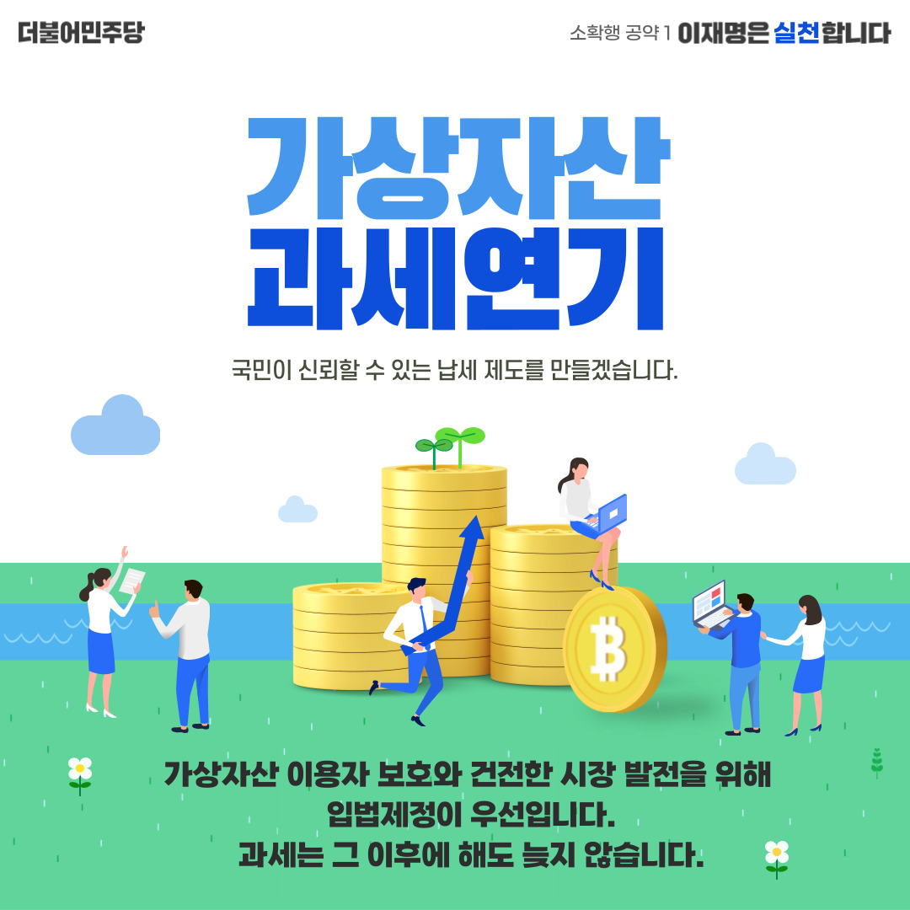
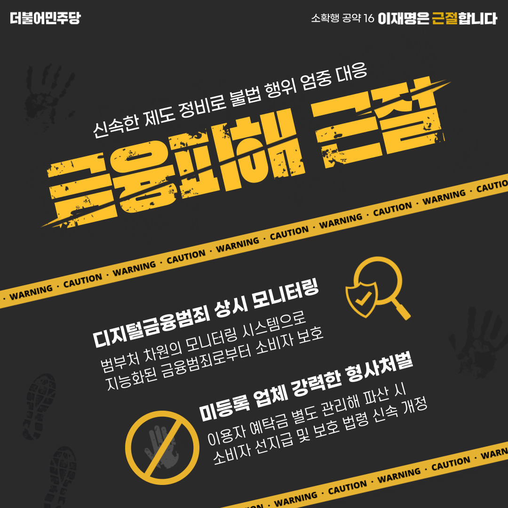
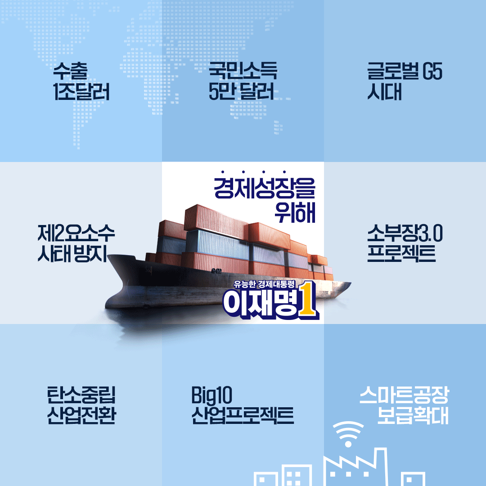
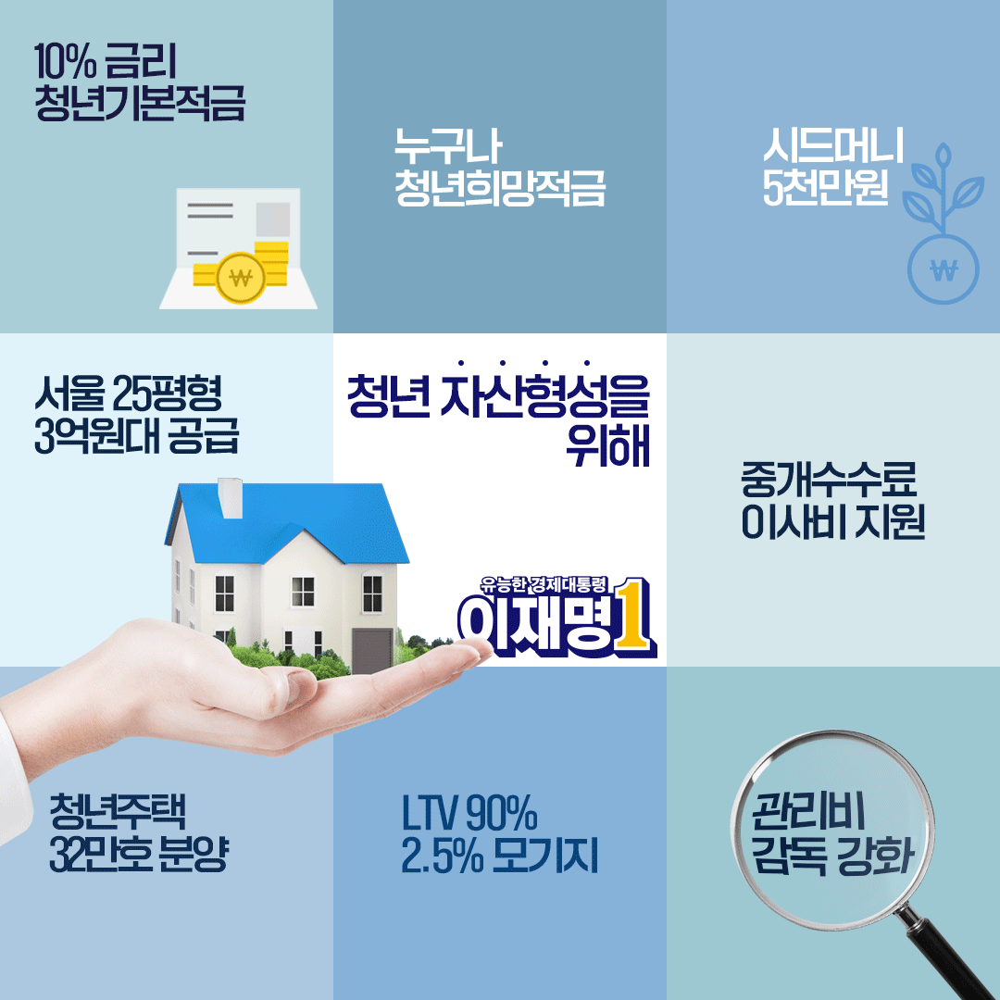

# 소확행 등 분야별 공약

## 경제

### 가상자산 과세, 1년 유예
> 

### 자본시장 불공정 해소
> 

### 금용피해 근절, 소비자 보호
> 

### 보이스피싱 단속 강화, 보호 강화
> 

### 주가조작 근절, 공정 시장 질서
> 

### 공정한 자동차세 구현
> 

### 주식투자자를 위해
> 

### 경제성장을 위해
> 

### 중소기업과 노동자를 위해
> 

### 사회적 경제를 위해
> 

### 일자리 대전환을 위해
> 

### 청년 자산형성을 위해
> 