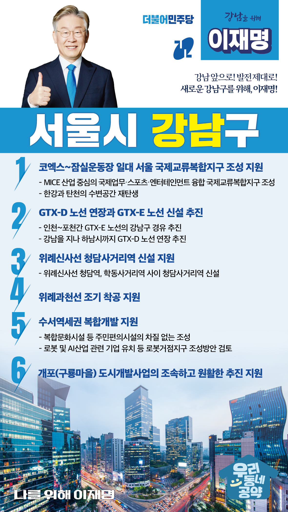

## 서울 지역 공약

# 강남구

---

### 강남 앞으로, 발전 제대로! 새로운 강남구를 위해!
> 2022-02-04

존경하는 강남구민 여러분

강남구는 한류의 메카이고 뉴욕의 맨하탄이 부럽지 않은 경제와 문화의 중심지입니다. ‘강남스타일’로 대변되는 문화와 생활이 있지만, 서울의 발전과 대한민국의 발전을 위해서는 강남이 다시 한번 도약을 해야 합니다.

한류의 중심이 되고, 서울의 중심이 되며, 대한민국의 중심이 되도록 저 이재명의 새로운 강남 발전을 위한 6대 공약을 말씀드리겠습니다.

첫째, ‘국제교류복합지구’가 차질 없이 조성되도록 지원하겠습니다.

코엑스부터 잠실운동장까지 이어지는 일대는 마이스(MICE)산업을 중심으로 국제업무․스포츠․엔터테인먼트가 융합한 ‘국제교류 복합지구’로 재탄생할 것입니다.  

한강과 탄천의 수변공간 또한 새롭게 거듭나게 하겠습니다. 

강남이 세계 최고 수준의 비즈니스․관광 도시가 되도록 적극 돕겠습니다.

둘째, GTX-D 노선 연장과 GTX-E 노선 신설을 추진하겠습니다.

인천-포천간 GTX-E 노선이 강남구 경유하도록 추진하겠습니다. 

또한 GTX-D 노선은 강남을 지나 하남시까지 연장하겠습니다.  

강남권 광역복합환승센터는 2개의 GTX 노선과 SRT가 정차하는 명실상부한 광역교통의 허브가 될 것입니다.

셋째, 위례신사선 청담사거리역 신설을 지원하겠습니다.

상습적인 정체구간인 도산대로와 삼성로의 교통 혼잡을 줄이기 위해 청담사거리역 신설이 필요합니다. 

위례신사선 노선에 ‘청담사거리역’을 신설하여 대중교통망을 개선하겠습니다. 

넷째, 위례과천선 조기 착공을 지원하겠습니다.

편리한 교통환경을 제공하여 도시철도 소외지역이 없도록 위례과천선 건설의 빠른 추진이 필요합니다. 

위례과천선 건설이 조속히 추진될 수 있도록 돕겠습니다. 

다섯째, 수서역세권 복합개발이 차질 없도록 지원하겠습니다.

수서역세권에 복합문화시설 등 주민편의시설 조성과 더불어 수서역세권 일대를 로봇과 AI 관련 기업이 집적된 로봇거점지구가 조성될 수 있도록 돕겠습니다.

수서역세권 복합개발 사업의 성공을 위해 적극 지원하겠습니다. 

여섯째, 개포(구룡마을) 도시개발사업의 원활한 추진을 지원하겠습니다. 

열악한 주거환경에서 생활하고 있는 구룡마을 주민들의 쾌적한 주거 제공과 복리 증진을 돕겠습니다. 

개포 도시개발사업이 성공적으로 마무리되도록 적극 지원하겠습니다.

이재명은 지킬 수 있는 것들만 약속합니다.

그동안 보여드린 추진력으로 강남이 한 단계 더 도약할 수 있도록 저, 이재명이 앞장서겠습니다.

강남 앞으로! 약속 제대로!

강남구민을 위해 이재명은 합니다.  

						