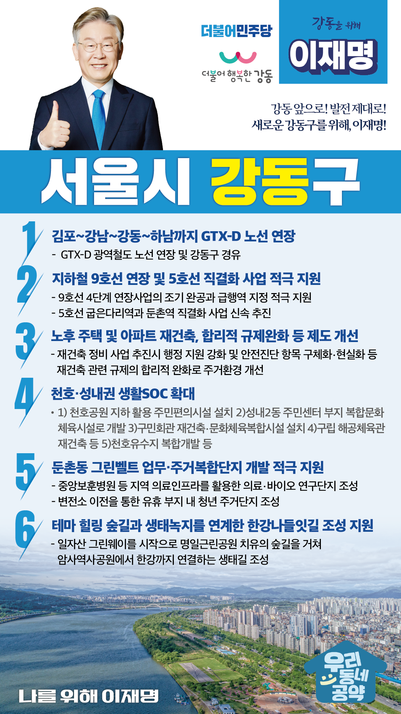

## 서울 지역 공약

# 강동구

---

### 강동 앞으로, 발전 제대로! 새로운 강동구를 위해!
> 2022-02-04

존경하는 서울 강동구민 여러분

6천년 전 선사문화의 꽃을 피웠던 강동구는 오늘날 서울의 교통, 문화, 교육 중심지로 발돋움하고 있습니다.

강동구는 일자산 근린공원, 광나루한강시민공원, 천호근린공원 뿐만 아니라 다양한 생태공원을 보유하여 주민들에게 도심 속 휴양 및 여가공간을 제공하고 있으며, 한강유역의 대표적인 신석기시대 ‘암사동 선사유적지’가 위치하고 있어 역사적인 의미 또한 매우 높은 곳입니다.

그러나 보다 경쟁력있고 활력이 넘치는 강동구를 위해 지속적인 계획과 실천이 필요합니다.

강동구에 새로운 동력을 불어넣기 위한 이재명의 강동구 6대 공약을 말씀드리겠습니다.

첫째, GTX-D 노선을 김포~강남~강동~하남까지 연장하겠습니다. 

강동구를 비롯한 수도권 동부지역은 택지 개발로 교통 수요가 증대되고 있습니다.  
그러나 강남권역과의 연결 교통망은 미흡하여 주민들 불편이 큽니다.
GTX-D 노선을 경기도 김포에서 강남과 강동구를 거쳐 하남까지 연결하겠습니다.  
강동구 교통을 획기적으로 개선하겠습니다.

둘째, 지하철 9호선 연장과 5호선 직결화 사업을 적극 지원하겠습니다.

강남 및 도심 접근성 향상을 위해 기존노선의 연장 및 개선이 시급합니다.
9호선 4단계 연장사업의 조기 완공과 급행역 지정을 적극 지원하겠습니다. 
또한 5호선 굽은다리역과 둔촌역 직결화 사업을 신속 추진하여 이용승객 혼잡도를 낮추고 주민들의 교통편의 향상에 최선을 다하겠습니다.

셋째, 노후 주택 및 아파트 재건축, 합리적 규제완화로 주거환경을 새롭게 하겠습니다.

강동의 여러 지역에서 도시정비 및 재건축이 진행되고 있지만, 현행 안전진단 기준으로는 재개발·재건축 사업이 사실상 불가능합니다.
안전진단 제도는 현실에 맞게 개선하고, 공공 재개발도 활성화 하겠습니다.
행정 절차도 신속하게 진행하여 주민들이 보다 쾌적한 주거환경에서 생활할 수 있도록 제도를 개선하겠습니다.

넷째, 천호·성내권 생활SOC 확대로 강동 균형발전을 이뤄내겠습니다.

구도심 지역인 천호동과 성내동 주민들께서는 주민편의시설 절대 부족으로 많은 불편을 겪고 계십니다.
천호공원 지하공간 활용해 주민편의시설 설치하고 성내2동 주민센터 부지를 복합문화체육시설로 개발할 수 있도록 지원하겠습니다. 
구민회관을 재건축하여 문화체육복합시설을 설치하고 천호유수지를 복합개발도 필요합니다. 
또한 구립 해공체육관 재건축을 추진하는 등 일상생활과 밀접한 인프라 투자를 확대하여 강동 주민의 삶의 질을 더욱 높이도록 지원을 아끼지 않겠습니다. 

다섯째, 둔촌동 그린벨트 업무·주거복합단지 개발을 적극 지원하겠습니다.

둔촌동 지역은 개발제한구역으로 묶인 지역이 많고 변전소가 있어서 주민 정주환경 개선이 시급합니다.
중앙보훈병원 등 지역 의료인프라를 활용한 의료-바이오 연구단지를 조성하고, 현 변전소 부지에 청년을 위한 주거단지를 조성하여 지역경제 활력을 견인하고 일자리의 원천이 될 수 있도록 지원하겠습니다.

여섯째, 테마 힐링 숲길과 생태녹지를 연계한 한강나들잇길 조성을 지원하겠습니다.

강동은 암사초록길 같은 한강 보행도 연결사업이 더 필요합니다.
일자산 그린웨이를 시작으로 명일근린공원 치유의 숲길을 거쳐 암사역사공원에서 한강까지 연결하는 생태길 조성사업을 지원하겠습니다. 
구민 누구나 편하게 한강을 찾아 나들이할 수 있는 환경 조성을 지원하겠습니다.

존경하는 강동구민 여러분!

이재명은 지킬 수 있는 것만 약속했고 약속했던 것은 지켜왔습니다.
살기 좋은 강동 미래를 위한 약속, 실력과 성과로 입증된 이재명이 반드시 실천하겠습니다.

강동 앞으로! 발전 제대로! 
강동구민을 위해, 이재명! 
