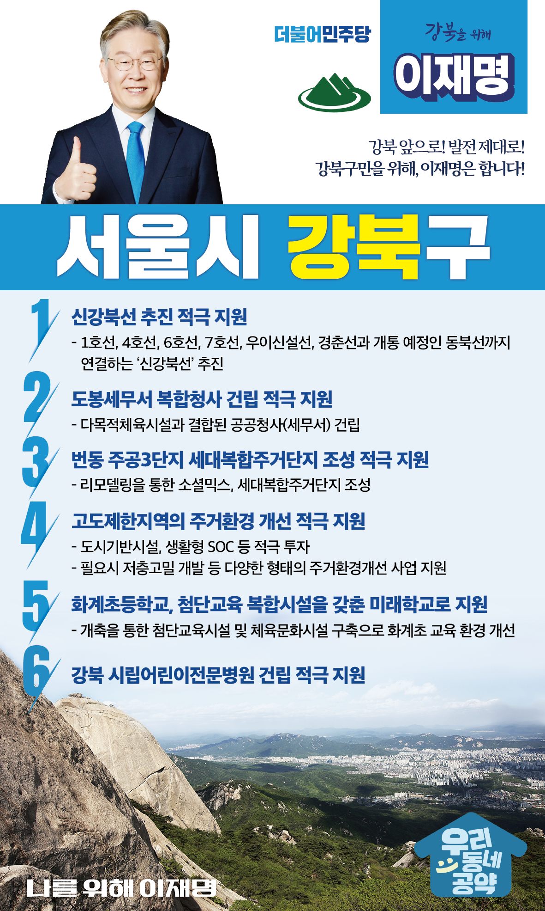

## 서울 지역 공약

# 강북구

---

### 강북 앞으로, 발전 제대로! 새로운 강북구를 위해! 
> 2022-02-04

존경하는 강북구민 여러분, 

북한산에 인접한 강북구는 
쾌적한 자연환경과, 4.19 민주묘역이 자리한 역사문화로 
성장 잠재력이 높은 곳입니다.

더 살기 좋은 강북구를 위해서는 더 과감한 투자가 필요합니다.
저 이재명이 구민 여러분과 함께 강북구에 새로운 활력을 불어넣겠습니다.
강북 발전을 위한 강북구 6대 공약을 말씀드리겠습니다.

첫째, 강북 교통인프라 개선을 위한 ‘신강북선’이 추진될 수 있도록 적극 지원하겠습니다.
강남북 교통 인프라 격차가 심각한 수준입니다. 
1호선, 4호선, 6호선, 7호선, 우이신설선, 경춘선과 개통 예정인 동북선까지 
연결할 수 있는 신강북선을 적극 지원하여 강북의 교통인프라를 획기적으로 개선하겠습니다. 

둘째, 도봉세무서 복합청사 건립을 지원하겠습니다. 
준공 30년이 지난 도봉세무서를 다목적 체육시설을 결합한 복합청사로 개발하면 
행정서비스와 주민편의 증진이라는 두 마리 토끼를 잡을 수 있습니다. 
복합청사가 적기에 건립될 수 있도록 적극 지원하겠습니다. 

셋째, 번동 주공3단지를 세대복합주거단지로 조성하겠습니다. 
1990년에 입주한 주공3단지는 
우리나라 최초의 영구임대주택단지로 주거안정에 큰 역할을 해왔습니다. 
그러나 세월이 흘러 노후화된 만큼 주거환경개선이 필요합니다. 
리모델링을 통해 소셜믹스, 세대복합주거단지로 거듭날 수 있도록 적극 지원하겠습니다. 

넷째, 강북구 고도제한지역의 주거환경 개선을 적극 지원하겠습니다.  
고도제한지역이 슬럼화될 위험이 큽니다. 
강북구는 고도제한으로 희생을 감내해 온 만큼 특별한 보상이 필요합니다. 
강북구 고도제한지역에 도시기반시설, 생활형 SOC 등을 적극 투자해 주거환경을 개선하겠습니다. 
필요한 경우 공공정비사업으로 저층고밀 개발 등 다양한 형태의 주거환경개선 사업을 지원하겠습니다. 

다섯째, 화계초등학교가 첨단교육 복합시설을 갖춘 미래학교가 되도록 지원하겠습니다.
50년이 넘은 화계초등학교는 노후화되어 교육환경개선이 필요합니다. 
화계초등학교를 개축해 첨단교육시설과 체육문화 시설을 갖춘 
미래학교로 거듭날 수 있도록 지원하겠습니다. 
화계초등학교의 교육 환경이 획기적으로 개선될 것입니다. 

여섯째, 강북 시립어린이전문병원 건립을 적극 지원하겠습니다.
강북 시립어린이전문병원 건립은 
강남북 균형발전과 강북권 보건의료서비스 향상을 위해 필요합니다. 
시립어린이전문병원이 적시에 건립될 수 있도록 돕겠습니다. 

존경하는 강북구민 여러분!

저는 지킬 수 있는 것만 약속했고 약속은 꼭 지켰습니다. 
성남시장, 경기도지사 평균 공약이행률 95%가 증명하듯
여러분께 드린 약속, 말이 아니라 성과로 보답하겠습니다

강남북 균형발전과 강북의 숙원 과제 해결, 저 이재명은 반드시 실천하겠습니다.

강북 앞으로! 발전 제대로!
강북구민을 위해, 이재명은 합니다! 
