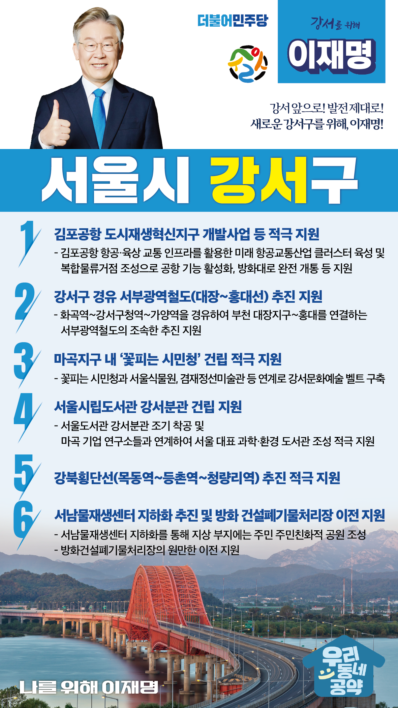

## 서울 지역 공약

# 강서구

### 강서 앞으로, 발전 제대로! 새로운 강서구를 위해!
> 2022-02-04

존경하는 서울시 강서구민 여러분, 

강서구는 서울시 서남권 경제의 중심지로 발돋움할 수 있는 
성장잠재력이 정말 높은 지역입니다. 
첨단 과학기술 연구소들이 입주해 있는 마곡 첨단연구개발단지와 
중국·일본 등 근거리 국가와 직통할 수 있는 김포국제공항은 강서구의 자산입니다. 

또한 문화·예술적으로도 큰 잠재력을 지니고 있습니다. 
서울식물원을 비롯하여 양천향교, 허준박물관, 겸재정선미술관, 스페이스-K 서울미술관에 이어 
LG아트센터가 곧 문을 엽니다. 

이러한 잠재력을 바탕으로 강서구를 
국제적 경제관문도시이자 서남권 경제의 성장거점으로 우뚝 세우겠습니다. 
이를 위해 저 이재명의 강서발전 6대 공약을 말씀드리겠습니다.