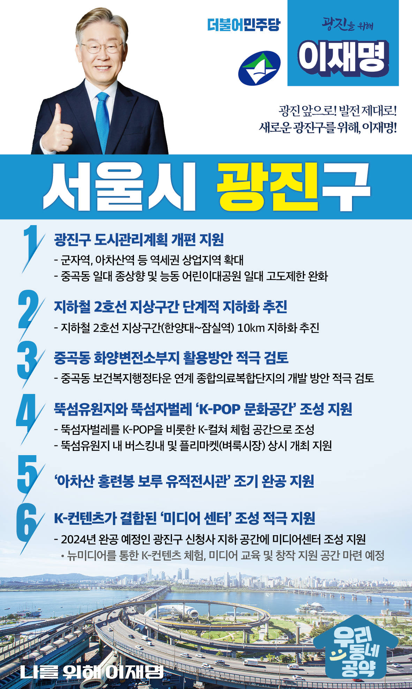

## 서울 지역 공약

# 광진구

### 광진 앞으로, 발전 제대로! 새로운 광진구를 위해!
> 2022-02-04

존경하는 서울 광진구민 여러분, 

 

광진구는 어린이대공원과 고구려의 역사가 살아있는 아차산, 최근 개관한 보건복지행정타운 등 서울시민들의 건강과 여가를 책임지고 있습니다. 또한, 건국대와 세종대 주변 역세권을 중심으로 상권이 발달 되고 유동 인구가 많은, 교통과 생활이 편리한 주거지역으로 개발여력과 성장 잠재력이 높은 곳입니다.

그러나 더 살기 좋은 광진구를 위해서는 전환적 성장과 혁신적 도약이 필요합니다.
저 이재명이 구민 여러분과 함께 광진구에 새로운 활력을 불어넣을 6대 공약을 말씀드리겠습니다.

첫째, 광진구 도시관리계획을 개편할 수 있도록 지원하겠습니다.

광진구는 교통과 생활여건이 좋은 편이지만, 상업 및 업무지역이 부족해 지역경제 활성화를 위한 체질 개선이 필요합니다. 
군자역, 아차산역 등 역세권은 상업지역을 확대하고, 중곡동은 주거환경개선을 위해 종상향하고, 능동 어린이대공원 일대는 고도제한을 완화하여 광진구가 지속가능한 발전을 이뤄야 합니다. 

둘째, 지하철 2호선 지상구간을 단계적으로 지하화하겠습니다.

한양대에서 잠실역으로 이어지는 10km의 지상구간의 지하화를 추진하겠습니다. 
지하철 2호선은 1980년에 완공되어 철도시설 내구연한인 40년을 경과했습니다. 
생활권 단절과 소음 문제를 개선하고 탁 트인 하늘을 광진구민께 돌려드리겠습니다.

셋째, 중곡동 화양변전소부지 활용방안을 적극 검토하겠습니다.

오랜 시간 방치되어 있는 중곡동 화양변전소 부지를 주민들을 위해 활용해야 합니다. 
작년에 문을 연 중곡동의 보건복지행정타운과 연계한 종합의료복합단지 개발방안 등을 적극 지원하겠습니다. 
동북권의 보건복지 중심지로 발전할 수 있도록 지원하겠습니다.

넷째, 뚝섬유원지와 뚝섬자벌레가 ‘K-POP 문화공간’이 되도록 돕겠습니다. 

뚝섬한강공원에 있는 복합공간인 뚝섬자벌레는 리모델링을 거쳐 재개관했지만 여전히 이용이 저조합니다. 
뚝섬자벌레를 K-POP을 비롯한 K-컬쳐를 체험하고 배울 수 있는 공간으로, 뚝섬유원지는 버스킹, 플리마켓(벼룩시장)이 상시 개최되는 곳으로 조성되도록 지원하겠습니다.

다섯째, ‘아차산 홍련봉 보루 유적전시관’이 조속히 건립되도록 지원하겠습니다.

아차산 홍련봉 보루군은 고구려 역사 유물이 가장 많이 발굴되는 장소 중 한 곳입니다. 
역사 유물을 보전하고, 체험 및 역사교육을 위한 유적전시관이 조기에 완공되도록 적극 지원하겠습니다.

여섯째, K-컨텐츠가 결합된 미디어 센터 조성을 적극 지원하겠습니다.

2024년에 완공될 광진구 신청사 지하에 구민 모두가 이용할 수 있는 미디어센터가 조성되도록 지원하겠습니다. 
뉴미디어를 통한 K-컨텐츠 체험, 미디어 교육 및 창작 지원 등 미디어의 모든 것을 경험할 수 있는 서울의 명소가 될 것입니다. 

존경하는 광진구민 여러분!

그동안 광진구민 여러분들은 후보들의 정책을 살펴 냉철한 판단을해주셨습니다.
저는 그동안 지킬 수 있는 것만 약속했고 약속은 꼭 지켰습니다.
오늘 여러분께 드린 약속도 실력과 성과로 입증된 제가 반드시 실천하겠습니다.

광진 앞으로! 발전 제대로!
새로운 광진을 위해, 이재명!