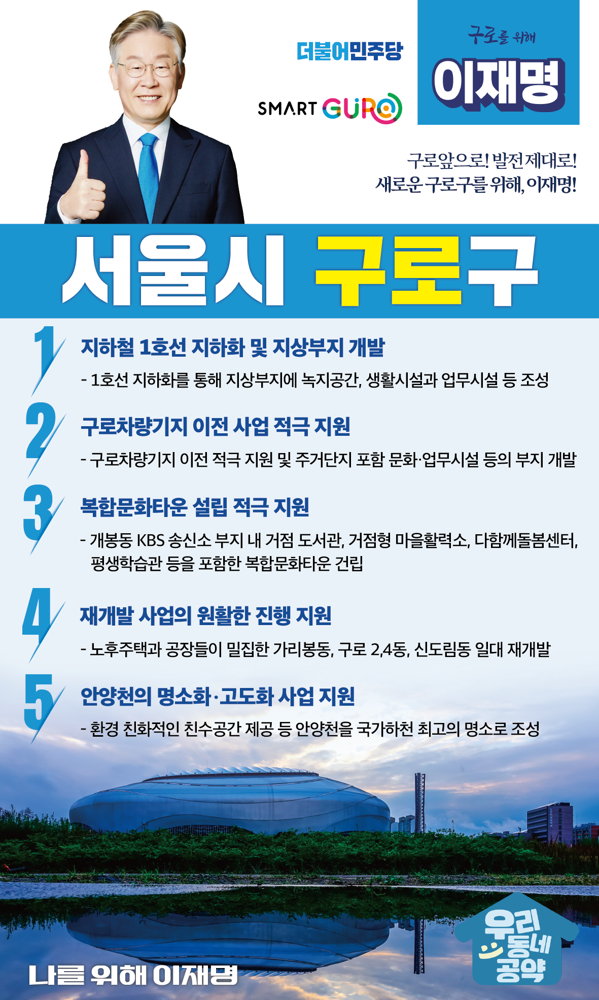

## 서울 지역 공약

# 구로구

### 구로 앞으로, 발전 제대로! 새로운 구로구를 위해!
> 2022-02-04

존경하는 서울 구로구민 여러분, 

우리 구로구는 서울지역 서남권의 마지막 관문이자 중심지로서, 경부·경인선 철도와 전철 1·2·7호선, 경인·경수국도가 연계되는 교통의 요충지이며, 디지털첨단산업의 메카입니다.

하지만 지하철 1호선으로 인한 지역단절로 주민들이 교통 불편을 겪고 있을 뿐만 아니라, 지역개발의 속도도 더딘 상황입니다.

이제 구로구민 여러분들의 숙원을 이재명의 추진력으로 해결해 내겠습니다. 
구로의 미래를 위한 5대 지역 공약을 말씀드리겠습니다.

첫째, 지하철 1호선을 지하화하고 지상부지를 개발해 구로구민들께 돌려 드리겠습니다.

지역단절과 소음, 분진 등으로 주민들의 불편을 야기하고 있는 지하철 1호선 구간을 지하화하겠습니다. 

지하화로 생기는 지상 부지는 녹지공간, 생활시설과 업무시설로 조성하겠습니다. 

둘째, 구로차량기지 이전이 원만히 추진되도록 지원하겠습니다. 

20년 동안 끌어왔던 구로차량기지 이전 사업을 적극 지원하고 주거단지를 포함한 문화·업무시설 등의 부지 개발을 통해 서울의 주택난 해결에 도움이 되는 방향을 검토하겠습니다. 

셋째, 구로구민을 위한 복합문화타운을 설립을 적극 지원하겠습니다.

구로구 거점 도서관, 평생학습관, 다함께돌봄센터 등이 들어설 복합문화타운은 구로구의 교육·문화인프라의 대표 공간이 될 것입니다.
개봉동에 위치한 KBS 송신소 부지가 서남권 문화교육 중심지로 탈바꿈할 수 있도록 적극 지원하겠습니다. 

넷째, 낙후된 구로지역의 재개발 사업이 원활히 진행될 수 있도록 지원하겠습니다. 

노후주택과 공장들이 밀집한 가리봉동, 구로 2,4동, 신도림동 일대가 재개발을 통해 구로디지털단지의 배후단지가 되도록 지원하겠습니다. 
주택공급과 주거환경개선으로 구로구 주민의 주거환경을 개선하겠습니다. 

다섯째, 안양천을 구로구민의 쉼터가 되도록 지원하겠습니다.  

안양천은 구로를 비롯한 서울·경기 8개 지자체를 따라 흐르는 국가하천입니다.
서울 서남권 지역의 대표하천으로써 시민들이 안심하고 편리하게 이용할 수 있는 친수공간을 조성해 안양천이 최고의 명소가 될 수 있도록 적극 지원하겠습니다. 

존경하는 구로구민 여러분

이재명은 지킬 수 있는 것들만 약속합니다.
그동안 보여드린 이재명의 추진력으로 오랜 시간 끌어온 구로구의 숙원사업의 해결에 힘쓰겠습니다.
구로구가 서남권의 중심지로 거듭날 수 있도록 저, 이재명이 앞장서겠습니다.

구로 앞으로! 약속 제대로!
구로구민을 위해 이재명은 한다면 합니다. 