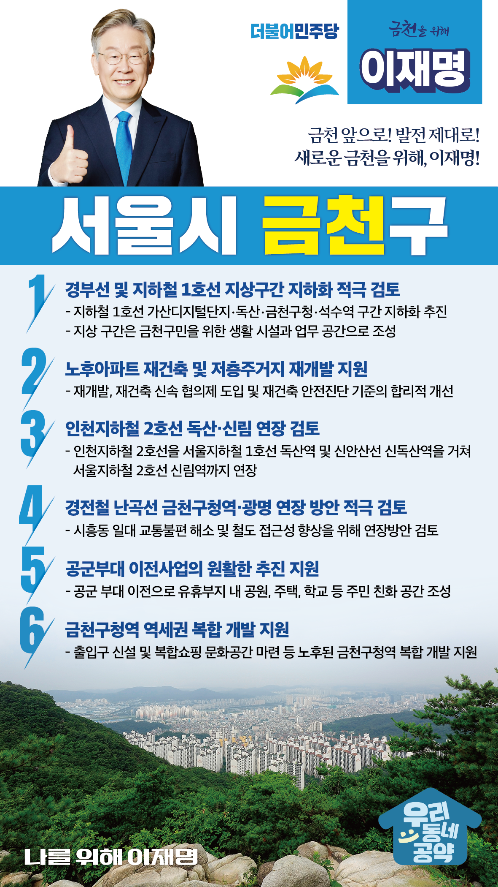

## 서울 지역 공약

# 금천구

---

### 금천 앞으로, 발전 제대로! 새로운 금천구를 위해!
> 2022-02-04

존경하는 서울 금천구민 여러분

금천구는 대한민국 산업의 심장 ‘G밸리 2·3단지’를 바탕으로 대한민국의 산업을 이끌어가는 산업 선도 지역입니다.

하지만, 시흥대로 동쪽의 저층주거지는 노후화되고, 철도 교통이 불편해서 획기적인 변신이 필요한 지역이기도 합니다. 

다행히 인천지하철 2호선과 경전철 난곡선 연장 등 주민들의 교통 불편을 개선하려는 움직임이 이어지고 있고, 독산동 공군부대와 시흥유통상가 부지 등 금천구의 발전을 이끌어낼 수 있는 대규모 개발 가능 부지가 있습니다.

금천구를 ‘넘치는 일자리와 쾌적한 주거환경을 갖춘 완전한 자족 도시’로 만들기 위한 ‘금천구 6대 공약’을 말씀드리겠습니다.

첫째, 경부선 및 지하철 1호선 지상구간 지하화를 적극 검토하겠습니다.

지하철 1호선 가산디지털단지·독산·금천구청·석수역 구간은 지하화가 필요합니다. 
지상 구간은 금천구민을 위한 생활 시설과 업무 공간으로 바뀌어야 합니다.
금천구의 발전을 위해 전철 지상구간 지하화를 적극 검토하겠습니다.

둘째, 노후아파트 재건축, 저층주거지 재개발로 주거환경을 획기적으로 개선하겠습니다.

재개발, 재건축 신속 협의제를 도입하고, 재건축 안전진단 기준을 합리적으로 개선하겠습니다. 
이를 통해 금천구의 노후아파트 재건축과 저층주거지 재개발이 용이해지도록 만들겠습니다.
금천구 주민들이 안전에 대한 걱정과 주차 고민 없이 편안하게 생활하실 수 있도록 주거환경 개선을 지원하겠습니다. 

셋째, 인천지하철 2호선 독산·신림 연장을 검토하겠습니다.

인천지하철 2호선을 서울지하철 1호선 독산역과 신안산선 신독산역을 거쳐 서울지하철 2호선 신림역까지 연장을 검토하겠습니다.
금천주민들의 강남 접근성을 높이고, 독산동 주변지역의 장기적 발전 토대를 마련하기 위해 노력하겠습니다.

넷째, 경전철 난곡선의 금천구청역·광명 연장 방안을 적극 검토하겠습니다.

경전철 난곡선을 금천구청역까지 연장하면, 겨울철 도로 결빙으로 마을버스가 다니기 어려울 정도인 시흥동 주민들의 교통 불편이 해소될 것입니다. 
이에 더해 난곡선이 하안역까지 연결될 수 있도록 사업 추진 방안을 검토하겠습니다. 

다섯째, 금천구가 추진하는 공군부대 이전이 원만하게 진행되도록 지원하겠습니다. 

공군부대가 독산동 한가운데에 위치하여 지역발전에 걸림돌이 되고 있습니다. 
공군부대가 조속히 이전하여 공원, 주택, 학교 등 주민들이 원하는 부지로 개발되어 금천구와 독산동의 가치를 더 높일 수 있도록 지원하겠습니다.

여섯째, 금천구청역 역세권 복합 개발을 지원하겠습니다.

금천구청역은 1981년 준공되어 매우 노후화 된 서울 내 유일한 단일출입구 역사입니다.
노후화된 금천구청역이 주거쇼핑문화가 어우러진 복합문화공간으로 탈바꿈하도록 지원하겠습니다. 

존경하는 금천구민 여러분!

금천구는 서울 어느 지역보다도 지역발전에 대한 열망이 높다는 것을 잘 알고 있습니다.
다양한 행정 경험을 갖춘 이재명이 여러분의 희망을 현실로 만들어 드리겠습니다.
성남시장과 경기도지사 공약 이행률 94.1%와 96.1%!
저는 그동안 지킬 수 있는 것만 약속했고 약속은 꼭 지켰습니다.
오늘 여러분께 드린 약속도 실력과 성과로 입증된 제가 반드시 실천하겠습니다.

금천 앞으로! 발전 제대로!
새로운 금천을 위해, 이재명!