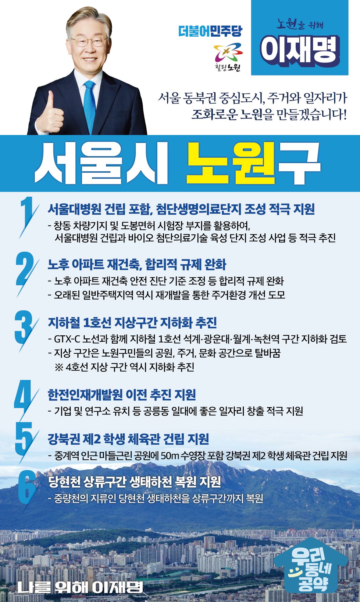

## 서울 지역 공약

# 노원구

### 노원 앞으로, 발전 제대로! 새로운 노원구를 위해!
> 2022-02-04

존경하는 서울 노원구민 여러분, 더불어민주당 대통령 후보 이재명입니다.

우리 노원구는 천혜의 자연환경을 바탕으로 주민들의 생활 만족도가 높은 지역이지만, 일자리와 산업시설이 부족한 전형적인 베드타운 지역입니다. 

다행히 노원구에는 창동차량기지와 도봉면허시험장, 한전인재개발원 등 새로운 일자리 창출과 서울의 균형발전을 이끌어 낼 수 있는 대규모 개발 가능 부지가 있습니다.

주거와 일자리 그리고 자연이 조화로운 살기좋은 노원, 노원의 미래를 위한 6대 지역공약을 말씀드리겠습니다.

첫째, 서울대병원 건립을 비롯한 첨단생명의료단지 조성을 적극 지원하겠습니다.

창동 차량기지와 도봉면허시험장 부지에 추진중인 서울대병원 건립과 바이오 첨단의료기술 육성단지 조성사업이 차질없이 추진될 수 있도록 범정부적인 지원을 아끼지 않겠습니다. 
노원은  도봉 K-POP전용 극장과 함께, 강북의 새로운 일자리 중심이 될 것입니다.

둘째, 노후아파트 재건축, 합리적 규제 완화로 주거환경을 새롭게 하겠습니다.

35년전 지하 주차장이 없이 지어진 상계동 주공아파트. 
주민들이 주차 고민 없이 편안하게 생활할 수 있도록 노후 아파트 재건축 안전진단 기준을 합리적으로 조정하겠습니다.
오래된 일반주택지역도 재개발을 통해 주거환경을 개선하겠습니다. 

셋째, 지하철 1호선 지상구간을 지하화하는 방안을 적극 검토하겠습니다.

GTX-C 노선과 함께 지하철 1호선 석계·광운대·월계·녹천역 구간 지하화를 검토하고 지상 구간은 노원구민들의 공원, 주거, 문화 공간으로 바꾸겠습니다. 

넷째, 한전인재개발원을 이전 추진을 지원하고 공릉동의 가치를 높이겠습니다. 

공공기관 지방이전에 따라 한전 인재개발원 이전을 적극 추진을 지원하겠습니다.
이 곳에는 기업 및 연구소 유치 등을 통해 공릉동 일대 좋은 일자리를 많이 만들 수 있도록 지원하겠습니다.

다섯째, 중계역 인근 강북 제2학생체육관 건립을 지원하겠습니다.

서울에 학생체육관은 강남권에만 한 곳 있습니다. 
중계역 인근 마들근린공원에 50미터 수영장을 포함하여 강북권 제2학생체육관 건립을 적극 지원하겠습니다. 

여섯째, 당현천 상류구간 생태하천 복원을 적극 지원하겠습니다. 

중랑천의 지류인 당현천 생태하천은 주민들의 행복한 휴식 공간입니다. 
이 당현천을 상류구간까지 복원하여 수락산 물길과 함께 주민들이 더 건강하게 여가를 즐길 수 있도록 하겠습니다.

존경하는 노원구민 여러분

저 이재명은 지킬 수 있는 것들만 약속했고 약속했던 것은 지켜왔습니다.
노원구 100년 미래를 위한 변화와 발전
행동과 실천으로 보여드리겠습니다.

노원 앞으로! 발전 제대로!
노원구를 위해 이재명은 합니다.