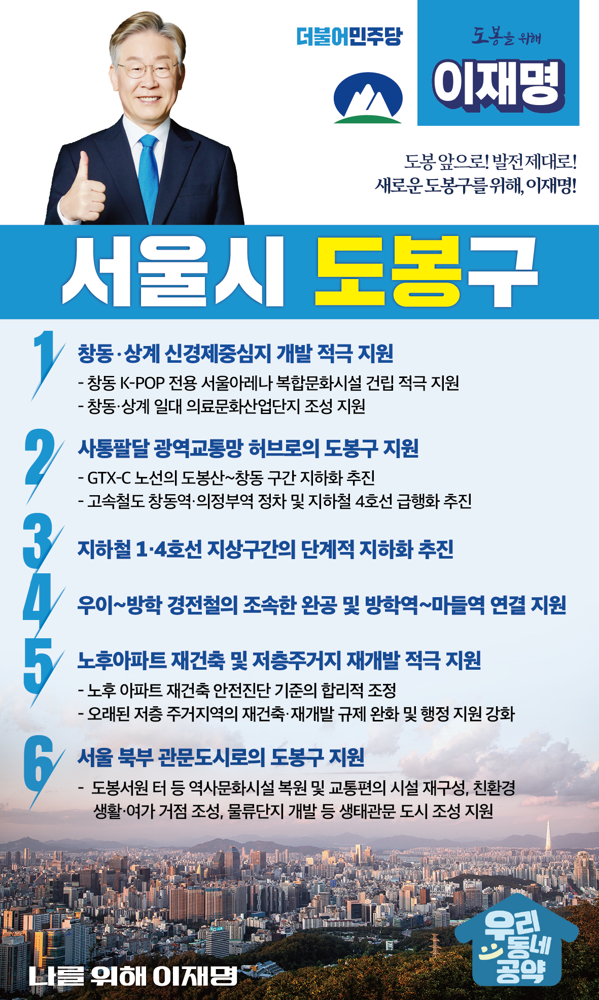

## 서울 지역 공약

# 도봉구

---

### 도봉 앞으로, 발전 제대로! 새로운 도봉구를 위해!
> 2022-02-04

존경하는 서울 도봉구민 여러분,

도봉산은 세계적 명산으로서 전국민의 사랑을 받고 있습니다. 하지만 우리 도봉구는 도봉산을 이용하는 전국민을 위하여 여러 규제를 감내하며 희생해 왔습니다.

이제 불필요한 규제를 과감히 뛰어넘어, 사통팔달, 일자리와 활력이 넘치는 도봉을 만들기 위한 6대 지역공약을 말씀드리겠습니다.

첫째, 창동･상계 신경제중심지가 서울 동북권 문화의료산업의 중심이 되도록 적극 지원하겠습니다.

창동에 2만석 규모로 건립중인 K-POP 전용 서울아레나 사업을 적극 지원하겠습니다. 
약 8만 개의 일자리가 창출되고 약 10조 원의 경제효과가 기대되는 창동‧상계 신경제중심지 개발로  
도봉구 일대가 경기 북부와 강남을 연결하는 동북권 광역거점이 되도록 하겠습니다. 

둘째, 도봉구가 사통팔달 광역교통망 허브가 되도록 돕겠습니다.

GTX-C노선의  ‘도봉산-창동’ 구간 지하화와 고속철도의 창동역·의정부역 정차를 추진하겠습니다. 
지하철 4호선은 급행화를 추진해 도봉구가 사통팔달 광역교통의 거점이 될 수 있도록 지원하겠습니다.

셋째, 지하철 1·4호선 지상구간을 단계적으로 지하화하겠습니다.

도봉구민들은 지하철 1·4호선의 지상구간 때문에 선로주변 소음·진동·분진, 토지이용 제한, 경관 훼손, 교통체증 등 다양한 불편을 겪어 왔습니다. 
도봉구의 발전을 가로막고 있는 지하철 1·4호선의 지상구간을 단계적으로 지하화하여 주민의 휴식공간과 일터로 만들겠습니다.

넷째, 우이~방학 경전철의 조속한 완공과 방학역~마들역 연결을 지원하겠습니다. 

지하철역과 멀리 떨어져 있는 방학·쌍문지역 주민들을 위해 우이~방학 경전철을 조속히 추진하겠습니다. 
그리고 방학역과 마들역을 이어 도봉 주민들의 이동권을 보장하고, 강남북 균형발전이 되도록 돕겠습니다. 

다섯째, 합리적인 규제 완화로 노후아파트의 재건축과 저층 주거지의 재개발을 적극 지원하겠습니다.

도봉구는 준공 30년이 넘은 아파트가 1/3이 넘습니다. 
도봉구 주민의 생활환경과 주거환경 개선하기 위해 노후 아파트 재건축 안전진단 기준을 합리적으로 조정하겠습니다.
오래된 저층 주거지역도 원활하고 신속하게 재건축·재개발이 이루어질 수 있도록 규제를 완화하고 행정 지원을 강화하겠습니다.

여섯째, 도봉구가 미래를 향한 관문도시로 발돋움하는 기틀을 마련하겠습니다.

도봉구가 통일시대를 여는 서울 북부 관문도시로서의 역할을 할 수 있도록 하겠습니다. 
도봉서원 터 등 역사문화시설 복원과 교통편의 시설 재구성, 친환경 생활·여가 거점 조성, 물류단지 개발 등을 통해 생태관문 도시가 되도록 지원하겠습니다.

존경하는 도봉구민 여러분,

저 이재명은 지킬 수 있는 것들만 약속했고 약속했던 것은 지켜왔습니다.
도봉구 100년 미래를 위한 변화와 발전, 행동과 실천으로 보여드리겠습니다.

도봉 앞으로! 발전 제대로!
도봉구민을 위해 이재명은 합니다.