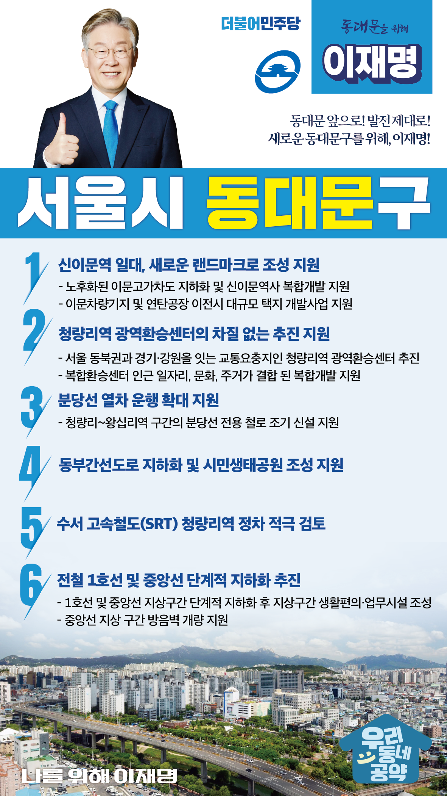

## 서울 지역 공약

# 동대문구

### 동대문 앞으로, 발전 제대로! 새로운 동대문구를 위해!
> 2022-02-04

존경하는 서울 동대문구민 여러분

동대문구는 청량리역과 천호대로 등 간선도로가 위치한 서울 동부권의 관문으로, 서울 중심과 주변 도시를 잇는 서울의 성장거점도시입니다.

동대문구는 KAIST, 종합대학 등이 밀집된 교육연구도시이자, 우리나라 전통 농경문화의 상징적 유적인 성농단을 품고 있어 전통과 현대가 함께 살아 숨 쉬는 문화도시이기도 합니다.

그러나 노후화된 역사와 교통체증의 문제는 동대문구 성장의 발목을 잡고 있습니다.

더 나은 동대문구를 위해서는 전환적 성장과 혁신적 도약이 필요합니다.
이재명의 동대문구 6대 공약을 말씀드리겠습니다. 

첫째, 신이문역 일대가 새로운 랜드마크로 거듭나도록 지원하겠습니다.

서울 동북권 발전을 위해 신이문역 일대의 개발이 필요합니다. 
노후화된 이문고가차도 지하화와 신이문역사의 복합개발을 통해 지역 간 단절을 해소하고 지역경제가 활성화 되도록 지원하겠습니다.
동대문구가 추진하고 있는 이문차량기지와 연탄공장의 이전과 대규모 택지 개발사업을 돕겠습니다.   
신이문역 일대가 새로운 랜드마크가 되도록 살피겠습니다.  

둘째, 청량리역이 서울 동북권의 중심으로 다시 태어나도록 지원하겠습니다. 

청량리역은 서울 동북권과 경기·강원을 잇는 교통의 요충지입니다. 
철도와 광역버스 노선이 다수 교차하지만 환승이 불편해 개선이 필요합니다.  
서울시가 추진하는 청량리역 광역환승센터 설치가 차질없이 추진되도록 지원하여 ‘초’단위 수평 환승 시스템을 구현하고 편리한 교통의 거점으로 만들겠습니다. 
복합환승센터 인근은 일자리, 문화, 주거가 결합된 복합개발이 이뤄질 수 있도록 적극 지원하겠습니다.

셋째, 분당선 열차운행의 확대로 강남 접근성을 높이겠습니다. 

선로용량이 부족한 청량리~왕십리역 구간은 열차운행 편수가 적어 강남권 이동에 많은 불편을 겪고 있습니다. 
‘제4차 국가철도망 구축계획’에 포함된 청량리~왕십리역 구간의 분당선 전용철로가 조속히 신설될 수 있도록 적극 지원하겠습니다.  

넷째, 동부간선도로를 지하화하고 시민생태공원이 조성되도록 지원하겠습니다. 

동부간선도로는 출퇴근 시간에 정체와 지체를 반복하는 상습 정체도로입니다.
도로 지하화를 통해 교통은 원활하게 만들고, 녹지 조성으로 주민들의 삶의 질을 높여야 합니다. 
동부간선도로를 지하화하고, 시민생태공원 조성을 지원해 시민들에게 돌려드리겠습니다.
사업에 만전을 기하여 동대문구를 서울 동북권의 대표적인 친환경 도시로 조성하겠습니다.

다섯째, 수서 고속철도(SRT) 청량리역 정차를 적극 검토하겠습니다.  

동대문구는 대규모 개발로 인해 교통 수요가 크게 증가할 예정으로 선제적 준비가 필요합니다. 
청량리역까지 SRT를 연장 운행하는 방안을 적극 검토하여, 동대문구에서 전국 각지까지 반나절 생활권인 교통 요지로 만들겠습니다. 

여섯째, 중앙선 철길 소음을 완화하고 전철 1호선, 중앙선을 단계적으로 지하화하겠습니다.

1호선과 중앙선 열차 운행으로 인한 소음 때문에 철로 주변에 거주하시는 인근 주민들이 불편을 겪고 있습니다. 
중앙선 지상 구간의 방음벽 개량사업을 지원하겠습니다.  
서울 동북권 발전을 막고 있는 1호선과 중앙선을 단계적으로 지하화하겠습니다. 
지상구간에 생활시설과 업무시설 등을 조성해 쾌적하고 활기찬 동대문을 만들겠습니다.

존경하는 동대문구 여러분!

동대문구의 전환적 성장을 위해서는 혁신적 도약이 필요합니다. 
한 번 약속하면 반드시 지키는 저 이재명, 여러분과 함께 하나하나 직접 챙기겠습니다.
실력과 성과로 입증된 이재명, 반드시 실천하겠습니다. 

동대문구 앞으로! 발전 제대로!
새로운 동대문구를 위해, 이재명!