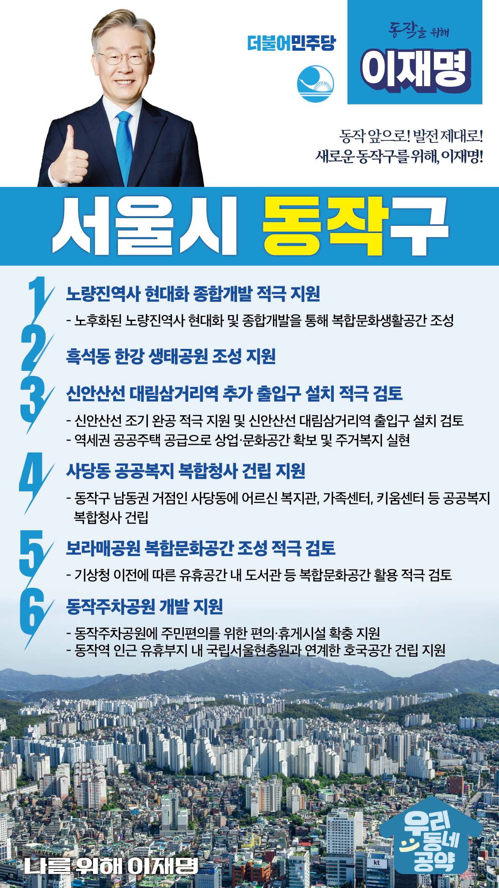

## 서울 지역 공약

# 동작구

### 동작 앞으로, 발전 제대로! 새로운 동작구를 위해! 
> 2022-02-04

존경하는 동작구민 여러분,

호국과 충절의 상징인 사육신묘와 국립서울현충원이 있는 곳, 우리나라의 역사를 보존하고 숭고한 혼을 기리는 동작구의 또 다른 이름입니다.

노량진 수산물도매시장부터 흑석 한강공원, 동작 주차공원까지 동작의 한강변을 중심축으로 하는 동작 개발은 서울의 새로운 중심, 동작의 미래를 만들어가는 초석이 될 것입니다.

명실상부한 교통의 요지를 넘어, 사람이 머무르고 문화가 교류하는 곳. 
자랑스러운 동작, 살만한 동네 동작을 위한 6대 공약을 말씀드립니다.

첫째, 노량진역사 현대화 종합개발을 적극 지원하겠습니다.

노후화된 노량진역사는 현대화 및 종합개발로 주택․공원․쇼핑․문화를 모두 갖춘 복합문화생활공간이 되도록 돕겠습니다.
노량진역사를 이용하는 시민들의 편의를 증진시키고, 동작구민의 삶의 질을 향상시키겠습니다.

둘째, 흑석동에 동작구민을 위한 한강 생태공원 조성을 지원하겠습니다. 

흑석역에서 한강으로 이어지는 한강 생태공원 조성을 지원하고 동작구 주민이 누릴 수 있는 복합 문화공간으로 만들겠습니다. 

셋째, 신안산선 대림삼거리역 추가 출입구 설치를 적극 검토하겠습니다.

신안산선이 조기에 완공되도록 적극 지원하겠습니다. 
신안산선 대림삼거리역에 유동인구가 많은 곳에 추가 출입구 설치를 적극 검토하겠습니다.  
역세권에 공공주택 공급으로 상업·문화공간을 확보하고 주거복지가 실현되도록 돕겠습니다. 

넷째, 사당동에 공공복지 복합청사가 건립되도록 지원하겠습니다.

동작구 남동권 거점인 사당동에 공공복지 복합청사를 건립해 복지 사각지대를 해소하고 행정서비스에 대한 접근성을 높이겠습니다. 
어르신 복지관, 가족센터, 키움센터 등을 만들어 모든 세대가 즐겨 찾는 행정·복지 서비스의 중심지가 되도록 돕겠습니다. 

다섯째, 보라매공원 복합문화공간 조성을 적극 검토하겠습니다.

기상청 이전이 단계적으로 진행되고 있습니다. 
동작구민들을 위한 교육, 문화, 여가 시설이 필요합니다.  
이에 따른 유휴공간이 도서관 등 복합문화공간으로 활용되도록 적극 검토하겠습니다. 

여섯째, 동작역 동작주차공원이 원활히 개발되도록 지원하겠습니다.

동작주차공원에 주민편의를 위한 편의·휴게시설이 확충되도록 지원하겠습니다. 
동작역을 국립서울현충원과 연계해 ‘호국의 상징’인 동작에 걸맞은 곳으로 만들겠습니다.

존경하는 동작구민 여러분!

동작구의 새로운 도약을 위해서는 일을 할 줄 아는 사람이 필요합니다.
이재명은 지킬 수 있는 것만 약속했고 약속했던 것은 지켜왔습니다.
살기 좋은 동작구의 미래를 위한 약속, 실력과 성과로 입증된 이재명이 반드시 실천하겠습니다.

동작 앞으로, 발전 제대로!
동작구민을 위해, 이재명은 합니다!