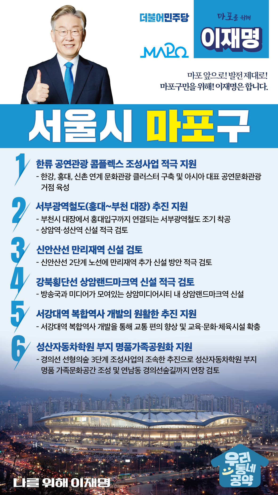

## 서울 지역 공약

# 마포구

### 마포 앞으로, 발전 제대로! 새로운 마포구를 위해!
> 2022-02-04

사랑하는 마포구민 여러분,

일명 연트럴파크로 불리는 경의선숲길과 한강을 앞에 둔 마포구는 홍대와 연남동 등을 중심으로 문화와 젊음이 넘치는 곳입니다. 
또한 상암DMC를 중심으로 한 방송·미디어산업과 한류 문화 산업의 새로운 거점으로의 변신을 꾀하고 있으며 서울 서부권의 중심지로 주목받고 있습니다.

살기 좋은 마포구를 한 단계 더 도약시킬 저 이재명의 6대 지역공약을 말씀드리겠습니다.

첫째, 한류 공연관광 콤플렉스 조성사업을 적극 지원하겠습니다.

마포유수지 일대에 한류 공연관광 콤플렉스 조성을 지원해 마포가 한류문화의 거점이 되도록 하겠습니다.
한강, 홍대, 신촌과 연계한 문화관광 클러스터를 구축해 대표적인 공연문화관광 중심지가 되도록 지원하겠습니다. 

둘째, 홍대∼부천 대장을 연결하는 서부광역철도의 조속한 추진을 지원하겠습니다.

부천시 대장에서 홍대입구까지 연결되는 서부광역철도를 조기에 착공하겠습니다.  
마포구 교통인프라 확충을 위해 상암역·성산역 신설도 적극 검토하겠습니다.

셋째, 신안산선 만리재역 신설을 검토하겠습니다.

마포구, 용산구, 중구 3개구가 인접한 만리재는 교통이 불편한 지역입니다. 
신안산선 2단계 노선 사업구간 내에 만리재역 신설방안을 적극 검토하겠습니다.

넷째, 강북횡단선 상암랜드마크역 신설을 적극 검토하겠습니다.

방송국과 미디어가 모여있는 상암미디어시티에 상암랜드마크역 신설을 적극 검토하겠습니다.  
마포구민의 도시철도 접근성을 향상하고 상암 일대의 가치를 높이겠습니다.

다섯째, 서강대역 복합역사 개발이 원활하게 추진되도록 지원하겠습니다.

서강대역 복합역사 개발을 통해 교통 편의를 높이고 교육·문화·체육시설도 확충하여 마포에 새로운 활력을 불어넣겠습니다.

여섯째, 성산자동차학원 부지가 시민을 위한 공원이 되도록 지원하겠습니다. 

경의선 선형의숲 3단계 조성사업의 조속한 추진으로 성산자동차학원 부지가 명품가족문화공간이 되도록 돕겠습니다.  
연남동 경의선숲길까지의 연장도 검토하겠습니다. 

존경하는 마포구민 여러분!

이재명은 지킬 수 있는 것만 약속했고 약속했던 것은 지켜왔습니다.
살기 좋은 마포 미래를 위한 약속, 실력과 성과로 입증된 이재명이 반드시 실천하겠습니다.

마포 앞으로! 발전 제대로! 
마포구민을 위해, 이재명!