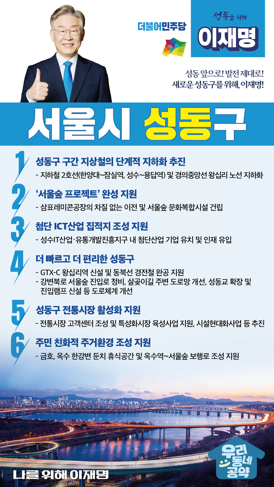

## 서울 지역 공약

# 성동구

### 성동 앞으로, 발전 제대로! 새로운 성동구를 위해! 
> 2022-02-04

존경하는 서울 성동구민 여러분, 

서울의 랜드마크인 서울숲이 자리하고 있는 성동구는 청계천, 중랑천, 한강이 아우르는 서울 최고의 수변도시입니다. 
또한, 성동구는 340여개 기업과 3천여명의 청년들이 모여 있는 전국 최대 규모의 소셜벤처 생태계를 형성하고 있는 혁신의 중심지입니다. 

저 이재명이 성동구민 여러분과 함께 성동구의 성장 잠재력을 이끌겠습니다.
이를 위한 성동구 6대 공약을 말씀드리겠습니다.

첫째, 성동구 구간 지상철의 단계적 지하화를 추진하겠습니다. 

한양대에서 잠실역, 성수에서 용답역의 지하철 2호선과 경의중앙선의 왕십리 노선 지하화를 단계적으로 추진하여 소음과 진동, 지역생활권 단절 문제를 해결하겠습니다. 

둘째, ‘서울숲 프로젝트’가 완성되도록 지원하겠습니다. 

삼표레미콘 공장이 차질 없이 이전되도록 지원하여 서울숲을 온전히 시민에게 돌려드리겠습니다. 
더불어 문화복합시설 건립을 통해 서울숲이 자연과 문화를 함께 누릴 수 있는 문화예술 클러스터가 되도록 적극 지원하겠습니다. 

셋째, 성동구가 첨단 ICT산업의 집적지가 되도록 지원하겠습니다.

‘성수IT산업‧유통개발진흥지구’에 여러 첨단산업 기업 유치를 지원하여 성동구가 ICT와 신산업 기반 중심지가 되도록 돕겠습니다.  

넷째, 더 빠르고 더 편리한 성동구가 되도록 지원하겠습니다. 

GTX-C 왕십리역 신설과 동북선 경전철 완공을 통해 스마트 교통도시가 될 수 있도록 지원하겠습니다. 
혼잡한 강변북로의 서울숲 진입로를 정비하고, 살곶이길 주변 도로망 개선, 성동교 확장 및 진입램프 신설 등을 지원하여 성동구민들의 교통편의를 높이겠습니다.

다섯째, 더 쾌적하고 활기찬 성동구 전통시장이 되도록 돕겠습니다. 

뚝도시장, 한양대앞 상점가, 뚝섬역 상점가 등에 고객센터를 조성하고, 행당시장과 성수역상점가를 특성화시장으로 발전되도록 지원하겠습니다.  
또한 마장축산물시장, 금남시장 등의 현대화도 지속적으로 추진되도록 살펴보겠습니다.

여섯째, 주민 친화적 주거환경을 갖춘 성동구가 되도록 지원하겠습니다.  

금호, 옥수 한강변 둔치에 주민 종합휴식공간 조성을 지원하겠습니다.  
한강을 따라 옥수역에서 서울숲까지 쾌적하고 안전하게 걸을 수 있는 보행환경이 되도록 살피겠습니다.  
성동구가 서울의 대표적인 신흥 주거지에 걸맞은 주거환경을 갖출 수 있도록 노력하겠습니다.

존경하는 성동구민 여러분!

저는 그동안 지킬 수 있는 약속을 했고, 약속드린 것을 반드시 지켜왔습니다.
제게 약속을 지킬 기회를 허락해주십시오.
실력과 성과로 입증된 제가 오늘 여러분께 드린 약속을 반드시 실천하겠습니다. 

멈춤없는 성동발전을 위해 ! 
성동 앞으로 ! 발전 제대로 ! 
나를 위해! 이재명! 