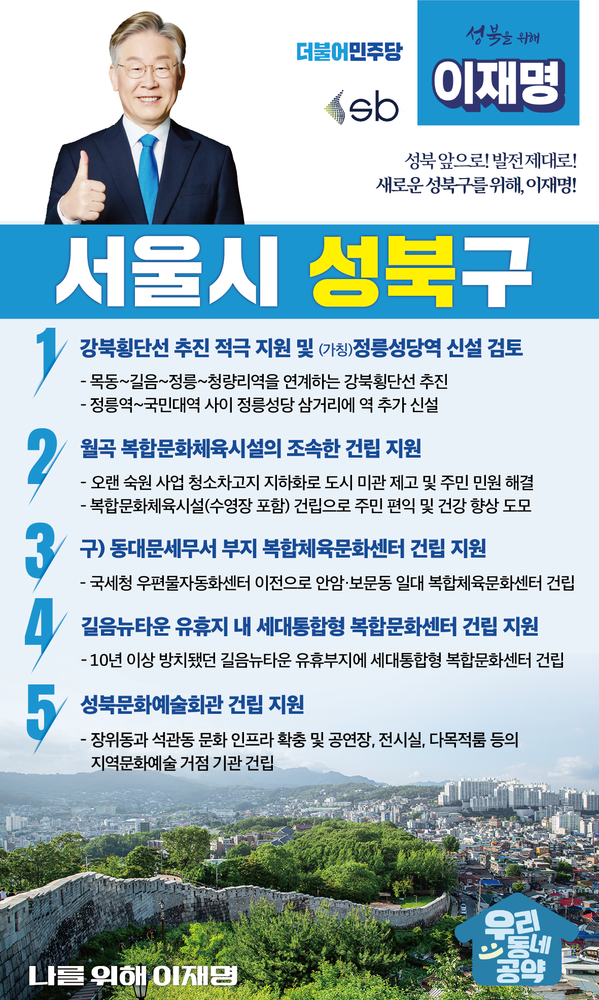

## 서울 지역 공약

# 성북구

### 성북 앞으로, 발전 제대로! 새로운 성북구를 위해! 
> 2022-02-04

존경하는 서울 성북구 주민 여러분, 

성북구는 서울 도심과 동북권 지역을 연결하는 요지이자, 과거와 현재, 미래가 공존하는 도시입니다.

북한산과 정릉천 등 천혜의 자연환경을 바탕으로 성북구는 정릉과 의릉 그리고 서울성곽 등의 역사문화유산과 더불어 박물관 등 역사문화자원이 풍부한 곳입니다. 또한 관내에 8개의 대학교 자리 잡은 교육의 중심입니다.

성북구는 ‘주거중심 도시’를 장점으로 사람과 삶, 이야기가 있는 마을공동체와 사회적경제 메카로 잘 알려져 있습니다. 

양극화와 불평등의 위기 속에서도 연대와 협동의 가치로 서로에게 힘이 되는 마을민주주의의 거점, 성북구를 응원합니다.

저 이재명은 성북구가 더 살기 좋은 도시로 성장할 수 있도록 다음과 같은 5대 공약을 말씀드리겠습니다. 

주민들의 염원을 모아 성북구에 활력을 불어넣겠습니다.

첫째, 강북횡단선 추진을 지원하고 (가칭)정릉성당역 신설 방안을 검토하겠습니다.

도시철도 취약 지역인 성북구에 강북횡단선이 추진될 수 있도록 지원하겠습니다. 
특히 정릉3동 주민센터 인근과 배밭골 등 주거밀집지역에 역이 신설된다면 주민의 삶과 교통접근성이 높아질 것입니다. 

둘째, 월곡 복합문화체육시설이 조속히 건립되도록 지원하겠습니다.

월곡동 주민들의 오랜 숙원사업인 청소차고지를 지하화하여 지상에 복합문화체육시설 건립이 추진되고 있습니다. 
조속한 건립으로 주민들의 삶의 질을 높이고, 주민들의 편익과 건강을 동시에 챙기겠습니다. 

셋째, 구)동대문세무서 일대가 복합체육문화센터로 재탄생되도록 지원하겠습니다. 

구)동대문세무서에 들어선 국세청 우편물자동화센터가 이전하게 되면, 안암‧보문 일대 주민들의 숙원사업인 복합체육문화센터가 건립되도록 지원하겠습니다. 

넷째, 길음동에 아이부터 어르신까지 이용할 수 있는 세대통합형 복합문화센터 건립을 지원하겠습니다.

뉴타운 개발로 길음동은 노년층과 청년층이 함께 거주하고 있는 특성이 있습니다. 
10년 이상 방치됐던 길음뉴타운 유휴부지에 세대통합형 복합문화센터가 하루빨리 건립될 수 있도록 지원하겠습니다.  

다섯째, 지역 문화발전의 거점, 성북 문화예술회관 건립을 지원하겠습니다.

성북 문화예술회관이 건립된다면 장위동과 석관동의 문화 인프라가 확충되고 지역문화예술의 거점이 될 것입니다. 문화예술회관 건립이 원만히 추진되도록 지원하여 지역문화공동체 형성에 보탬이 되게 하겠습니다.  

존경하는 성북구민 여러분!

성북의 변화와 새로운 미래를 위해 저 이재명이 앞장서겠습니다. 
성북구민 여러분께서 제 뒤를 받쳐주십시오.
저는 그동안 지킬 수 있는 것만 약속했고, 약속은 꼭 지켰습니다.
오늘 여러분께 드린 약속도 실력과 성과로 입증된 제가 반드시 실천하겠습니다.

성북 앞으로! 발전 제대로!
새로운 성북을 위해, 이재명! 