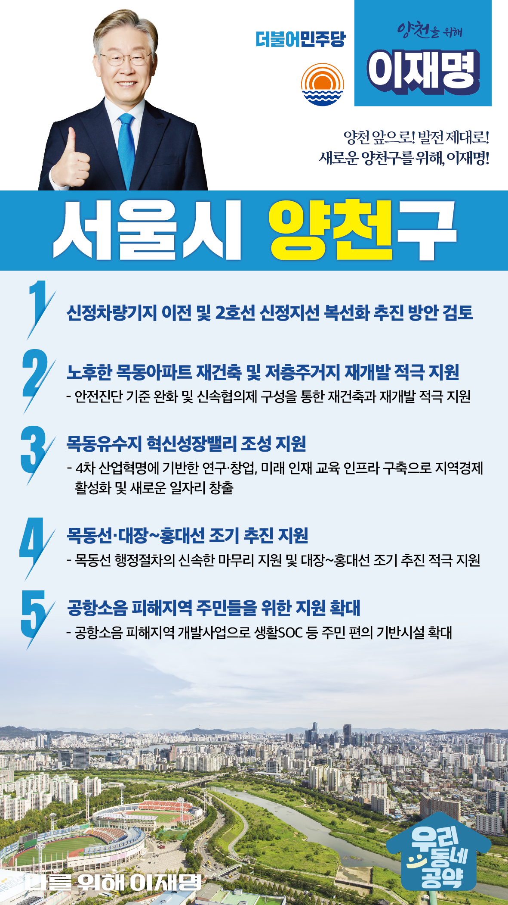

## 서울 지역 공약

# 양천구

### 양천 앞으로, 발전 제대로! 새로운 양천구를 위해! 
> 2022-02-04

존경하는 서울 양천구민 여러분,

우리 양천구는 서울의 대표적인 교육도시입니다. 
높은 교육열에 걸맞은 교육 인프라를 갖추고 있지만, 일자리와 산업시설이 부족한 전형적인 베드타운이기도 합니다. 

한편 입주 30년이 넘은 목동아파트 등 노후된 아파트 지역과 저층주거지가 많아 재개발과 재건축의 신속한 추진이 지역의 큰 관심인 곳입니다. 
또한 신월동 일대는 지하철 이용이 불편해 도심으로 출퇴근이 어려워 도시철도에 대한 기대가 큰 곳이기도 합니다.

쾌적하고 살기 좋은 교육도시, 양천구의 미래를 위해 저 이재명의 양천 발전 5대 지역공약을 말씀드리겠습니다.

첫째, 신정차량기지 이전과 신정지선 복선화 추진방안을 검토하겠습니다.

신정차량기지는 도시 팽창으로 주거지 중심부에 위치하게 되어 지역발전 저해하고 있습니다. 
이를 해소하기 위해 신정차량기지 이전을 적극 검토하겠습니다. 
또한 지하철 2호선 지선의 사용성을 높이기 위한 복선화 추진도 검토하겠습니다.

둘째, 노후한 목동아파트 재건축과 저층주거지 재개발을 적극 지원하겠습니다.

30년이 넘은 목동의 아파트들은 심각한 주차난, 녹물, 내진설계 미반영으로 인한 불편을 겪고 있습니다.  
안전진단 기준 완화와 ‘신속협의제’구성을 통한 신속한 사업 추진을 지원하여 목동아파트 재건축과 일반주택지역의 재개발을 적극 지원하겠습니다.

셋째, 목동유수지에 혁신성장밸리 조성을 돕겠습니다.

목동유수지 일대를 혁신성장을 위한 지역으로 발전할 필요가 큽니다.  
4차 산업혁명에 기반한 연구·창업, 미래 인재 교육 인프라를 구축하여 지역경제 활성화 및 새로운 일자리가 창출되도록 돕겠습니다.

넷째, 목동선·대장-홍대선 조기 추진을 지원하겠습니다.

신월 1동부터 7동까지는 지하철역이 전혀 없는 도시철도 소외지역입니다. 
목동선이 행정절차를 신속히 마무리하고 현실화 될 수 있도록 지원하겠습니다.  
대장-홍대선의 조기 추진을 적극 지원하여 신월동 역세권 시대를 열겠습니다. 

다섯째, 공항소음 피해지역 주민들을 위한 지원을 확대하겠습니다. 

김포공항을 오가는 항공기로 인한 소음과 분진으로 주민들이 일상생활에 불편함을 겪고 있습니다. 
소음피해지역 주민들을 위한 생활SOC 등 지원을 확대하겠습니다.  

존경하는 양천 구민 여러분!

이재명은 지킬 수 있는 것만 약속했고 약속했던 것은 지켜왔습니다.
살기 좋은 양천 미래를 위한 약속,  실력과 성과로 입증된 이재명이 반드시 실천하겠습니다.

양천 앞으로! 발전 제대로! 
양천 구민을 위해, 이재명! 