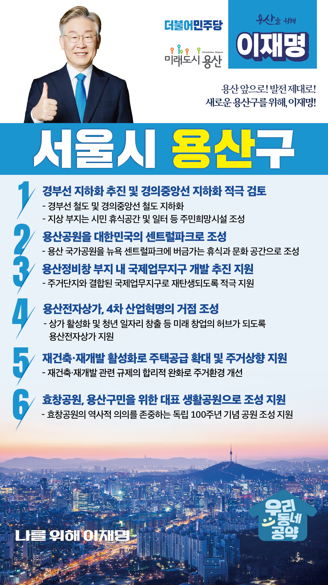

## 서울 지역 공약

# 용산구

---

### 용산 앞으로, 발전 제대로! 새로운 용산구를 위해!
> 2022-02-04

존경하는 용산구민 여러분, 

용산구는 서울의 발전과 함께해온 서울의 지리적 중심일 뿐만 아니라 KTX와 6개 노선의 도시철도로 서울 전역과 전국으로 빠르게 연결되는 사통팔달의 교통 중심지입니다. 
그러나 지역경제의 중심인 용산전자상가가 침체 되고, 코로나 등으로 이태원 일대는 활기를 잃어버렸습니다.
그럼에도 불구하고 용산구는 미군부대 이전, 용산정비창 개발 등으로 다시 미래를 위한 새로운 변화를 앞두고 있습니다. 

용산구 미래를 위한 저 이재명의 6대 지역공약을 말씀드리겠습니다.

첫째, 경부선 지화하를 추진하고 경의중앙선 지하화를 적극 검토하겠습니다. 

경부선 지하화를 추진해 지상구간은 시민들의 휴식과 일자리를 위한 공간으로 조성하겠습니다. 
경의중앙선 지하화도 적극 검토해 동서남북으로 단절된 용산이 다시 연결되도록 지원하겠습니다. 

둘째, 용산공원을 대한민국의 센트럴파크로 만들겠습니다.

이제 용산미군기지가 우리 품으로 돌아옵니다. 
우리나라를 대표할 도시생태공원으로 새롭게 탄생할 것입니다. 
용산 국가공원을 뉴욕의 센트럴파크에 버금가는 자연 속 휴식과 문화의 공간으로 조성하여 공원의 도시 용산을 만들겠습니다.

셋째, 용산정비창 부지에 국제업무지구 개발이 원만히 추진되도록 지원하겠습니다. 

용산역은 명실상부한 대한민국 철도교통의 허브입니다. 
용산정비창 부지에 철도교통의 허브로써 필요한 핵심 시설과 주거단지가 결합된 국제업무지구 개발을 적극 지원하겠습니다. 

넷째, 용산전자상가가 4차 산업혁명의 거점이 되도록 지원하겠습니다.

1987년 개장 이후 우리나라 대표 전자상가였던 용산전자상가는 30년이 지난 현재 시설노후화와 온라인 쇼핑 활성화로 낙후되고 있습니다. 
용산전자상가를 4차산업혁명의 거점이 되도록 적극 지원하여 청년 일자리를 늘리고 미래 창업의 허브가 되도록 하겠습니다. 

다섯째, 재건축·재개발 활성화로 주택공급을 확대하겠습니다.

용산은 오래된 주택과 노후 아파트들이 많습니다. 
재건축·재개발 관련 규제의 합리적 완화로 주거환경을 새롭게 개선하겠습니다. 
주거와 생활환경을 개선하려는 재개발·재건축의 본래 기능을 살려 주택공급을 확대하고 주민의 주거상향을 지원하겠습니다. 

여섯째, 효창공원을 용산구민을 위한 대표 생활공원으로 돌려드리겠습니다. 

효창공원은 애국지사를 기리기 위해 조성되어 이제는 용산구민의 사랑받는 생활공원입니다. 
효창공원의 역사적 의의를 존중하는 독립 100주년 기념 공원으로 조성되도록 지원하겠습니다. 
효창운동장을 용산을 대표하는 생활공원이 되도록 지원하겠습니다. 

존경하는 용산구민 여러분

그동안 용산은 경부선 철도 지하화와 용산공원 조성 등 해결해야 할 과제들이 많지만 실제로는 결실을 맺지 못했습니다. 
저 이재명은 지킬 수 있는 것들만 약속했고, 약속했던 것은 반드시 지켜왔습니다. 
용산을 국제적인 비즈니스 중심지로, 남산과 한강을 잇는 생태의 중심 도시로 만들겠습니다. 

용산 앞으로! 발전 제대로!
용산구민을 위해 이재명은 합니다. 