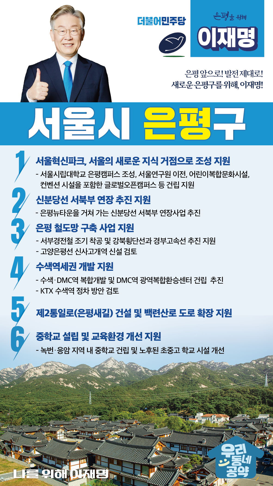

## 서울 지역 공약

# 은평구

### 은평 앞으로, 발전 제대로! 새로운 은평구를 위해!
> 2022-02-04

존경하는 서울 은평구민 여러분,

은평구는 북한산과 불광천을 배경으로 유서 깊은 사찰을 비롯하여 한문화와 한옥마을을 경험할 수 있는 한문화체험특구입니다.
이처럼 자연과 사람이 조화를 이루어 살아가기 좋은 은평이지만 구도심으로서의 겪는 교통 불편과 생활 인프라 부족 또한 은평구의 현실입니다. 

저 이재명, 은평구민 여러분들과 함께 새로운 은평, 활력 있는 은평을 위한 6대 지역공약을 말씀드리겠습니다.

첫째, 은평 주민들을 위한 서울혁신파크가 되도록 지원하겠습니다. 

서울혁신파크에 당초 계획대로 서울시립대학교 은평캠퍼스 조성, 서울연구원 이전, 컨벤션 시설을 포함한 글로벌오픈캠퍼스와 어린이복합문화시설이 건립될 수 있도록 지원하겠습니다. 

둘째, 강남북 균형발전의 핵심인 신분당선 서북부 연장 추진을 지원하겠습니다.

신분당선은 서울 서북부 주민들의 열악한 교통 불편 해소를 위한 숙원 사업입니다. 
또한 강남북 지역균형발전을 위한 선도 사업입니다. 
은평뉴타운을 거쳐 가는 신분당선 서북부 연장 추진을 지원하여 은평의 가치를 높이겠습니다.

셋째, 은평을 철도 교통의 허브가 되도록 지원하겠습니다.

서부경전철 사업이 차질 없이 착공될 수 있도록 꼼꼼히 살피겠습니다. 
주변 신도시 개발에 따른 교통량 증가로 고통 받고 있는 은평 주민을 위해 고양은평선 신사고개역 신설을 검토하겠습니다. 
또한 수색 지역에 추진되고 있는 강북횡단선, 경부고속선 사업도 적극 지원하겠습니다.

넷째, 통일 대한민국 시대를 대비한 수색역세권 개발을 지원하겠습니다. 

수색·DMC역 복합개발을 통해 지역 주민들의 편의성을 높이고 상권을 살려야 합니다.  
경의선과 공항철도와의 연계성을 높이기 위해 KTX를 수색역에 정차하는 방안도 검토하겠습니다.  
광역복합환승센터 설치하여 수색이 통일 대한민국을 대비한 교통 허브가 되도록 지원하겠습니다.

다섯째, 은평 일대의 만성적 교통체증이 해소되도록 지원하겠습니다. 

서울 중심부에서 은평을 거쳐 경기도로 이어지는 통일로는 교통체증이 극심한 도로입니다. 백련산로 또한 마찬가지입니다. 
제2통일로인 은평새길과 백련산로의 도로 확장을 통해 은평 일대의 만성적 교통체증을 해소하는 방안을 적극 검토하겠습니다. 

여섯째, 교육 환경을 개선하여 살기 좋은 은평을 만들겠습니다.

나날이 발전하고 있는 은평, 하지만 초등학생 자녀를 둔 녹번, 응암 지역 주민들은 이사를 고민합니다. 바로 녹번·응암 지역에 중학교가 부족하기 때문입니다. 
또한 노후화된 학교도 많아 개선이 시급합니다. 
중학교 과밀하급 해소와 학교 환경 개선을 적극 지원하겠습니다. 

존경하는 은평구민 여러분!

은평구의 새로운 발전과 미래를 위해 노력하겠습니다.
지금껏 그래왔던 것처럼 저는 약속한 것은 꼭 지킵니다.
오늘 여러분께 드린 약속도 실력과 성과로 입증된 제가 반드시 실천하겠습니다.

은평 앞으로! 발전 제대로!
더 살기 좋은 은평을 위해, 이재명!