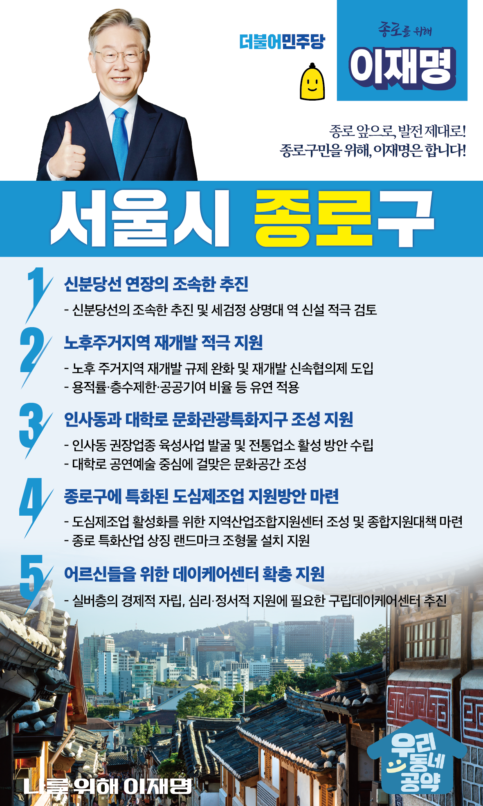

## 서울 지역 공약

# 종로구

### 종로 앞으로, 발전 제대로! 새로운 종로구를 위해!
> 2022-02-04

존경하는 종로구민 여러분, 

종로구는 명실상부한 서울 천년 역사의 중심입니다.
정치적 중심지인 세종로와 태평로가 있고, 육의전이 있던 경제적 중심지였습니다. 
이런 역사와 전통은 종로구의 자랑입니다. 

그러나 노후화된 인프라로 인해 종로구의 강점이 퇴색되고 있습니다.
종로구를 다시 서울의 중심, 대한민국의 중심으로 만들어야 합니다. 

종로를 과거와 미래, 문화와 산업이 공존하는 곳으로 재탄생시키겠습니다. 

낙후한 주거지역을 개선하고 교통환경을 개선하여 사람 사는 종로로, 
젊음의 대학로와 역사의 인사동을 특화하여 문화의 종로로
악기, 보석 등의 고부가가치 도심제조업을 특화하여 장인(匠人)의 종로로 만들겠습니다.

이재명과 민주당이 제대로 종로구를 발전시키기 위해 5대 공약을 말씀드립니다.

첫째, 신분당선 연장을 조속히 추진하겠습니다.

종로구 서북부 지역은 광화문 일대와 가깝지만 
경복궁 등 문화재와 북악산 등으로 인해 이동에 불편을 겪어왔습니다.
신분당선을 조속히 추진해 종로구의 교통여건을 개선하겠습니다.  
‘세검정 상명대 역’ 신설도 적극 검토하겠습니다. 
GTX-A와 신분당선 연장은 종로구 서북부 교통이 전기가 될 것입니다. 

둘째, 종로구 노후주거지역 재개발을 적극 지원하겠습니다.

창신동과 숭의동은 주거환경 노후화로 주민분들이 많은 고통을 받고 계셨습니다.
노후 주거지역의 재개발 규제를 완화하고 
재개발 신속협의제를 도입해 빠른 재개발이 이뤄지도록 돕겠습니다. 
용적률·층수제한·공공기여 비율 등도 유연하게 적용하겠습니다. 

셋째. 인사동과 대학로의 문화관광특화지구 조성을 지원하겠습니다.
인사동 일대와 대학로를 종로만의 특색이 담긴 
세계적인 명품거리가 되도록 지원하겠습니다. 
인사동에는 권장업종 육성사업을 발굴하고, 전통업소 활성화 방안을 수립하겠습니다.
대학로는 공연예술의 중심에 걸맞은 문화공간을 조성하겠습니다.

넷째. 종로구에 특화된 도심제조업 지원방안을 마련하겠습니다. 

악기․보석․패션 등 도심제조업은 종로구와 서울 경제의 원동력이었으나 
활력을 잃어가고 있습니다.
악기․보석․패션 등 종로구의 특화산업은 성장가능성이 무궁무진합니다.
도심제조업 활성화를 위해 지역산업조합지원센터 조성을 지원하고, 
종합지원대책을 마련하겠습니다.
종로 특화산업을 상징하는 랜드마크 조형물 설치도 지원하겠습니다. 

다섯째. 어르신들을 위한 데이케어센터 확충을 지원하겠습니다. 

노인성 질환으로 전문적인 돌봄이 필요한 어르신들이 늘어나고 있습니다.
내 집처럼 편안한 환경에서 전문인력의 돌봄을 받으며 생활하는 곳이 필요합니다.
종로구에 데이케어센터가 추가로 설치될 수 있도록 지원하겠습니다. 

존경하는 종로구민 여러분!

이재명은 지킬 수 있는 것만 약속했고 
약속했던 것은 지켜왔습니다.
살기 좋은 종로구 미래를 위한 약속
실력과 성과로 입증된 이재명이 반드시 실천하겠습니다.

종로 앞으로, 발전 제대로!
종로구민을 위해, 이재명은 합니다!