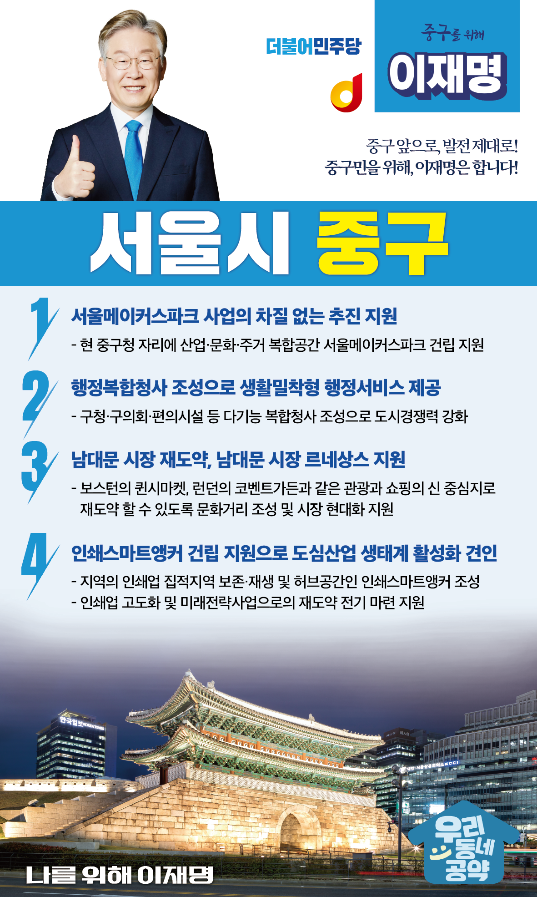

## 서울 지역 공약

# 중구

---

### 중구 앞으로, 발전 제대로! 새로운 중구를 위해!
> 2022-02-04

존경하는 서울 중구 시민 여러분.

더불어 민주당 대통령 후보 이재명입니다.

남산 북쪽에 위치한 중구는 서울의 중심이었으나 정체기를 거치면서 많은 주민들이 중구를 떠나 현재는 서울에서 가장 적은 주민이 거주하는 자치구가 되었습니다.
중구는 남대문으로 상징되는 역사와 남산이라는 자연환경이 있습니다. 오래된 주거지에 다시 새로운 기운을 불어넣을 수 있다면 중구는 다시 사람살기 좋은 동네로 태어날 수 있습니다.

중구 대전환이 필요합니다.
패션, 공예 등의 전문가들의 상상력이 넘치는 도심의 혁신공간으로, 깨끗하고 믿을 수 있는 현대화된 상업지역으로, 행정, 복지, 문화 등을 즐길 수 있는 도심의 주거지역이 되어야 합니다.

중구 재도약을 실현하기 위한 서울 중구 4대 공약을 말씀드리겠습니다.

첫째, 서울메이커스파크 사업이 차질 없이 추진되도록 지원하겠습니다.

중구는 서울 도심의 대표적 제조업 집적지입니다. 그러나 세운상가 일대 개발로 인한 도심 제조업 여건이 악화되고 있습니다.
현 중구청 자리에 산업·문화·주거 복합공간인 서울메이커스파크 건립을 지원하겠습니다. 이 사업은 인쇄산업진흥센터, 충무아트센터 등 공연시설과 공공주택이 어우러진 도심 신산업거점이 될 것입니다.

둘째, 행정복합청사 조성으로 생활밀착형 행정서비스를 제공하겠습니다.

구민 70%가 중구 동쪽에 거주하지만, 구청사가 산업 밀집지역에 위치하여 주민 접근성이 낮고 청사의 노후화, 주민이용시설 부족 등 행정시설 개선도 필요합니다.
구청·구의회·편의시설 등 다기능 복합청사 조성을 통해 중구 도시경쟁력을 높일 수 있도록 지원하겠습니다.

셋째, 남대문 시장 재도약, 남대문 시장 르네상스를 지원하겠습니다.

남대문시장은 대한민국 전통시장의 상징이자 역사입니다.
그러나 유통환경의 변화와 시설노후화, 코로나-19의 여파로 매우 힘든 상황입니다.
남대문 시장 르네상스 사업을 통해 보스턴의 퀸시마켓, 런던의 코벤트가든과 같은 관광과 쇼핑의 신 중심지로 재도약 할 수 있도록 지원하겠습니다.

넷째,  인쇄스마트앵커 건립을 지원하여 도심산업 생태계 활성화를 견인하겠습니다.

중구는 대표적 도심산업인 인쇄산업의 메카입니다. 그러나 열악한 작업 환경 및 저부가가치 생산 구조로 인해 침체기에 접어들었습니다. 지역의 인쇄업 집적지역을 보존·재생하고, 허브공간인 인쇄스마트앵커를 조성하여 인쇄업 고도화 및 미래전략사업으로의 재도약 전기를 마련하도록 지원하겠습니다.

중구의 미래 앞으로! 중구 발전 제대로!
새로운 중구를 위해, 이재명은 합니다!