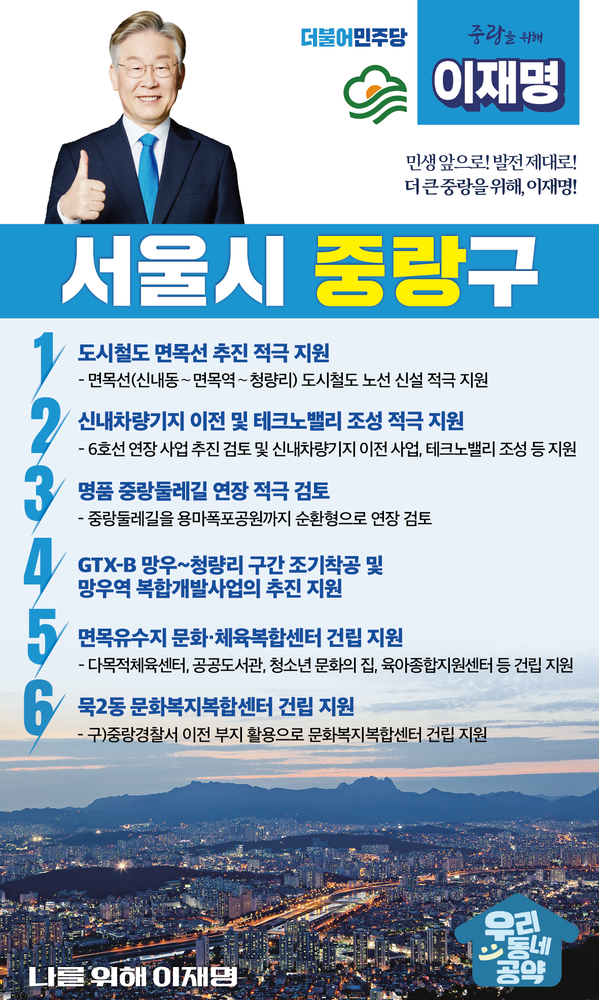

## 서울 지역 공약

# 중랑

### 중랑 앞으로, 발전 제대로! 새로운 중랑구를 위해! 
> 2022-02-04

존경하는 서울 중랑구민 여러분,

중랑구는 용마산, 망우산, 봉화산, 중랑천을 앞뒤로 두고 따뜻하고 인정이 넘치는 살기좋은 지역입니다. 또한 지역발전의 잠재력이 그 어느 곳보다 높은 지역입니다. 
이러한 중랑구를 더욱 살기 좋은 곳으로 만들기 위해 전환적 성장과 혁신적 도약이 필요합니다. 

저 이재명이 중랑구에 새로운 활력을 불어넣을 중랑구 6대 공약을 말씀드리겠습니다.

첫째, 도시철도 면목선이 추진되도록 적극 지원하겠습니다. 

중랑구는 아직도 대중교통 접근이 어려운 곳이 있습니다. 
중랑구민들이 지하철을 더 가깝고 쉽게 이용할 수 있도록 면목선이 조기에 추진되도록 돕겠습니다.  

둘째, 신내차량기지 이전과 테크노밸리 조성을 적극 지원하겠습니다.

6호선 연장 사업이 추진될 수 있도록 검토하고, 신내차량기지 이전과 테크노밸리 조성을 적극 지원하겠습니다. 
신내에 들어설 테크노밸리는 일자리가 창출되어 중랑구의 미래 먹거리가 될 것입니다. 

셋째, 명품 중랑둘레길 연장을 적극 검토하겠습니다.

중랑구민들의 휴식공간이자 자랑인 중랑둘레길을 서울 시민 모두가 찾아올 수 있도록 용마폭포공원까지 순환형으로 연장하는 방안을 적극 검토하겠습니다. 

넷째, GTX-B 망우~청량리 구간의 조기착공과 망우역 복합개발사업 추진을 지원하겠습니다.

중랑구민들의 교통 편의를 위해 GTX-B 망우~청량리 구간이 조기에 착공될 수 있도록 지원하겠습니다. 
또한 망우역 복합개발사업의 차질 없는 추진을 지원하여 지역 상권을 활성화하고 중랑구민의 문화복지를 향상시키겠습니다.  

다섯째, 중랑구가 추진중인 면목유수지 문화·체육복합센터 건립을 돕겠습니다. 

현재 면목유수지에 추진중인 문화체육복합센터 건립을 지원해 그동안 부족했던 중랑구민의 체육과 문화여가 활동을 즐길 수 있는 공간을 마련하겠습니다.  

여섯째, 중랑구가 추진중인 묵2동 문화복지복합센터 건립을 돕겠습니다. 

구)중랑경찰서 이전 부지를 활용한 문화복지복합센터 건립을 지원하여 중랑구민이 문화와 복지를 함께 누릴 수 있도록 하겠습니다.

존경하는 중랑구민 여러분!

그동안 여러분께서는 모든 선거에서 후보들의 정책을 살펴 냉철한 판단을 해주셨습니다.
저는 그동안 지킬 수 있는 것만 약속했고 약속은 꼭 지켰습니다.
오늘 구민들께 드린 약속도 실력과 성과로 입증된 제가 반드시 실천하겠습니다.

민생 앞으로! 발전 제대로!
더 큰 중랑을 위해, 이재명!