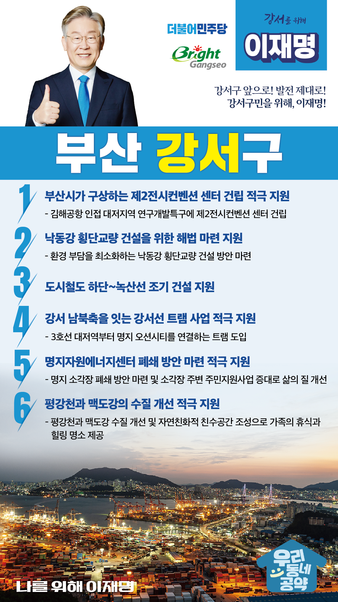

## 부산 지역 공약

# 강서구

### 강서구 앞으로! 발전 제대로! 강서구민을 위해, 이재명!
> 2022-02-10

존경하는 부산시 강서구민 여러분,

 

부산시의 약 4분의 1을 차지하는 강서구는 김해공항과 부산신항이 있고, 녹산국가산단, 신호산단, 부산과학산단 등 12개의 산업단지와 명지국제신도시, 에코델타시티, 연구개발특구 등 굵직한 개발 사업들이 진행되고 있는 역동적인 도시입니다.

강서구는 이런 역동성을 바탕으로 인구가 계속 증가하고 평균연령 39세로 부산에서 가장 젊고 활력있는 도시로 변모하고 있습니다.

 

미래 도시 강서 발전을 위한 이재명의 여섯가지 약속을 말씀드리겠습니다.

 

첫째, 부산시가 구상하는 제2전시컨벤션 센터 건립을 적극 지원하겠습니다.

동부산 벡스코는 수요가 과포화된 반면 서부산에는 문화 전시 공간이 부족합니다.

김해공항에 인접한 대저지역 연구개발특구에 제2전시컨벤션 센터 건립이 필요합니다. 

부산시가 추진하는 제2전시컨벤션 센터 건립으로 강서구의 마이스산업이 발전하도록 지원하겠습니다.

 

둘째, 낙동강 횡단교량 건설을 위한 해법 마련을 지원하겠습니다. 

서부산권 교통체증을 해소하기 위해 낙동강 횡단 교량 건설이 필요합니다.  

그러나 환경 훼손 우려로 사업이 정체되어 있습니다. 

환경 부담을 최소화하는 낙동강 횡단교량 건설 방안 마련을 적극 지원하겠습니다.  

 

셋째, 도시철도 하단~녹산선을 조기 건설을 지원하겠습니다.

대중교통 수단이 부족하여 출퇴근 지옥이 되풀이되는 하단~녹산 구간에 도시철도 건설이 필요합니다. 

하단~녹산선은 가덕도 신공항의 배후 공항철도로 역할을 할 수 있을 것입니다. 

 

넷째, 강서 남북축을 잇는 강서선 트램 사업을 적극 지원하겠습니다.

강서구는 산업 인프라와 주거단지 건설로 교통량이 증가하고 있지만, 대중교통 인프라는 취약합니다. 

3호선 대저역부터 명지 오션시티를 연결하는 트램이 도입될 수 있도록 돕겠습니다. 

 

다섯째, 명지자원에너지센터 이전 방안 마련을 적극 지원하겠습니다.

주거지 인근에 있는 명지소각장은 내구연한이 경과했고, 시설 현대화도 막대한 비용이 발생합니다. 

명지 소각장 이전 방안 마련을 적극 지원하겠습니다. 

 

여섯째, 평강천과 맥도강의 수질 개선을 적극 지원하겠습니다.

대한민국 대표 수변도시인 에코델타시티에는 평강천과 맥도강이 흐르고 있습니다.

평강천과 맥도강의 수질을 개선하고 자연친화적 친수공간으로 조성하여 강서 가족의 휴식과 힐링의 명소가 될 수 있도록 적극 지원하겠습니다.

 

 

존경하는 강서구민 여러분!

이재명은 지킬 수 있는 것만 약속했고 약속했던 것은 지켜왔습니다.

살기 좋은 부산 강서구 미래를 위한 약속, 실력과 성과로 입증된 이재명이 반드시 실천하겠습니다.

 

강서구 앞으로! 발전 제대로! 

강서구민을 위해, 이재명!