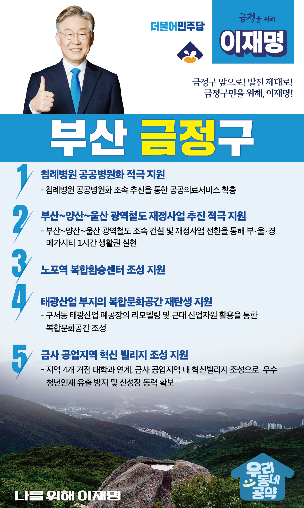

## 부산 지역 공약

# 금정구

### 금정구 앞으로! 발전 제대로!  금정구민을 위해, 이재명!
> 2022-02-10

존경하는 금정구민 여러분,

 

금정구는 부산의 4개 대학이 집중되어 있어 매년 유능한 인재가 배출되는 교육과 문화가 융성한 도시입니다. 

 

그러나 제조업이 쇠퇴하고, 경영난 악화로 침례병원이 폐쇄되는 등 어려움도 많이 있습니다. 

 

금사공단에 지역대학과 연계해 혁신빌리지를 구축하고, 침례병원도 공공병원화 하는 등 금정에 새로운 활력이 필요합니다.

 

금정 발전을 위한 이재명의 다섯가지 약속을 말씀드리겠습니다.

 

첫째, 침례병원의 공공병원화를 적극 지원하겠습니다. 

코로나19로 감영병 대응과 응급의료에 대한 수요가 높은 가운데 침례병원 폐업으로 동부산권 의료 공백이 큽니다. 

침례병원의 공공병원화를 지원해 주민의 생명과 건강을 지키는 지역 거점 병원으로서 역할을 할 수 있도록 돕겠습니다. 

 

둘째, 부산-양산-울산 광역철도의 재정사업 추진을 적극 지원하겠습니다.  

부울경 메가시티가 수도권에 버금가는 경쟁력을 갖기 위해서는 광역교통망 구축이 매우 중요합니다.

부산~양산~울산간 광역철도가 재정사업으로 추진될 수 있도록 지원하겠습니다.  

부･울･경 메가시티 1시간 생활권을 실현하겠습니다.

 

셋째, 노포역 복합환승센터 조성을 지원하겠습니다. 

노포역은 부산도시철도 1호선에 이어 양산 북정선과 울산 광역철도가 정차할 예정입니다.  

또한, 인근에 사송신도시, 양산신도시, 물금신도시, 정관 신도시 등이 입지하여 대중교통 수요가 증가하고 있습니다.  

노포역 광역복합환승 플랫폼 건설로 북부산 주민이 편리하게 대중교통을 이용할 수 있도록 돕겠습니다. 

 

 

넷째, 태광산업 부지가 복합문화공간으로 재탄생할 수 있도록 지원하겠습니다.

구서동 태광산업은 동부산권의 경제의 중심이었으나 지금은 도심 속 유휴부지로 남아 있습니다.  

이 공간을 금정구가 계획하는 복합문화공간으로 조성되도록 지원하겠습니다. 

 

다섯째, 금사 공업지역 혁신 빌리지 조성을 지원하여 새로운 성장동력을 만들겠습니다.

금정의 일자리 거점이던 금사공업지역이 쇠퇴하고 청년이 지역을 떠나고 있습니다. 

금정의 4개 대학과 힘을 모아 금사 공업지역에 혁신빌리지를 조성하여  동부산의 새로운 성장동력을 만들 수 있도록 적극 지원하겠습니다.

 

 

존경하는 금정구민 여러분!

이재명은 지킬 수 있는 것만 약속했고 약속했던 것은 지켜왔습니다.

살기 좋은 금정구 미래를 위한 약속, 실력과 성과로 입증된 이재명이 반드시 실천하겠습니다.

 

금정구 앞으로! 발전 제대로! 

금정구민을 위해, 이재명!