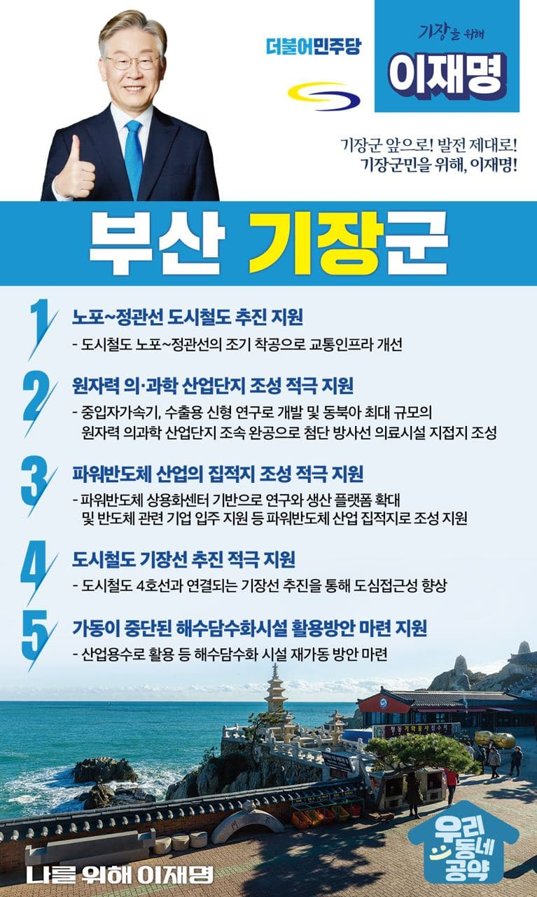

## 부산 지역 공약

# 기장군

### 기장군 앞으로! 발전 제대로! 기장군민을 위해, 이재명!
> 2022-02-11

존경하는 기장군민 여러분,

 

기장군은 부산 전체 면적의 30%를 차지하고, 최대 산림을 보유하고 있는 ‘부산 생태환경의 허파’와 같은 땅입니다. 또한 대한민국 전력 생산을 위한 세계최대규모의 고리 원자력발전소가 있어 주민의 희생의 큰 곳이기도 합니다. 

 

그러나 기장군은 부산의 변방으로 부산 균형발전 전략에서 늘 소외되었고, 주민의 고통은 커져만 가고 있습니다. 이제는 기장이 변화 발전해야합니다. 

 

이를 위한 이재명의 다섯가지 약속을 말씀드리겠습니다. 

 

첫째, 노포-정관선 추진을 지원해 기장의 교통 불편을 해소하겠습니다.

정관신도시와 일광신도시의 인구 증가로 급격한 교통혼잡이 생기고 있습니다. 교통인프라 개선을 위해 도시철도 노포~정관선의 조기 착공을 지원하겠습니다. 젊은 도시 기장의 교통 여건을 획기적으로 개선하겠습니다.

 

둘째, ‘원자력 의·과학 산업단지’조성을 적극 지원하겠습니다. 

기장에는 중입자가속기, 수출용 신형 연구로 개발이 진행되고 있습니다. 동북아 최대 규모의 원자력 의과학 산업단지도 조성되고 있습니다. 산업단지의 조속한 완공으로 기장에 첨단 방사선 의료시설이 집적되도록 적극 지원하겠습니다. 

 

셋째, 파워반도체 산업이 집적될 수 있도록 적극 지원하겠습니다.

기장에 ‘파워반도체 상용화센터’가 준공되어 관련 기업이 늘어나고 있습니다. 이를 기반으로 연구와 생산 플랫폼을 확대하고, 여러 반도체 관련 기업이 입주하여 기장이 파워반도체 산업 집적지가 되도록 적극 지원하겠습니다.

 

넷째, 도시철도 기장선 추진을 적극 지원하겠습니다. 

기장은 오랜 기간 부산도심과 단절된 도시철도 소외지역입니다. 도시철도 4호선과 연결되는 기장선이 하루빨리 추진될 수 있도록 지원하겠습니다. 기장의 도심접근성을 향상하고 지역경제 활성화를 견인하겠습니다. 

 

다섯째, 가동이 중단된 해수담수화시설의 활용방안 마련을 지원하겠습니다. 

기장해수담수화 시설은 주민들의 반대와 낮은 수요로 가동이 중단되어 있습니다. 산업용수로 활용 등 해수담수화 시설의 재가동 방안이 마련되도록 돕겠습니다.

 

 

존경하는 기장군민 여러분!

이재명은 지킬 수 있는 것만 약속했고 약속했던 것은 지켜왔습니다.

살기 좋은 기장군 미래를 위한 약속, 실력과 성과로 입증된 이재명이 반드시 실천하겠습니다.

 

기장군 앞으로! 발전 제대로! 

기장군민을 위해, 이재명!