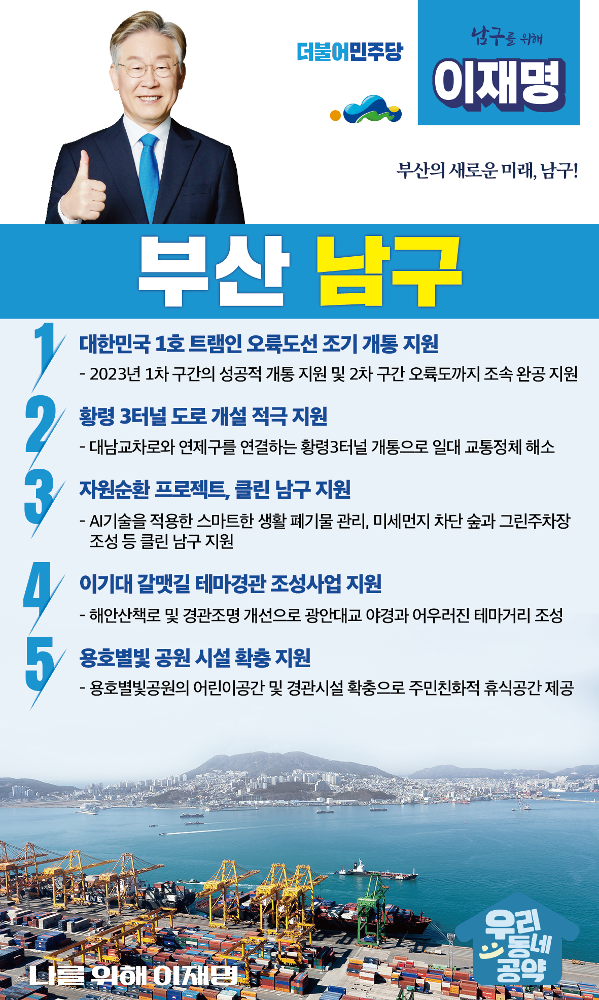

## 부산 지역 공약

# 남구

### 부산의 새로운 미래, 남구! - 재명이네 공약센터
> 2022-02-10

존경하는 부산 남구 구민 여러분, 

 

부산남구는 UN평화공원과 오륙도가 자리한 관광평화특구입니다.  

또한 부경대, 경성대 등 대학이 많아 젊고 역동적인 교육도시입니다. 

 

남구는 지금보다 더욱 살기 좋은 도시, 활기가 넘치는 도시로 나아갈 가능성이 무궁무진합니다.

 

남구의 지속가능한 발전을 위해 남구 구민들에게 이재명이 5가지 약속을 드립니다. 

 

첫째. 대한민국 1호 트램인 오륙도선의 조기 개통을 지원하겠습니다.

지난 1월 25일, 차량기지 착공을 시작으로 드디어 오륙도선 트램 개통이 가시화되었습니다. 

2023년에 1차 구간을 성공적으로 개통하고, 2차 구간인 오륙도까지 조속한 완공을 위해 적극 지원하겠습니다.

 

둘째, ‘황령 3터널 도로’개설을 적극 지원하여 답답했던 출·퇴근길을 시원하게 뚫어드리겠습니다.

황령 3터널은 대남교차로와 연제구를 연결하는 터널입니다. 

대남교차로 일대는 수도권의 대표적 상습 정체구역과 맞먹는 혼잡도로입니다. 

황령 3터널 개통으로 남구에서 부산 전역까지 원활한 도로망이 구축되도록 돕겠습니다.

 

셋째, 자원순환 프로젝트로 ‘클린 남구’가 되도록 지원하겠습니다.

탄소중립시대, 자원순환은 선택이 아니라 필수입니다.

디지털시대에 걸맞게 AI기술을 적용한 스마트한 생활 폐기물 관리도 필요합니다.

또한 미세먼지 차단 숲과 그린주차장 조성으로 가족이 안심할 수 있는 클린 남구, 깨끗한 남구가 되도록 돕겠습니다.

 

넷째, ‘이기대 갈맷길 테마경관 조성사업’이 성공할 수 있도록 지원하여 ‘더 걷기 좋은 남구’를 만들겠습니다.

이기대 갈맷길은 전국적 명성을 자랑하고 있습니다.

해안산책로와 경관조명을 개선하여 광안대교 야경과 어우러진 테마거리로 발전하도록 적극 지원하겠습니다. 

낮과 밤의 멋이 색다른 관광명소로 업그레이드하겠습니다. 

 

다섯째, 용호별빛 공원을 더욱 주민친화적으로 만들겠습니다.

용호별빛공원은 폐쇄된 용호부두를 재탄생시킨 항만 재생의 모범사례입니다. 

어린이 휴식시설과 경관시설을 확충해 가족의 편안한 휴식처가 되도록 돕겠습니다.

더 가까이 광안대교를 즐길 수 있는 부산의 새로운 명소로 만들겠습니다. 

 

존경하는 남구 구민 여러분!

 

이재명은 지킬 수 있는 것만 약속했고 약속했던 것은 지켜왔습니다.

살기좋은 부산 남구 미래를 위한 약속 실력과 성과로 입증된 이재명이 반드시 실천하겠습니다.

 

남구 앞으로, 발전 제대로!

남구 구민을 위해, 이재명!