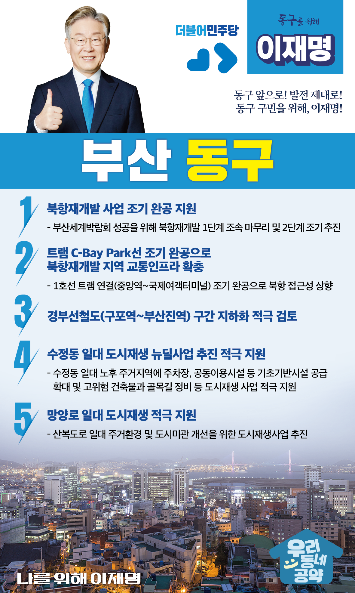

## 부산 지역 공약

# 동구

### 동구 앞으로! 발전 제대로! 동구 구민을 위해, 이재명!
> 2022-02-10

존경하는 부산 동구 구민 여러분,

부산 동구는 부산역과 부산항이 위치한 부산의 첫 얼굴이었습니다.

교통과 항만, 한국거래소를 거점으로 한 비즈니스와 금융의 메카였습니다. 

하지만 부산항 기능이 신항으로 옮기고, 한국거래소 이전과 구도심의 노후화를 거치며 서서히 동력을 잃고 있습니다.

산복도로를 타고 집으로 빼곡하던 동네도 이제 빈집이 늘고 있습니다.

 

이제 다시 동구의 위상을 높이고 매력적인 도시 만들기를 시작해야 할 때입니다. 

북항재개발과 경부선 철도 지하화 등을 통해 부산의 첫 얼굴을 되찾도록 하겠습니다. 

동구 발전을 위한 이재명의 다섯가지 약속을 말씀 드리겠습니다.

 

첫째, 부산세계 박람회 성공을 위해 북항재개발 사업의 조기 완공을 지원하겠습니다.

북항재개발은 원도심 재도약을 위한 핵심 사업입니다.

부산세계박람회 성공을 위해 북항재개발 1단계를 조속히 마무리하고, 2단계 조기 추진을 지원하겠습니다. 

북항 일대가 세계적인 해양관광의 허브가 되도록 적극 지원하겠습니다.

 

둘째, 트램 C-Bay Park선 조기 완공으로 북항재개발 지역 교통인프라를 확충하겠습니다.

C-Bay Park선은 도시철도 1호선 중앙역부터 북항재개발 지역을 관통하여 국제여객터미널까지 트램으로 연결하는 사업입니다. 

이 노선의 조기 완공을 지원해 북항의 접근성을 높이고 부산의 해양문화가 품격있게 발전하도록 돕겠습니다. 

 

셋째, 경부선철도 지하화를 적극 검토하겠습니다.

경부선 철도는 동구의 도심과 바다의 연계발전을 가로막고 있습니다.

철도 지하화를 통해 도심과 바다가 연결되도록 계획을 수립하겠습니다. 

부산 동구 발전의 기틀을 마련하겠습니다. 

 

넷째, 수정동 일대가 도시재생 뉴딜사업이 추진되도록 적극 지원하겠습니다.

수정동 일대는 높은 경사로와 좁은 골목길, 그리고 늘어나는 빈집들로 주민들의 생활안전과 치안이 위협받고 있습니다. 

수정동 일대 도시재생 사업을 적극 지원하여 주민들의 주거환경을 개선하고 더 안전하고 살기 좋은 수정동이 되도록 노력하겠습니다.

 

다섯째, 망양로 일대의 도시재생을 적극 지원하겠습니다. 

망양로 일대가 해안조망과 도시미관을 위해 고도제한이 적용되어 주거환경 개선이 어렵습니다.  

망양로 일대가 주거환경 개선과 도시미관이 조화되는 도시재생사업이 추진될 수 있도록 적극 지원하겠습니다. 

 

 

존경하는 동구 구민 여러분!

이재명은 지킬 수 있는 것만 약속했고 약속했던 것은 지켜왔습니다.

살기 좋은 부산 동구 미래를 위한 약속, 실력과 성과로 입증된 이재명이 반드시 실천하겠습니다.

 

동구 앞으로! 발전 제대로! 

동구 구민을 위해, 이재명! 