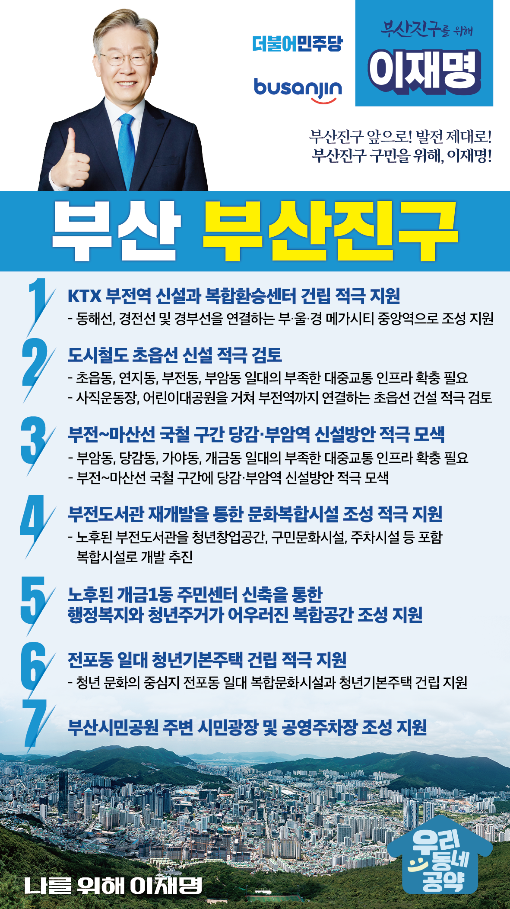

## 부산 지역 공약

# 부산진구

### 부산진구 앞으로! 발전 제대로! 부산진구 구민을 위해, 이재명!
> 2022-02-10

존경하는 부산진구 구민 여러분,

부산진구는 부산의 근·현대 역사를 고스란히 담고 있는 지역이자, 동부산과 서부산을 사이에 둔 교통의 요지, 금융과 경제, 젊음의 중심지로 오랫동안 사랑받아왔습니다. 

 

부산 최대 규모를 자랑하는 부산시민공원과 어린이대공원이 있고, 변화의 거리 서면을 품고 있는 그야말로 부산의 중심입니다.

 

하지만 줄어드는 인구, 감소하는 성장 동력, 지역간 불균형 문제로 부산진구도 노후화하고 있습니다.

부산의 재건은 부산진구부터 시작해야 합니다. 

부산 진구 발전을 위한 이재명의 일곱가지 약속을 말씀드리겠습니다.

 

첫째, KTX 부전역 신설과 복합환승센터 건립을 적극 지원하겠습니다.

장차 동해선, 경전선의 기종점이자 부산의 도심과 가덕도 신공항의 연결점이 될 부전역을 부･울･경 메가시티 중앙역으로 만들겠습니다. 

또한, KTX 부전역의 복합환승센터 개발을 지원하겠습니다. 

동해선, 경부선, 경전선을 편리하게 갈아탈 수 있는 교통망이 구축될 것입니다.

 

둘째, 도시철도 초읍선 신설을 적극 검토하겠습니다. 

초읍동, 연지동, 부전동, 부암동 일대는 좁은 도로와 대중교통 인프라 부족으로 교통난이 심각합니다. 

이 곳의 교통난 해소를 위해 사직운동장과 어린이대공원을 거쳐 부전역까지 연결하는 도시철도 초읍선이 건설되도록 적극 지원하겠습니다.

 

셋째, 부전~마산선 광역철도 구간 가야역 신설방안을 적극 모색하겠습니다.

당감동, 가야동, 개금동 일대는 좁은 도로와 대중교통 인프라 부족으로 교통체증이 상시적으로 발생하고 있습니다.

주민 교통 불편을 해소하기 위해 부전~마선선 광역철도 구간에 가야역 신설방안을 적극 모색하겠습니다. 

 

넷째, 부전도서관이 문화복합시설이 될 수 있도록 적극 지원하겠습니다. 

부산진구의 한가운데 있는 부전도서관은 건물 노후화로 재단장이 필요합니다. 

부전도서관이 문화시설과 청년창업공간을 갖춘 문화복합시설로 거듭날 수 있도록 적극 지원하겠습니다.

 

다섯째, 개금 1동 주민센터를 행정복지와 청년주거가 어우러진 복합공간이 되도록 지원하겠습니다. 

개금 1동 주민센터는 건물이 낡고, 공간이 협소하여 주민 불편이 큽니다. 

이 센터를 재건축하여 주민을 위한 행정복지 공간을 넓히고 상층에 청년기본주택을 신축하여 청년들의 주거 안정에 기여할 수 있도록 지원하겠습니다.

 

여섯째, 전포동 일대에 청년기본주택이 건립되도록 적극 지원하겠습니다.

부산진구 전포동은 도시철도 1호선과 2호선을 사이에 둔 청년 문화의 중심지입니다. 

이곳에 복합문화시설과 청년기본주택 건축을 지원하여 부산 청년들의 삶의 질을 높이겠습니다. 

 

일곱째, 부산시민공원 주변에 시민광장과 공영주차장 조성을 지원하겠습니다. 

부산시민공원은 많은 시민들이 찾는 도심 속 힐링 공간입니다. 

더 많은 주민들이 편리하게 시민공원을 찾을 수 있도록 시민광장을 조성하고 지하에 공영주차장이 건설되도록 적극 지원하겠습니다. 

 

 

존경하는 부산진구 구민 여러분!

 

이재명은 지킬 수 있는 것만 약속했고 약속했던 것은 지켜왔습니다.

살기 좋은 부산진구 미래를 위한 약속, 실력과 성과로 입증된 이재명이 반드시 실천하겠습니다.

 

부산진구 앞으로! 발전 제대로! 

부산진구 구민을 위해, 이재명!  

						