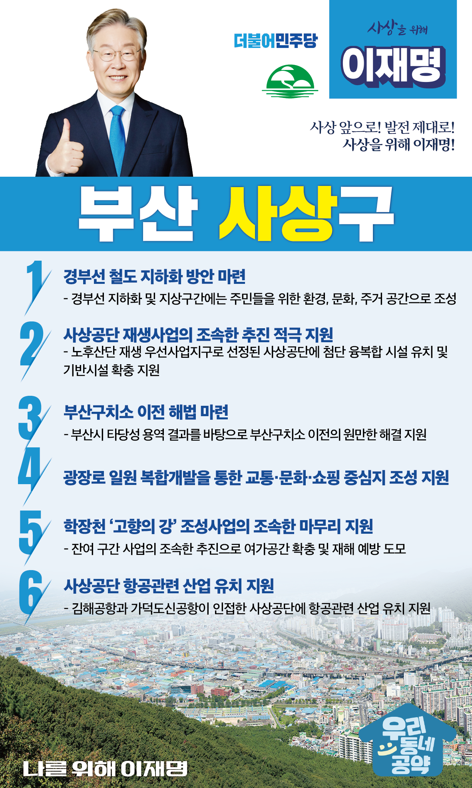

## 부산 지역 공약

# 사상구

### 사상 앞으로! 발전 제대로! 사상을 위해 이재명!
> 2022-02-10

자랑스러운 부산 사상구민 여러분,

사상은 힘겨웠던 산업화 시절, 부산을 먹여 살렸던 곳입니다. 

사상공단에서 어머니 아버지들은 기름밥을 먹으며 자식들을 기르고 공부시켰습니다. 

그 덕분에 대한민국과 부산이 선진국 반열에 오를 수 있었습니다.

 

그러나 수십 년 동안 부산 정치권력을 독점했던 세력들은 사상과 서부산을 버려두었습니다. 

낙후된 사상과 서부산은 사상구민 여러분의 마음에 상처만 남겼습니다.

 

저 이재명은 사상을 명실상부한 동남권 거점도시로 탈바꿈시키겠습니다.

앞으로 건설될 가덕신공항과 연계해 부가가치 높은 관련 산업을 유치, 발전시켜 서부산 지역 핵심 요충지 사상을 부울경 메가시티 중심으로 우뚝 세우겠습니다.

현 정부에서 적극 추진된 노후 산업단지 재생사업을 제대로 마무리해 사상이 제2의 전성기를 누릴 수 있도록 변모시키겠습니다.

 

사상구민과 함께 이재명이 만들어 갈 여섯가지 약속을 말씀드리겠습니다.

 

첫째, 경부선 철도 지하화 방안을 마련하겠습니다.  

1905년 개통된 경부선 철도는 그동안 부산 발전을 이끌어왔지만 지금은 부산을 단절시키고, 사상의 발전을 가로막고 있습니다.

경부선의 지화화를 통해 그 공간이 주민의 환경, 문화, 주거 공간으로 탈바꿈 할 수 있는 계획을 수립하겠습니다. 

 

둘째, 사상공단 재생사업의 조속한 추진을 적극 지원하겠습니다.

사상 공업지역은 노후산단 재생을 위한 우선사업지구로 선정되었습니다. 

하지만 사업이 계속 답보되다가 최근에 다시 재개되고 있습니다.  

사상공단에 첨단 융복합 시설을 유치하고 도로 등 기반시설이 확충될 수 있도록 적극 지원하겠습니다. 

 

셋째, 부산구치소 이전을 위한 원만한 해법이 마련되도록 돕겠습니다. 

부산구치소는 시설 노후화와 과밀수용으로 오래전부터 이전 논의가 진행되어 왔습니다. 

부산시의 타당성 용역 결과를 바탕으로 부산구치소 이전 문제가 원만히 해결될 수 있도록 지원하겠습니다.

 

넷째, 광장로 일원이 교통, 문화, 쇼핑의 중심지가 되도록 적극 지원하겠습니다.

사상은 아울렛과 쇼핑몰, 대형마트가 입점해 있고, 서부경남과 동부경남 주민들이 1시간 내에 사상을 찾을 수 있습니다.  

광장로 일원을 복합개발하여 교통, 문화, 쇼핑의 중심지가 되도록 지원하겠습니다.  

 

다섯째,  학창천 ‘고향의 강’사업의 마무리를 돕겠습니다.

학창천 ‘고향의 강’ 조성사업이 마무리 단계입니다. 

잔여 구간 사업을 조속히 추진하여 여가 공간을 확충하고 재해 위험으로부터 주민 안전을 확보하겠습니다.  

 

여섯째, 사상공단에 항공관련 산업이 유치되도록 지원하겠습니다. 

사상공단은 김해공항과 가덕도신공항이 인접해 있어 공항 정비와 항공관련 산업을 유치할 수 있는 이점이 있습니다. 

사상공단에 항공관련 산업 유치를 지원하겠습니다. 

사상의 새로운 성장 동력이 되도록 하겠습니다.

 

존경하는 사상구민 여러분

저 이재명은 지킬 수 있는 것들만 약속했고 약속했던 것은 지켜왔습니다.

사상을 명실상부한 부울경 메가시티의 중심도시로 변모시키겠다는 약속, 이재명이 사상구민과 함께 사상구의 미래를 만들겠습니다.

 

사상 앞으로! 발전 제대로!

사상을 위해 이재명!  

						