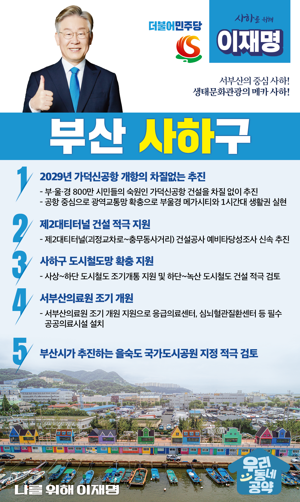

## 부산 지역 공약

# 사하구

### 서부산의 중심 사하! 생태문화관광의 메카 사하!
> 2022-02-10

존경하는 사하구민 여러분, 

 

사하는 서부산의 중심이며, 낙동강 하구와 을숙도 등 천혜의 관광자원을 보유한 곳입니다.

사하를 중심으로 서부산을 발전시켜 동부산과 서부산의 균형을 맞춰야 합니다.

제2대티터널, 하단~녹산 도시철도, 사상~하단 도시철도 등 교통인프라 확충이 무엇보다 중요합니다.

 

2029년 가덕신공항이 완성되면 사하는 신공항의 핵심 배후도시로 성장할 것입니다.

또, 동양 최대 철새도래지인 을숙도와 낙조로 유명한 낙동강을 잘 활용한다면 생태문화관광의 메카가 될 것입니다.

 

서부산의 중심 사하, 생태문화관광의 메카 사하를 위한

이재명의 다섯 가지 약속입니다.

 

첫째, 2029년 가덕신공항 개항을 목표로 쉬지 않고 달려가겠습니다. 

부·울·경 800만 시민들의 숙원인 가덕신공항 건설을 차질 없이 추진하겠습니다.

가덕신공항이 완성되면 부산은 유라시아와 태평양을 잇는 경제 관문이 될 것입니다.

공항, 항만, 철도를 연결하는 트라이포트(드?)가 완성돼 부산은 글로벌 물류 허브로 거듭날 것입니다.

공항을 중심으로 광역교통망을 확충해 부울경 메가시티와 1시간대 생활권을 실현하겠습니다.

 

둘째, 부산시가 추진하는 제2대티터널 건설을 적극 지원하겠습니다.

괴정교차로에서 충무동사거리까지 4차선 도로가 뚫리면 

출퇴근 시간이 획기적으로 단축됩니다. 

서부산과 사하의 교통난 해소를 위해 

예비타당성조사를 신속하게 추진하여 제2대티터널 건설을 적극 지원하겠습니다.

 

셋째, 하단~녹산 도시철도 건설을 적극 검토하고 사상~하단 도시철도 건설을 조속히 마무리 짓겠습니다. 

하단~녹산선과 사상~하단선은 서부산을 관통하는 핵심 교통수단이며, 

사하구민들의 숙원사업입니다.

현재 공사중인 사상~하단선은 조기 개통될 수 있도록 지원하고, 

하단~녹산선을 적극적으로 검토해 사하구민들의 이동편의성을 높이겠습니다. 

 

넷째, 서부산의료원을 조기에 개원하겠습니다. 

공공의료기관이 동부산에 집중돼 서부산 시민들은 그동안 많은 불편함을 겪었습니다.

서부산 의료원이 조기에 개원하도록 지원하여 

응급의료센터, 심뇌혈관질환센터 등 필수 공공의료시설들을 설치하겠습니다. 

서부산의료원이 부산을 대표하는 종합병원이 되도록 만들겠습니다.

 

다섯째, 부산시가 추진하는 을숙도 국가도시공원 지정을 적극 검토하겠습니다. 

천혜의 자연환경을 간직한 을숙도는 사하와 부산의 자랑입니다.

서부산 시민들이 일상 속에서 자연을 즐길 수 있도록 만들겠습니다.

을숙도를 품은 사하가 대표적인 생태문화관광지가 되도록 지원하겠습니다. 

 

이재명이 서부산 전성시대를 차근차근 준비하겠습니다.

 

사하 앞으로 발전 제대로!

사하구민을 위해 이재명 

						