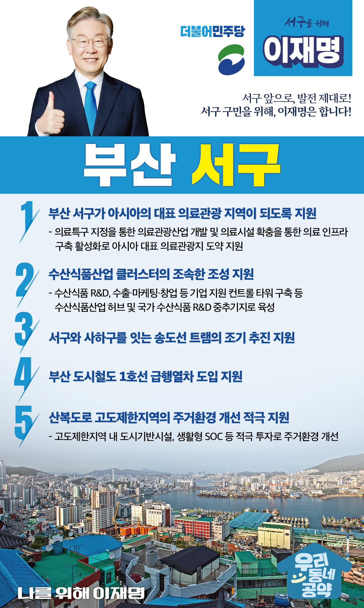

## 부산 지역 공약

# 서구

### 서구 앞으로, 발전 제대로! 서구 구민을 위해, 이재명은 합니다! 
> 2022-02-10

존경하는 서구 구민 여러분,

 

서구는 국내 최대 수산업의 중심지이자 의료와 관광자원이 풍부한 곳입니다. 

과거 한국전쟁 당시 임시수도 청사와 대통령 청사가 있었고, 송도해수욕장과 노무현, 문재인 대통령의 법률사무소가 있던 지역이 바로 서구입니다. 

 

하지만 대부분 6,70년대 이루어진 도시개발로 인해 좁은 도로와 낡은 건물이 많아서 도시재생이 시급합니다.

부산 어느 지역보다 뛰어난 천혜의 자연 환경과 다양한 자원을 활용하여 새롭게 시작하는 서구를 위해 발 벗고 나서겠습니다.

 

서구 발전을 위한 이재명의 다섯가지 약속을 말씀드리겠습니다.

 

첫째, 부산 서구가 아시아의 대표 의료관광 지역이 되도록 지원하겠습니다.

서구는 부울경 최초로 의료관광특구로 지정되었습니다.  

대학병원 3곳과 종합병원 1곳이 있고, 공항, 철도, 항만이 인접하여 의료와 관광을 연결한 특화산업육성에 최적의 조건을 가지고 있습니다. 

이런 장점을 살려 서구가 아시아의 대표 의료관광지역이 되도록 적극 지원하겠습니다. 

 

둘째, 수산식품산업 클러스터가 조속히 조성되도록 지원하겠습니다.

국내 최대 수산도시인 서구는 지난해 수산식품산업 클러스터 사업의 예비타당성조사를 통과했습니다.

서구가 동북아 수산식품 산업의 허브가 되도록 적극 지원하겠습니다. 

 

셋째, 송도선 트램의 조기 추진을 지원하겠습니다. 

자갈치역에서 시작하는 송도선 트램 계획이 확정되었습니다. 

송도선 트램이 완공되면 주민들의 교통환경이 개선되고 관광객들이 서구를 편리하게 찾을 수 있는 환경이 마련될 것입니다. 

송도선 트램이 하루빨리 운행될 수 있도록 적극 지원하겠습니다.

 

넷째, 부산 도시철도 1호선 급행열차 도입을 서두르겠습니다.

올해 1월 도시철도 1호선의 급행열차 도입계획이 확정되었습니다.

향후 도시철도망 구축계획에 따라 신설될 노선과 연계하여 서구 대중교통을 확충하겠습니다. 

급행열차 도입이 빠르게 시행될 수 있도록 뒷받침하겠습니다.

 

다섯째, 산복도로 고도제한지역의 주거환경 개선을 적극 지원하겠습니다. 

부산 동구부터 서구까지 망양로 일원은 고도제한으로 지역발전이 정체되어 왔습니다.  

좁고 낡은 도로와 노후 주택의 거주환경 개선이 필요합니다.  

고도제한으로 희생을 감내해 온 만큼 특별한 보상이 필요합니다. 

고도제한지역에 도시기반시설, 생활형 SOC 등을 적극 투자해 주거환경을 개선하겠습니다. 

 

 

 

존경하는 서구 구민 여러분!

이재명은 지킬 수 있는 것만 약속했고 약속했던 것은 지켜왔습니다.

살기좋은 서구 미래를 위한 약속 실력과 성과로 입증된 이재명이 반드시 실천하겠습니다.

 

서구 앞으로, 발전 제대로!

서구 구민을 위해, 이재명은 합니다! 

						