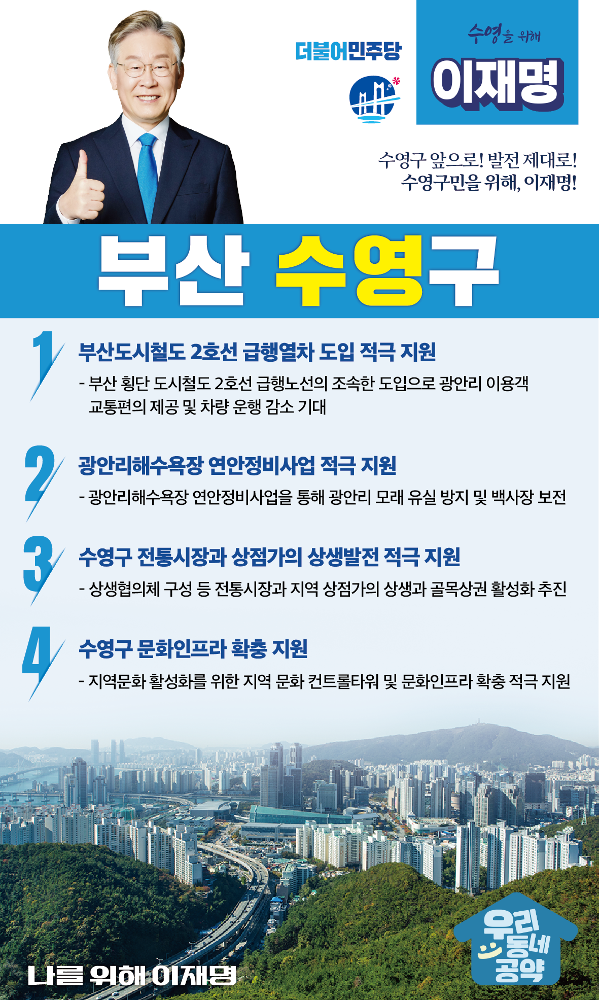

## 부산 지역 공약

# 수영구

### 수영구 앞으로! 발전 제대로! 수영구민을 위해, 이재명!
> 2022-02-10

존경하는 수영구민 여러분,

산과 바다가 어우러진 도시, 역사적인 좌수영 성지가 있는 곳, 강과 바다가 만나는 천혜의 아름다운 고장, 전통이 살아 숨 쉬는 여기는 부산 수영구입니다.

여름철에는 수 많은 피서객들이 광안리해수욕장을 찾아오는 부산의 대표 관광지입니다.

 

하지만 낮은 지역 내 총생산, 제조업 기반의 부재, 주거 중심으로 인한 출퇴근 인구 비중 부산 최하위인 지역이기도 합니다. 이제 수영은 근본적인 대책이 필요합니다. 

자연과 문화, 생활이 조화로운 미래를 되찾아야 할 때입니다.

이를 위한 4대 지역공약을 말씀드리겠습니다.

 

 

첫째, 부산도시철도 2호선 급행열차 도입을 적극 지원하겠습니다. 

부산을 횡단하는 도시철도 2호선 급행노선이 조속히 추진되도록 적극 지원하여 이동시간을 획기적으로 줄이겠습니다.

급행 도입으로 수영과 광안리를 찾는 이용객이 늘어나고 차량유입이 감소할 것으로 기대됩니다. 

활기차고 살기 편한 수영구가 되도록 돕겠습니다.  

 

둘째, 광안리해수욕장 연안정비사업을 적극 지원하겠습니다.

광안리는 부산의 대표 관광지이지만 백사장 모래 유실이 가속화되고 있습니다. 

해마다 모래를 보충하는 것만으로는 해결할 수 없어 근본적인 대책이 필요합니다. 

송도, 해운대 해수욕장처럼 연안정비사업을 통해 모래 유실을 방지하고 광안리의 아름다운 백사장을 시민들께 돌려드겠습니다. 

 

셋째, 수영구 전통시장과 상점가의 상생발전을 적극 지원하겠습니다.

전통시장과 지역 상점가의 상생과 골목상권 활성화를 추진하겠습니다. 

상생협의체 구성으로 주민 갈등을 원만히 해결하고 상생을 통해 지역경제에 활력을 불어넣겠습니다.

 

넷째, 수영구에 문화인프라가 확충되도록 지원하겠습니다.

수영구는 관광에 특화되어 있지만, 지역문화를 향유할 공간과 프로그램이 부족합니다.  

지역문화를 활성화하기 위한 컨트롤타워와 문화인프라 확충을 적극 지원하겠습니다.

 

존경하는 수영구민 여러분!

 

이재명은 지킬 수 있는 것만 약속했고 약속했던 것은 지켜왔습니다.

살기 좋은 수영구 미래를 위한 약속, 실력과 성과로 입증된 이재명이 반드시 실천하겠습니다.

 

수영구 앞으로! 발전 제대로! 

수영구민을 위해, 이재명!  

						