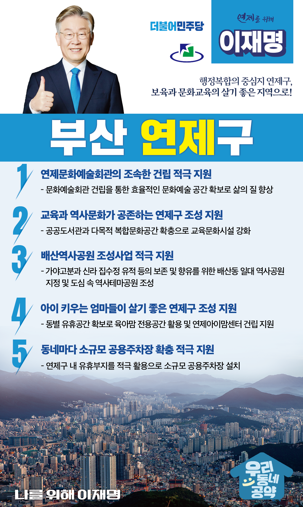

## 부산 지역 공약

# 연제구

### 행정복합의 중심지 연제구, 보육과 문화교육의 살기 좋은 지역으로!
> 2022-02-10

존경하는 연제구민 여러분, 

 

연제구는 지리적으로 부산의 중심부에 위치하고, 부산시청을 비롯하여 경찰청, 법원 등 25개의 관공서가 밀집되어 있는 행정중심지입니다. 도심 속을 가로지르는 생태하천인 온천천 시민공원은 연제구민의 건강을 책임지고 있으며 활력이 넘치는 연제구의 자랑이기도 합니다. 

 

그러나 청년들은 일자리를 찾아 연제구를 떠나 인구 소멸 도시가 되어가고 있고 이로 인해 일자리와 지역경제가 타격을 받을 수밖에 없는 상황입니다.

 

이제 누군가 연제구를 바꿔야 합니다. 행정복합의 중심지에 걸맞은 인프라를 갖춰야 합니다.

이재명이 열어갈 연제구의 미래를 위한 저 이재명의 5대 지역발전 공약을 말씀드리겠습니다.

 

첫째, 연제문화예술회관의 조속한 건립을 적극 지원하겠습니다.

행정중심도시 연제구는 그동안 문화회관이나 예술회관이 없어 주민들이 문화향유를 누릴 기회가 부족했습니다. 

연제문화예술회관이 차질 없이 건립되도록 지원하겠습니다. 

연제구민들 누구나 풍요롭게 문화예술을 누릴 수 있도록 하겠습니다. 

 

둘째, 교육과 역사문화가 공존하는 연제구가 되도록 지원하겠습니다. 

평생학습도시, 교육명품도시 연제에 걸맞게 공공도서관과 다목적 복합문화공간 확충을 지원하겠습니다.   연제구민의 힐링공간인 배산 역사유적과 연산로터리 상권이 어우러진 도심 속 역사테마공원이 조성되도록 돕겠습니다. 

 

셋째, 배산역사공원 조성사업을 적극 지원하겠습니다.

연제구에는 부산 내 유일한 가야고분과 영남 최대 신라 집수정 유적이 있습니다. 

이러한 유산을 보존하고 향유할 수 있도록 배산동 일대 역사테마공원 조성을 적극 지원하겠습니다. 

연제구의 역사적, 문화적 공간을 다채롭게 꾸며나가겠습니다.

 

넷째, 아이 키우는 엄마들이 살기 좋은 연제구가 되도록 돕겠습니다.

연제구 부모들의 육아, 휴식을 위한 육아맘 전용공간이 필요합니다. 

각 동네별 유휴공간에 육아맘들의 전용공간을 확보해 연제아이맘센터가 건립되도록 지원하겠습니다. 

 

다섯째, 동네마다 소규모 공용주차장 확충을 적극 지원하겠습니다.

연제구 내 유휴부지를 적극 활용하여 주민들의 주차 문제를 해소해야 합니다.  

주차장 확보율이 낮아 주차에 어려움이 많은 곳부터 소규모 공용주차장 설치를 적극 지원하겠습니다.

 

 

존경하는 연제구민 여러분!

이재명은 지킬 수 있는 것만 약속했고 약속했던 것은 지켜왔습니다.

살기 좋은 연제구 미래를 위한 약속, 실력과 성과로 입증된 이재명이 반드시 실천하겠습니다.

 

연제구 앞으로! 발전 제대로! 

연제구민을 위해, 이재명! 

						