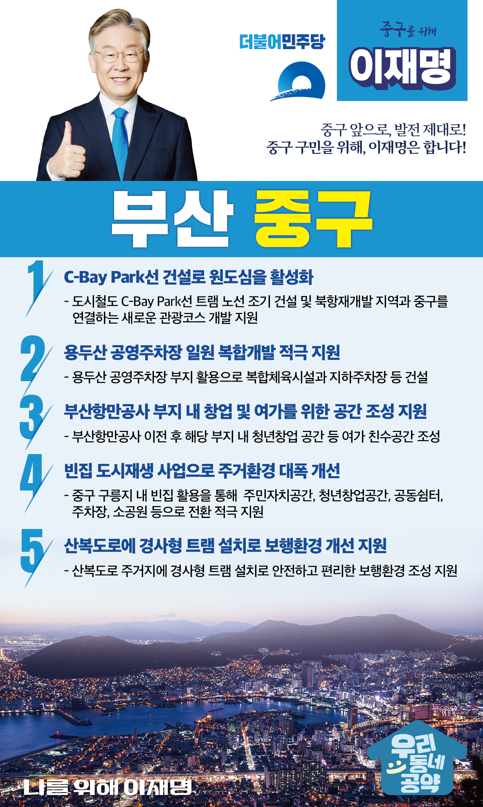

## 부산 지역 공약

# 중구

### 중구 앞으로, 발전 제대로! 중구 구민을 위해, 이재명은 합니다!
> 2022-02-10

존경하는 부산 중구 구민 여러분,

 

중구는 과거부터 부산의 중심이자 찬란한 역사와 관광의 중심지입니다.

부산항 개항을 비롯한 한국 근현대사의 산실이자 남항과 북항을 잇는 수변 경관과 산지 조망으로 아름다움을 겸비한 도시입니다. 

이에 더해 국제영화제, 자갈치 문화 축제처럼 다양한 볼거리가 있는 곳이 바로 중구입니다. 

 

하지만 부산에서 가장 먼저 도시화가 되다보니 지금은 노후 건축물이 가장 많은 도시가 되었습니다. 

 

이제 중구는 새로운 변화가 필요합니다. 

북항 재개발을 기반으로 주민 친화적이고 다시금 사람들이 찾아오는 활기찬 중구로 거듭나야합니다. 

중구의 재도약을 위한 이재명의 다섯가지 약속을 말씀드리겠습니다.

 

첫째, C-Bay Park선 건설로 원도심을 활성화하겠습니다.

도시철도 C-Bay Park선 트램 노선이 조기에 건설될 수 있도록 적극 지원하겠습니다. 

북항재개발 지역과 중구를 연결하는 새로운 관광코스가 개발되도록 돕겠습니다.

이 사업으로 중구가 문화·관광도시로 거듭나고, 중구 교통난을 해결하는 계기가 되도록 돕겠습니다.

 

둘째, 용두산 공영주차장 일원 복합개발을 적극 지원하겠습니다.

용두산 공영주차장 부지를 전략적으로 활용할 필요가 큽니다.

중구가 계획하는 복합체육시설과 지하주차장 건설 등을 통해 주민 생활과 건강에 기여하는 공간으로 거듭날 수 있도록 적극 지원하겠습니다.

 

셋째, 부산항만공사 부지에 창업과 여가를 위한 공간이 조성되도록 지원하겠습니다.

중구에 있는 부산항만공사가 이전할 예정입니다. 

부산 중구는 이 부지를 청년창업 공간 등 시민을 위한 다양한 시설을 조성할 계획입니다.

이 곳이 중구의 상징적인 여가 친수공간이 될 수 있도록 적극 돕겠습니다.

 

넷째, 빈집 도시재생 사업으로 주거환경을 대폭 개선하겠습니다.

중구 구릉지에는 주거환경이 노후화되며 빈집이 늘고 있습니다.

신속한 도시재생 사업을 통해 빈집이 주민자치공간, 청년창업공간, 공동쉼터, 주차장, 소공원 등으로 전환되도록 적극 지원하겠습니다.

이 사업을 통해 주거환경 개선과 공동체 문화가 형성되도록 하겠습니다.

 

다섯째, 산복도로에 경사형 트램 설치로 보행환경 개선을 지원하겠습니다.

중구는 대부분의 주거지가 높은 경사지에 집중되어 있습니다. 

좁은 골목과 턱 높은 계단으로 어르신들의 안전사고 위험이 큽니다.

산복도로 주거지에 경사형 트램을 설치하여 안전하고 편리한 보행환경이 조성되도록 지원하겠습니다. 

 

 

존경하는 중구 구민 여러분!

이재명은 지킬 수 있는 것만 약속했고 약속했던 것은 지켜왔습니다.

살기좋은 중구 미래를 위한 약속 실력과 성과로 입증된 이재명이 반드시 실천하겠습니다.

 

중구 앞으로, 발전 제대로!

중구 구민을 위해, 이재명은 합니다!  

						