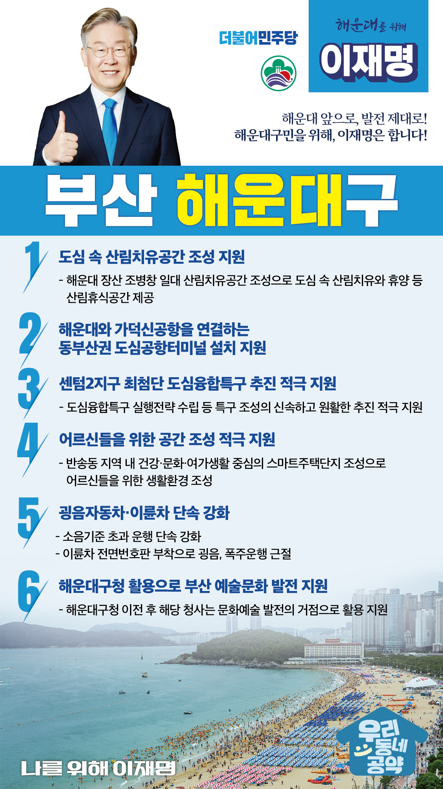

## 부산 지역 공약

# 해운대구

### 해운대 앞으로, 발전 제대로! 해운대구민을 위해, 이재명은 합니다!
> 2022-02-10

존경하는 해운대구 구민 여러분,

해운대는 대한민국에서 최대 해변인 해운대해수욕장이 있고, 바다, 강, 산, 온천에 둘러싸인 대한민국 최고의 관광휴양 도시입니다. 

 

또한 부산국제영화제와 영상벤처센터를 품은 영화의 도시이며, 부산전시컨벤션센터와 연중 대형 국제 행사를 개최하는 전시 컨벤션의 도시이기도 합니다. 

 

그러나 해외여행이 증가하고, 국내 경쟁이 심화되면서 해운대의 명성이 위축되면서 주력사업인 관광사업이 타격을 받고 있습니다. 

청년세대의 유출로 도시는 점점 나이가 들어가고 있습니다.

 

전환의 시대를 맞이하여 해운대를 다시 도약시켜야 합니다.

일자리가 있는 자족형 도시, 아이부터 어르신까지 포용적 복지가 있는 도시, 젊은이가 다시 돌아오는 도시로 만들고자 합니다. 

이재명이 해운대구 발전을 위해 6대 지역공약을 제안드립니다. 

 

첫째, 일상에 지친 도시민들을 위한 ‘도심 속 산림치유공간’조성을 지원하겠습니다.

센텀 2지구 첨단산업단지 개발을 계기로 해운대 장산 조병창 일대는 60년 만에 출입제한구역 해제를 앞두고 있습니다. 

‘산림치유공간’조성하여 도심 속에서 산림치유, 휴양, 산림문화를 향유할 수 있도록 적극 지원하겠습니다. 

바다에서 산에 이르는 새로운 해운대 랜드마크를 만들어가겠습니다.

 

둘째, 해운대와 가덕신공항과 연결하는 동부산권 도심공항터미널 설치를 지원하겠습니다.

해운대에서 간편하게 공항출국 서비스를 받을 수 있는 도심공항터미널이 건립되도록 적극 지원하겠습니다. 

국제관광도시 부산에 걸맞은 관광인프라를 조성해 나가겠습니다. 

 

셋째, 센텀2지구 최첨단 도심융합특구의 신속하고 원활한 추진을 적극 지원하겠습니다.

센텀 2지구에 최첨단 도심융합특구 조성은 해운대의 오랜 숙원사업입니다. 

하지만 사업 진행에 난항을 겪고 있습니다.  

도심융합특구 실행전략을 수립하고 특구조성이 활로를 찾을 수 있도록 적극 지원하겠습니다.   

 

넷째, 해운대에 어르신들을 위한 공간 조성을 적극 지원하겠습니다.  

해운대 반송동 지역은 어르신 인구 비중이 높아 어르신들을 위한 생활환경 조성이 절실합니다. 

건강·문화·여가생활 중심의 스마트주택단지가 조성된다면 어르신들이 건강하고 삶의 질을 높일 수 있을 것입니다. 

 

다섯째, 그동안 방치되어왔던 굉음자동차·이륜차에 대한 단속을 강화하겠습니다.

세계적 관광지인 해운대는 여름철마다 스포츠카, 오토바이 굉음과 폭주로 주민들은 물론 관광객들이 많은 불편을 호소해왔습니다. 

소음기준을 초과하는 운행에 대한 단속을 강화하고 오토바이 전면번호판 부착으로 안전을 위협하는 굉음, 폭주운행을 근절하겠습니다.

 

여섯째,  해운대구청이 부산의 예술문화 발전의 거점이 되도록 지원하겠습니다. 

문화예술분야 일자리는 수도권에 집중되어  지역 문화예술 인재의 유출이 심각한 상황입니다. 

해운대구청이 이전하면 청사부지가 부산의 문화예술 발전의 활용되도록 지원하겠습니다. 

해운대가 문화 중심도시가 될 수 있도록 지원을 아끼지 않겠습니다. 

 

 

존경하는 해운대구 구민 여러분!

 

이재명은 지킬 수 있는 것만 약속했고 약속했던 것은 지켜왔습니다.

살기좋은 해운대구 미래를 위한 약속실력과 성과로 입증된 이재명이 반드시 실천하겠습니다.

 

해운대 앞으로, 발전 제대로!

해운대구민을 위해, 이재명은 합니다!  

						