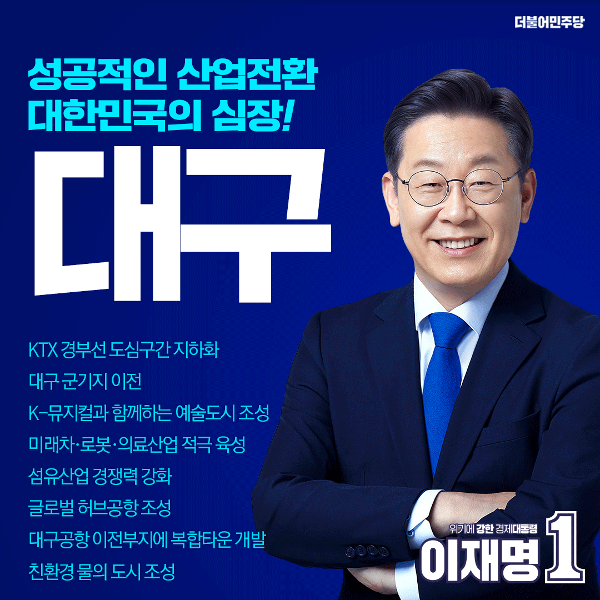

## 지역 공약

# 대구광역시
- [남구](./005_003_001/005_003_001.md)
- [달서](./005_003_002/005_003_002.md)
- [달성](./005_003_003/005_003_003.md)
- [동구](./005_003_004/005_003_004.md)
- [북구](./005_003_005/005_003_005.md)
- [서구](./005_003_006/005_003_006.md)
- [수성](./005_003_007/005_003_007.md)
- [중구](./005_003_008/005_003_008.md)

---

### 친환경 문화중심 도시! 대구공항 이전부지 복합타운 개발! 대구의 성공적인 산업전환, 이재명은 합니다!
> 2022-02-15

존경하는 대구시민 여러분,  

 

더불어민주당 대통령 후보가 되고 나서

가장 먼저 찾았던 곳이 대구 서문시장입니다. 공식 선거운동 첫날인 오늘도

고향 대구․경북에 내려와 다시 인사드리고 싶었습니다.  

 

대구는 언제나 시대를 선도해왔습니다.

한국 최초의 여성운동이라 불리는 국채보상운동에서도

6․25 전쟁 중 가장 격렬했던 다부동 전투에서도

고등학생들이 독재정권에 일제히 항거한 2.28 민주운동에서도

대구는 남달랐습니다.  

 

1938년 대구에서 시작한 호암 이병철 회장의 ‘삼성상회’는

대한민국 경제도약의 상징입니다.  

 

그러던 대구의 불빛이 지금은 꺼져 가고 있습니다.

청년은 일자리를 찾아 대구를 떠나고

24시간 돌아가던 방적 기계는 퇴물 취급을 받습니다.

시대를 앞서가는 대구로 되돌려야 합니다.  

 

수도권에 집중된 일극 체제를 끝내겠습니다.

모두 함께 잘사는 대한민국으로의 국토 대전환을

반드시 이루겠습니다.

이 국가 균형발전의 토대 위에 대구를 다시 일으키겠습니다.  

 

대구에 지지 기반을 둔 기존 정치세력이 하지 못했던 일,

저 이재명은 할 수 있습니다.

대구를 재도약시키고

대구시민의 먹고사는 문제를 해결하는 일,

이미 실력을 인정받은 유능한 후보만이 할 수 있습니다.  

 

이를 위한 대구광역시 7대 공약을 말씀드립니다.  

 

첫째, KTX 경부선의 대구 도심구간 지하화를 추진하겠습니다.  

 

급격하게 도시화가 진행되었던 대구는

철도가 도심을 관통하면서 두 개의 대구가 되었습니다.

두 개의 대구를 숲길로 연결해 다시 하나의 대구로 만들겠습니다.  

 

대구 도심을 지나는 KTX 경부선의 13km 구간을 지하화해서

철새가 날아오고 시민이 편안하게 걷고 쉴 수 있는

한국형 센트럴 파크를 조성하겠습니다.  

 

철도 주변의 주거지역을 정비하고

상업지역을 새롭게 만들겠습니다.

오랫동안 불편을 겪은 철도 인근 시민의 삶을 개선하고

인구가 떠나가는 대구가 아닌

사람이 찾아오는 대구로 변화시키겠습니다.  

 

둘째, 대구 군기지를 이전해  

도심 공간을 시민의 품으로 돌려드리겠습니다.  

 

대구 군기지는 일제강점기 일본군이 주둔했던 곳이

미군기지로 이어져 온 우리 역사의 아픔입니다.  

 

도시 한복판에 위치해 있는 미군기지가

K-2 공군기지와 함께 이전할 수 있도록 적극 지원하겠습니다.  

 

한국군 주둔지인 제2작전사령부와 제5군수지원사령부,

50사단과 공군방공포병학교도 단계적으로 적합지를 찾아

경북의 인구소멸지역으로 이동하겠습니다.  

 

장기적으로 대구․경북 메가시티 추진과 함께

조화로운 대구․경북이 되도록 하겠습니다.  

 

셋째, K-뮤지컬과 함께하는 예술도시 대구를 만들겠습니다.  

 

대구국제뮤지컬페스티벌(DIMF)은

15년의 장구한 역사를 지니고 있습니다.

대구에는 6개의 예술대학이 위치해 있고

뮤지컬 ‘투란도트’도 대구에서 탄생했습니다.  

 

대구가 세계로 뻗어나가는

K-뮤지컬의 시작이 되도록 하겠습니다.

대구에 뮤지컬진흥원과 창작지원센터를 구축하고

대형 뮤지컬 극장과 소극장을 만들겠습니다.  

 

넷째, 미래차․로봇․의료산업을 이끌어갈  

혁신도시 대구를 만들겠습니다.  

 

혁신도시 대구를 기획해 꺼져 가는

대구의 불빛을 다시 밝히겠습니다.  

 

친환경 미래차로의 산업전환을 적극 추진하겠습니다.

미래차 부품 R&D센터와 스마트 생산설비를 갖춘

‘미래형 전기차 부품 혁신 클러스터’를 조성하겠습니다.

부품기업과 종사자가 산업전환에서 소외되지 않도록

체계적인 직업훈련을 적극 지원하겠습니다.  

 

대구는 약 12만 평의 자동차 주행시험장과 같은

전국 최고의 자율주행 인프라를 갖추고 있습니다.

주행시험장과 연계한 자율주행 신기술 개발,

실증 플랫폼 구축으로

자율주행 생태계를 더욱 튼튼히 하겠습니다.  

 

지난해 유치한 3천억 원 규모의 국가로봇테스트필드를 기반으로

서비스로봇의 R&D부터 규제개선, 테스트베드, 사업화까지

로봇산업의 전주기 지원체계를 갖추도록

차질없이 지원하겠습니다.  

 

이를 통해 수요맞춤형 서비스로봇의 핵심기술을 확보하고

서비스로봇을 신산업으로 적극 육성하겠습니다.  

 

디지털 의료산업의 중심도시 대구를 만들겠습니다.

대구의 풍부한 의료 인프라를 바탕으로

의료 특화 소프트웨어 교육과정을 만들고

소프트웨어 의료기기 산업을 육성하겠습니다.

첨단의료복합단지, 대구경북과학기술원, 한국뇌연구원 등

기존에 지정된 클러스터를 소프트웨어 진흥단지로

추진하겠습니다.  

 

뇌산업 혁신클러스터를 구축하겠습니다.

대구에 소재한 한국뇌연구원의 연구실적을 기반 삼아

관련 산업 육성을 적극 지원하겠습니다.  

 

다섯째, 첨단 고부가가치 기술로의 전환을 유도해  

섬유산업의 경쟁력을 높이겠습니다.  

 

대구를 주축으로 한 섬유산업은

대한민국 경제발전에 크게 기여해온 효자산업입니다.  

 

대구 섬유산업의 재도약을 위해

섬유패션기업의 디지털 전환 실증 플랫폼을 구축해

경쟁력을 강화하겠습니다.  

 

고부가가치 스마트의류의 수출 지원사업을 뒷받침하고

프리미엄 신제품의 국내외 신시장을 적극 발굴하겠습니다.

수입 의존도가 매우 높은 섬유 소재를 국산화하기 위해

테스트베드를 구축하고 관련 제품의

표준화 개발사업을 지원하겠습니다.  

 

여섯째, 대구․경북을 세계와 연결하는  

글로벌 허브공항을 조성하겠습니다.  

 

의성과 군위에 들어설 대구경북 통합신공항을

2028년까지 차질없이 추진하겠습니다.

먼저 K-2 군공항 이전을 추진하고 스마트 물류 산단을 조성해

신공항을 세계로 뻗어가는 글로벌 관문으로 만들겠습니다.  

 

신공항의 접근성을 높이기 위해

대구 서부권 광역교통망을 개선하겠습니다.

서대구~의성을 잇는 광역 철도를 조속히 건설하겠습니다.

대구산업선 철도의 조기 복선화와

도시철도 3호선의 혁신도시 연장을 적극 지원하겠습니다.

중앙고속도로 금호JC에서 의성IC까지 구간은

4차선의 6차선 확장을 단계적으로 추진하겠습니다.  

 

공항 이전 부지에는 약속한 대로

혁신 기업도시를 건설하겠습니다.

새로운 혁신 기업도시는 대구시민의 의사를 존중하며

국가균형발전의 한 축이 되도록 추진하겠습니다.  

 

특히, 홍준표 전 대표께서 공약하신 바를 수용해

대구공항 이전부지에 혁신 기업도시와 함께

일자리 창출과 연계할 수 있는 복합타운 개발을 추진하겠습니다.  

 

일곱째, 대구를 친환경 물의 도시로 만들겠습니다.  

 

대구시민은 오랜 기간 식수의 공포를 안고 있었습니다.

앞으로는 해평취수장을 공동으로 이용해

불안감이 해소될 것입니다.  

 

취수원 다변화와 더불어 구미국가산단 제5단지 분양 활성화,

해평습지 국가정원 조성과 같은 상생 지원을

빠짐없이 살피겠습니다.  

 

나아가 세계 최고 수준의 스마트 물 관리 시스템을 구축하고

빗물 재이용과 같이 도심 물순환시스템을 정비해

안전한 수돗물 공급을 지원하겠습니다.

물산업 클러스터 입주기업에 지원을 강화하고

한국물기술인증원의 국제인증 실현을 지원하겠습니다.  

 

존경하는 대구시민 여러분!  

 

국민의 먹고사는 문제 해결에

여야가 따로 있을 수 없습니다.

경제를 살리고 성장을 회복시키는 일에

국가의 명운이 달렸습니다.

가장 일 잘하는 사람, 이미 검증된 유능한 사람에게

맡겨 주십시오.  

 

저 이재명은 주어진 작은 권한으로 차근차근 실적을 냈고

그 성과를 인정받아 이 자리까지 성장해 왔습니다.

말이 아닌 행동으로 주권자와의 약속을 천금같이 지켜서

공약 이행률이 평균 95%가 넘습니다.  

 

지금까지 해왔던 이재명, 앞으로도 할 수 있습니다.

정말 잘 드는 도구를 사용하면

대구시민의 삶이 어떻게 달라지는가를 보여드리겠습니다.

대구가 바뀌면 대한민국이 바뀝니다.  

 

친환경 문화중심 도시!

대구의 성공적인 산업전환, 이재명은 합니다!  

 

고맙습니다.