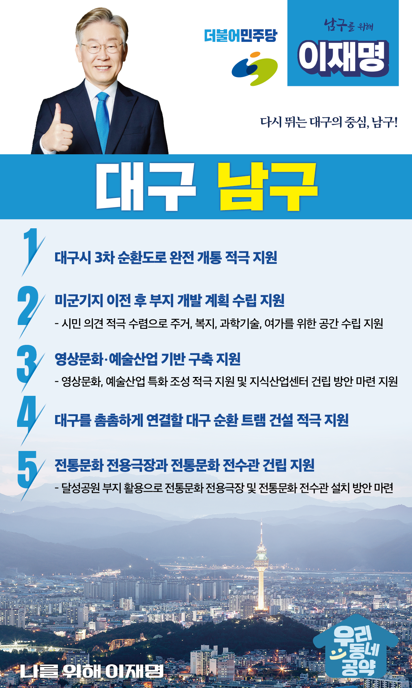

## 대구 지역 공약

# 남구

### 다시 뛰는 대구의 중심, 남구!
> 2022-02-10

존경하는 대구 남구민 여러분

 

대구시 남구는 1980년대까지만 해도 고급아파트가 집중된 중심지역이었습니다.

그러나 원도심이 노후화되면서 경제는 활력을 잃어가고 있고 각종 규제로 인해 고층건물들을 찾아보기 힘든 지경입니다. 

 

누군가는 정체되어 있는 대구 남구를 변화시켜야 합니다. 

남구가 옛 명성을 되찾을 수 있게 교통, 주거환경, 경제산업 전반에 걸친 노력이 필요합니다.

 

행정전문가인 이재명이 하겠습니다. 

대구 남구 발전을 위한 이재명의 5대 공약을 말씀드리겠습니다. 

 

 

첫째, 대구시 3차 순환도로 완전 개통을 적극 지원하겠습니다. 

대구 3차 순환도로는 1996년 건설됐지만, 순환도로라는 이름이 무색하게 미군기지로 인해 단절되어 많은 대구시민들이 불편을 호소해왔습니다.

우여곡절 끝에 부지반환 합의각서가 체결됐지만 아직 갈 길이 멉니다.

대구시 3차 순환도로가 조속히 완전개통 되도록 적극 지원하겠습니다.

 

둘째, 미군기지 이전 후 부지 개발 계획 수립을 지원하겠습니다.

남구에 있는 미군기지가 이전하면 해당 부지는 시민들의 공간이 되어야 합니다.

시민들의 의견을 적극적으로 수렴하여 주거, 복지, 과학기술, 여가를 위한 공간계획이 수립될 수 있도록 지원하겠습니다. 

 

셋째, 남구의 영상문화‧예술산업 기반 구축을 지원하겠습니다. 

대구 남구는 세계적 영화감독인 봉준호 감독의 고향입니다.

또 대명동과 삼각지 일대에는 많은 청년예술인들이 활동하고 있습니다.

대구 남구가 영상의 메카로 재탄생할 수 있도록 영상문화, 예술산업에 특화될 수 있도록 적극 지원하겠습니다. 

지식산업센터 건립 방안 마련도 지원하겠습니다. 

 

넷째, 대구를 촘촘하게 연결할 대구 순환 트램 건설을 적극 지원하겠습니다.

동구 주민과 대구 시민들이 바라는 대구 순환 트램 추진이 지연되고 있습니다. 

대구의 균형발전을 위해 시내 곳곳을 연결하는 교통망 확충이 필요합니다.

대구 순환 트램 추진이 조속히 실현되도록 적극 지원하겠습니다.

 

다섯째, 전통문화 전용극장과 전통문화 전수관 건립이 되도록 지원하겠습니다.

대구시는 2017년에 유네스코 음악창의도시로 선정되었습니다. 

대구의 전통음악과 전통문화의 계승과 발전을 위한 지원을 아끼지 않겠습니다.

달성공원 부지를 활용하여 전통문화 전용극장과 전통문화 전수관을 설치하는 방안 마련을 적극 지원하겠습니다. 

 

 

존경하는 대구 남구민 여러분

 

이재명은 지킬 수 있는 것만 약속했고 약속했던 것은 지켜왔습니다.

살기 좋은 대구 남구의 미래를 위한 약속 실력과 성과로 입증된 이재명이 반드시 실천하겠습니다.

 

남구 앞으로, 발전 제대로!

대구 남구 구민을 위해, 이재명은 합니다! 