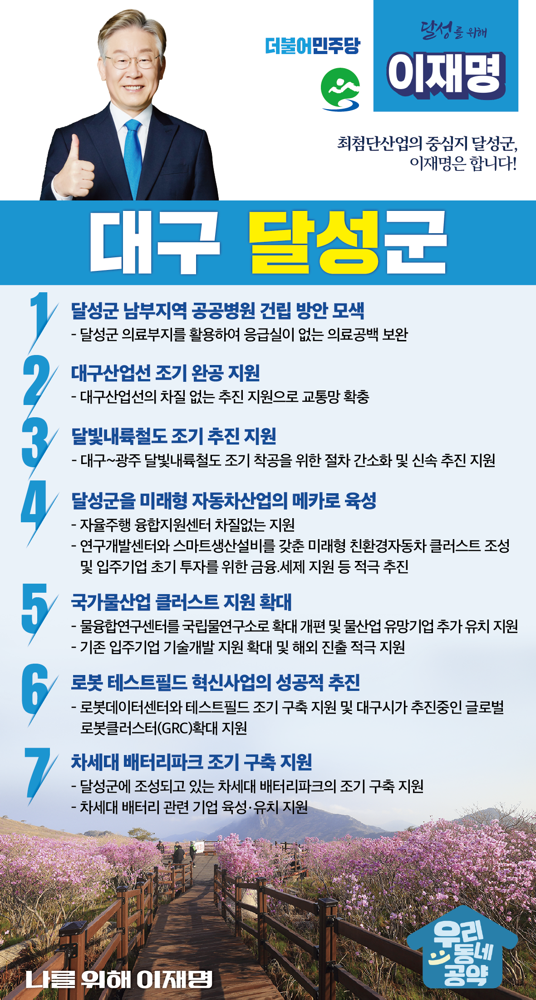

## 대구 지역 공약

# 달성군

### 최첨단산업의 중심지 달성군, 이재명은 합니다!
> 2022-02-10

존경하는 달성군민 여러분,

 

대구 달성군은 선사이래 유구한 역사와 문화가 살아 숨쉬는 전통의 고장입니다. 또한 신도시 개발과 각종 국책사업으로 지속적으로 성장하고 있는 대구의 자랑입니다. 

 

달성군을 대구의 자랑이 아니라 대한민국의 자랑으로 만들기 위해서는 강력한 실행력을 가진 정부의 지원이 필요합니다. 

 

달성군을 지원하기 위한 7가지 공약을 말씀드리겠습니다.  

 

 

첫째, 달빛내륙철도가 조기에 추진되도록 지원하겠습니다. 

영호남 상생협력과 남부지역 동서간 경제교류 활성화를 위해 대구~광주 간 달빛내륙철도의 조기 건설이 필요합니다. 달빛내륙철도가 조기에 착공될 수 있도록 절차를 간소화하고 사업을 신속히 추진하겠습니다. 달성군이 남북은 물론 동서로도 뻗어나갈 수 있는 길을 달빛내륙철도를 통해 열겠습니다. 

 

둘째, 달성군을 미래형 자동차산업의 메카로 키우겠습니다. 

전 세계는 자율주행과 친환경 등 미래자동차 산업 선점을 위한 각축을 벌이고 있습니다. 달성군은 자율주행자동차 연구개발이 집적되어 미래차 산업의 중심지가 될 것입니다. 대구시가 추진하는 자율주행 융합지원센터를 차질이 없도록 지원하고, 연구개발센터와 스마트생산설비를 갖춘 미래형 친환경자동차 클러스터를 조성하겠습니다. 이를 위해 입주기업에 초기 투자를 위한 금융․세제 지원 등을 적극 추진하겠습니다. 

 

셋째. 국가물산업 클러스터 지원을 확대하겠습니다.  

국가물산업 클러스터는 달성군의 역점사업일 뿐만 아니라 국가의 주요 정책사업입니다. 이제 막 성장하고 있는 물산업에서 달성군이 세계의 중심이 될 수 있도록 지원하겠습니다. 달성군에 있는 물융합연구센터를 국립물연구소로 확대 개편하고 더 많은 물산업 기업들이 입주할 수 있도록 지원하겠습니다. 기존 입주기업들에게는 기술개발 지원을 늘리고 입주기업의 해외 진출도 적극 지원하겠습니다.

 

넷째. 로봇 테스트필드 혁신사업을 성공적으로 추진하겠습니다.  

총 사업비 3,000억원 규모의 로봇 테스트필드 혁신사업이 성공적으로 진행되도록 꼼꼼히 지원하겠습니다. 로봇데이터센터와 테스트필드가 조기에 구축될 수 있도록 지원하겠습니다. 대구시가 추진하고 있는 글로벌 로봇클러스터(GRC) 확대를 지원하여 최첨단 산업이 조기에 안착될 수 있도록 돕겠습니다. 

 

다섯째. 대구시가 추진하는 차세대 배터리파크가 차질이 없도록 지원하겠습니다.

 

배터리를 의미하는 이차전지 산업은 제2의 반도체 산업입니다. 대구․경북에 이차전지 소재산업 벨트를 구축하고 달성군을 배터리산업의 중심지로 육성하겠습니다. 달성군에 조성되고 있는 차세대 배터리파크가 조기에 구축될 수 있도록 돕겠습니다. 배터리 산업으로 달성군을 최첨단 도시의 상징으로 만들겠습니다. 

 

여섯째. 달성군 남부지역에 공공병원 건립 방안을 모색하겠습니다.

달성군 의료부지를 활용하여 응급실이 없는 의료 공백을 보안하도록 하겠습니다.

 

일곱째. 대구 산업선 조기 완공을 지원하겠습니다.

대구산업선의 차질없는 추진 지원으로 대구 달성군의 교통망을 확충하도록 하겠습니다.

 

 

존경하는 달성군민 여러분!

 

이재명은 지킬 수 있는 것만 약속했고 약속했던 것은 지켜왔습니다.

살기 좋은 달성 미래를 위한 약속, 실력과 성과로 입증된 이재명이 반드시 실천하겠습니다.

 

달성 앞으로! 발전 제대로! 

달성군민을 위해, 이재명!  