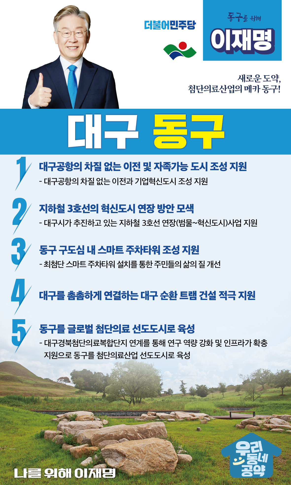

## 대구 지역 공약

# 동구

### 새로운 도약, 첨단의료산업의 메카 동구!
> 2022-02-10

존경하는 대구 동구 시민 여러분,

 

우리 대구 동구는 팔공산과 금호강이라는 천혜의 자연환경을 품고 있습니다.  

그러나 일자리와 산업시설은 부족한 전형적인 도농복합 지역입니다. 

이제는 교육, 문화, 주거 등 정주환경과 자족기능을 갖춘 복합도시로 나아가야 합니다.  

 

동구는 새로운 도약이 필요합니다.

더 많은 일자리와 더 많은 첨단산업으로 동구가 대구경제의 심장이 되도록 만들어야 합니다. 

 

주거와 일자리 그리고 교통이 조화로운 살기 좋은 동구, 동구의 미래를 열 5대 지역공약을 말씀드리겠습니다.

 

 

첫째, 대구공항이 차질 없이 이전하고 이 부지가 자족가능 도시가 되도록 지원하겠습니다.

대구공항 이전 부지에 아파트만 잔뜩 들어서서 전형적인 베드타운이 될까 우려하는 목소리가 높습니다. 

대구공항이 이전하면 자족가능한 도시가 조성되도록 지원하겠습니다.

첨단기업들과 좋은 일자리로 청년들이 찾아오는 동구를 만들겠습니다. 

 

둘째, 지하철 3호선의 혁신도시 연장 방안을 찾겠습니다.

신서혁신도시는 전철이 없어 시민들이 불편을 호소하고 있습니다.

대구대공원과 연호공공주택지구, 수성알파시티로 교통수요도 큽니다. 

대구시가 추진하고 있는 지하철 3호선 혁신도시 연장을 적극 검토하겠습니다. 

교통이 편리한 동구로 거듭나도록 힘껏 돕겠습니다.

 

셋째, 동구 구도심에 스마트 주차타워 조성을 지원하겠습니다. 

동구 구도심 지역은 주차 환경이 좋지 않아 시민들의 불편이 큽니다.

동구의 생활환경을 고려해 최첨단 스마트 주차타워 설치를 적극 지원하겠습니다. 

주민들의 주차문제 해결을 위해 최선을 다하겠습니다. 

 

넷째, 대구를 촘촘하게 연결하는 대구 순환 트램 건설을 적극 지원하겠습니다.

동구 주민과 대구 시민들이 적극적으로 요구하는 대구 순환 트램 건설을 적극 지원해 동구 주민들의 교통 편의를 높이고 대구의 균형발전도 이루겠습니다.

 

다섯째, 동구를 글로벌 첨단의료의 선도도시로 키우겠습니다. 

 

대구경북첨단의료복합단지에는 신약개발지원센터, 첨단의료기기센터 등이 입주해 있습니다.

연구역량을 강화하고 인프라가 확충되도록 지원하여 동구를 첨단의료산업의 선도도시로 만들겠습니다.

 

 

이재명은 지킬 수 있는 것만 약속했고 약속했던 것은 지켜왔습니다.

살기 좋은 동구의 미래를 위한 약속 실력과 성과로 입증된 이재명이 반드시 실천하겠습니다.

 

대구 동구 앞으로, 발전 제대로!

동구 구민민을 위해, 이재명은 합니다! 