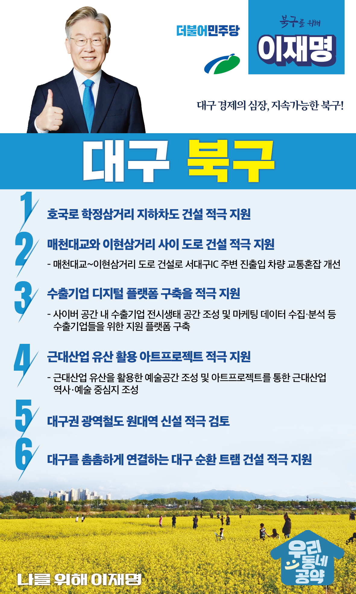

## 대구 지역 공약

# 북구

### 대구 경제의 심장, 지속가능한 북구!

> 2022-02-10

존경하는 대구시 북구민 여러분.

 

대구 북구는 3공단과 검단산업단지 그리고 전국 최대의 물류단지인 대구종합유통단지가 위치한 대구 경제의 심장입니다.

 

옛 경북도청터와 경북대학교, 삼성창조캠퍼스를 아우르는 지역은 도심 내 산업, 주거, 문화 등 우수한 복합인프라를 갖출 수 있는 힘이 있습니다. 

 

그러나 지속가능한 대구 북구를 위해서는 변화가 필요합니다.

이재명이 대구 북구를 대구의 주인공으로 만들겠습니다.

대구 북구의 발전을 위해 6가지 약속을 합니다. 

 

 

첫째, 대구시가 추진하는 호국로 학정삼거리 지하차도 건설을 적극 지원하겠습니다. 

대구 북부의 주간선도로인 호국로는 4차 순환도로 건설과 도남, 학정지구 개발로 앞으로 심각한 교통난이 우려됩니다. 

호국로 학정삼거리에 지하차도 건설로 선제적인 교통대책이 마련될 수 있도록 적극 지원하겠습니다.  

 

둘째. 매천대교와 이현삼거리 사이 도로 건설을 적극적으로 지원하겠습니다. 

매천대교에서 이현삼거리를 연결하는 도로 신설은 대도시권 교통 혼잡도로 개선계획에 포함되어 있는 주요사업입니다. 

도로 건설이 완료되면 서대구역을 이용하는 주민들의 접근성이 높아지고 서대구 IC 주변의 교통혼잡이 크게 개선될 것입니다.  

오랫동안 추진하지 못한 매천대교~이현삼거리 간 도로 건설이 제대로 추진되도록 지원하겠습니다. 

 

셋째. 수출기업들을 위한 디지털 플랫폼 구축을 지원하겠습니다.  

그간 대구는 대한민국 제조업의 중심이었지만 수출의 중심지는 아니었습니다.

디지털 시대에는 생산이 바로 수출로 연결됩니다. 

대구 북구에 위치한 수출기업들이 첨단 수출플랫폼을 활용해 성장할 수 있도록 수출기업 디지털 플랫폼 구축을 적극 지원하겠습니다. 

 

넷째. 근대산업 유산을 활용한 아트프로젝트를 적극 지원하겠습니다.  

북구에는 대구 산업화의 근간이 된 근대산업 유산들이 많습니다.

그러나 제대로 관리가 되지 않아 소중한 유산이 소실되고 있습니다.

소중한 유산을 활용해 예술공간을 조성하고 관광자원으로 활용하는 근대산업 아트프로젝트를 통해 북구가 역사와 예술의 중심지가 되도록 돕겠습니다. 

 

다섯째. 대구권 광역철도 원대역 신설을 적극 검토하겠습니다. 

대구권 광역철도 원대역은 주민들의 요구에도 불구하고 계획이 수정되면서 원대역이 제외되었습니다. 

원대역 부지 인근에는 대규모 아파트단지가 있고, 인구가 계속 유입되고 있습니다.  

북구 구민들을 위해 원대역이 신설될 수 있도록 최선을 다하겠습니다. 

 

여섯째. 대구시가 추진하는 대구 순환 트램 건설을 적극 지원하겠습니다.

북구 주민과 대구 시민들의 적극적인 요구에도 불구하고 대구 순환 트램 추진이 지연되고 있습니다. 

대구의 균형발전과 북구 발전을 위해서는 시내 곳곳을 연결하는 순환 트램 건설이 필요합니다.  

대구시가 순환 트램 건설을 성공적으로 추진할 수 있도록 적극 지원하겠습니다.

 

 

존경하는 대구시 북구 구민 여러분, 

 

오랜기간 대구 북구는 대구의 심장이자 대한민국 경제성장의 원동력이었습니다.

 

대구 북구는 더 발전할 수 있습니다.

대구 북구의 미래, 이재명이 함께 하겠습니다. 

 

발전 제대로, 북구 앞으로.

북구를 위해, 나를 위해

이재명은 합니다. 