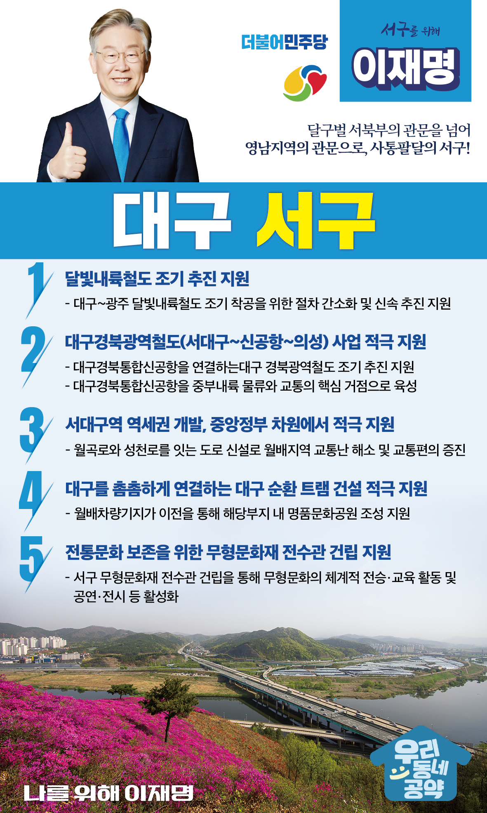

## 대구 지역 공약

# 서구

### 달구벌 서북부의 관문을 넘어 영남지역의 관문으로! 

> 2022-02-10

존경하는 대구시 서구 구민 여러분,

 

대구 서구는 오래 전부터 대구시 서북부의 관문 역할을 해왔습니다.

이제는 대구의 관문을 넘어 경부선 철도와 중부내륙, 광주대구, 중앙고속도로의 관문으로 확장되고 있습니다.

 

또한 지금은 SRT와 KTX 운행을 앞두고 꾸준히 대구의 새로운 중심권으로 부각되고 있는 지역입니다.

 

하지만, 서대구역 역세권개발은 진통을 거듭하면서 점점 더 지연되고 있고, 서구의 자랑인 전통문화 역시 제대로 된 대접을 받지 못하고 있습니다.

 

서구의 정체 이재명이 속시원히 뚫어드리겠습니다.

약속도, 일도 했던 사람이 잘 할 수 있습니다.

 

공약이행률 1위의 이재명이 서구의 미래를 약속드립니다. 

 

 

첫째. 대구와 광주를 잇는 달빛내륙철도를 조기에 추진하겠습니다.

서대구역에 KTX와 SRT가 정차하게 되면, 충청과 경북으로 교통 여건이 좋아집니다. 

이제 사통팔달의 서구가 되기 위해 호남과 연결되는 달빛 내륙철도가 필요합니다.

달빛내륙철도를 조기에 추진하여 대구 서구를 한반도 전역으로 뻗어가는 교통의 중심지로 만들겠습니다. 

 

둘째. 대구경북통합신공항을 연결하는 대구경북광역철도 사업을 적극 지원하겠습니다.  

군위군으로 이전이 확정된 대구경북통합신공항은 대구와 경북의 물류, 교통의 핵심 거점이 될 것입니다. 

신공항을 잇는 광역철도의 시발점이 바로 서대구역입니다. 

대구경북통합신공항의 성공적 개항을 적극 지원하겠습니다. 

 

 

셋째. 서대구역 역세권 개발을 중앙정부가 적극 지원하겠습니다.

KTX와 SRT 정차가 결정되었지만 서대구역 인근의 개발은 아직 시작도 못했습니다. 

대구순환 트램이나 도로 등 교통 인프라가 아직 부족합니다. 

서대구역 역세권 개발이 빠르게 진행되도록 규제를 완화하고 행정지원을 아끼지 않겠습니다.  

 

 

넷째. 대구시가 추진하는 대구 순환 트램 건설을 적극 지원하겠습니다.

서구 주민과 대구 시민들의 적극적인 요구에도 불구하고 대구 순환 트램 추진이 지연되고 있습니다. 

대구의 균형발전과 서구의 발전을 위해서는 시내 곳곳을 연결하는 순환 트램 건설이 필요합니다.  

대구시가 순환 트램 건설을 성공적으로 추진할 수 있도록 적극 지원하겠습니다.

 

다섯째. 대구 서구의 전통문화 보존을 위해 무형문화재 전수관 건립을 지원하겠습니다.

대구 서구에는 날뫼북춤, 천왕메기, 동부민요와 같은 전 세계에 자랑할 수 있는 뛰어난 전통문화가 많습니다. 

그러나 서구의 무형문화를 체계적으로 전수할 시설은 없습니다.  

서구 무형문화재 전수관 건립을 지원하여 서구의 전통문화가 세계의 전통문화로 발돋움할 수 있도록 하겠습니다. 

 

 

존경하는 대구시 서구 구민 여러분,

 

대구 서구가 새로운 대구의 중심이 될 것인지, 아니면 유망주로 남을 것인지는 누가 계획을 이끄느냐에 달려있습니다.

 

하고 싶은 것과 할 수 있는 것은 다릅니다.

할 수 있는 이재명, 해왔던 이재명이 새로운 서구 약속드립니다. 

 

성장 제대로, 서구 앞으로.

서구를 위해, 나를 위해

이재명은 합니다. 