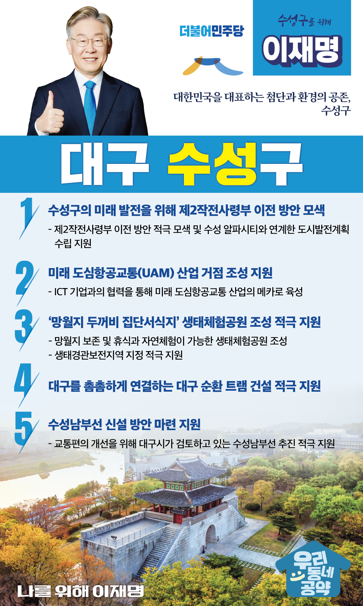

## 대구 지역 공약

# 수성구

### 대한민국을 대표하는 첨단과 환경의 공존, 수성구! 

> 2022-02-10

존경하는 대구 수성구민 여러분,

 

수성구는 전체면적의 74%가 녹지인 생태친화지역이면서 각종 관공서와 오피스가 밀집된 업무지구이자 거주 만족도가 가장 높은 지역입니다.

유수의 명문학교와 우수한 교육인프라로 대구를 대표하는 교육도시이기도 합니다.

 

수성구가 지속적으로 발전하기 위해서는 남다른 전략이 필요한 때입니다.

가까이는 군부대 이전과 수성알파시티의 성공적인 완성 로드맵이 있어야 하고 중장기적으로는 서비스산업을 넘어 첨단산업의 유치를 통한 업그레이드 전략을 수립해야 합니다.

 

이재명과 민주당이 수성구의 미래를 책임지겠습니다.

수성구가 대구를 넘어 대한민국을 대표하는 지역이 될 때까지 지원을 아끼지 않겠습니다.

수성구민의, 수성구민에 의한, 수성구민을 위한 5대 공약을 말씀드리겠습니다.

 

 

첫째, 수성구의 미래 발전을 위해 제2작전사령부 이전 방안을 찾겠습니다. 

수성구가 비약적으로 발전하면서 제2작전사령부는 도심 한가운데 외딴 섬처럼 남게 되었습니다. 

제2작전사령부 이전 방안을 적극 찾아보고 수성 알파시티와 연계해 대구 경제의 르네상스를 이끌어갈 수 있는 도시발전계획 수립을 지원하겠습니다.

 

둘째, 미래 도심항공교통(UAM) 산업의 거점이 되도록 지원하겠습니다.

수성구는 드론택시로 불리는 도심항공교통에 특화되어 있는 도시입니다. 

수성구의 강점인 ICT 기업과 협력하여 미래 도심항공교통 산업의 거점이 되도록 적극 지원하겠습니다.  

 

셋째, ‘망월지 두꺼비 집단서식지’의 생태체험공원 조성을 적극 돕겠습니다. 

수성구의 망월지는 전국 최대 두꺼비 산란지로 해마다 2~300만 마리의 두꺼비가 대이동을 하는 생태지역입니다.

망월지를 보존하고 지역주민의 휴식과 자연체험을 위한 생태체험공원을 조성하고 ‘생태경관보전지역’ 지정도 적극 돕겠습니다.

 

넷째, 대구를 촘촘하게 연결하는 대구 순환 트램 건설을 적극 지원하겠습니다.

 

수성구 주민과 대구 시민들이 적극적으로 요구하는 대구 순환 트램 건설을 적극 지원하여 첨단과 환경이 같이 숨 쉬는 수성구를 만들겠습니다. 

 

다섯째, 수성남부선 신설 방안 마련을 지원하겠습니다.

 

파동, 상동, 중동 지역은 대표적인 철도 소외지역입니다. 

시내 이동이 수월하지 않아 지역주민들이 많은 불편을 겪어왔습니다.

수성남부선 신설을 원하는 수성구민들의 의견을 적극 수렴해 수성구가 사통팔달의 교통망을 갖추도록 돕겠습니다.

 

 

존경하는 수성구민 여러분,

 

수성구의 지속가능발전 여부는 여러분의 손에 달렸습니다.

이재명이 수성구민들이 만들어가는 미래를 응원하겠습니다.

 

이재명은 지킬 수 있는 것만 약속했고 약속했던 것은 지켜왔습니다.

살기 좋은 수성구 미래를 위한 약속 실력과 성과로 입증된 이재명이 반드시 실천하겠습니다.

 

수성 앞으로, 발전 제대로!

수성구민을 위해, 이재명은 합니다! 