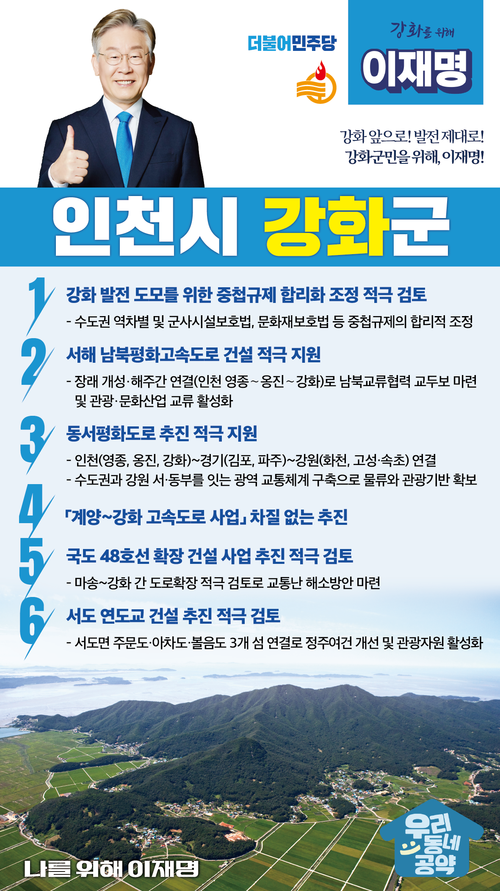

## 인천 지역 공약

# 강화군

### 강화 앞으로, 발전 제대로!
> 2022-02-05

인천 강화군민 여러분,

 

인천 강화군은 수도권의 외곽에 위치한, 북한과 불과 1.8km의 거리를 둔 인구 7만의 농어촌지역입니다.

 

강화군은 국제도시로서, 평화상징도시로서, 그리고 위성도시로서 잠재력이 가득한 곳입니다. 그러나 강화군은 불필요한 규제들에 둘러 쌓여 발전 가능성의 날개를 맘껏 펼칠 기회조차 부여받지 못했습니다.

 

강화군의 잠재력을 맘껏 발산하기 위해서는 국가 균형발전과 접경지원 등 국가적 관심과 정책이 절실히 필요한 때입니다.

이를 위한 저 이재명의 강화군 6대 지역공약을 말씀드리겠습니다.

 

첫째, 중첩규제의 합리화 조정으로 강화 발전을 도모하겠습니다.

강화군은 인구 감소와 고령화로 어려움을 겪고 있습니다. 

또한, 수도권이라는 지리적 이유와 군사시설·문화재 보호를 이유로 각종 규제를 받고 있습니다. 

중첩규제의 합리적 조정을 적극 검토하겠습니다. 

 

둘째, 서해남북평화고속도로 건설을 적극 지원하겠습니다.

인천 영종도와 신도를 잇는 서해남북평화도로가 착공됐습니다. 

서해평화도로는 남북교류협력과 지역 경제 활성화를 위한 핵심 현안입니다. 

한반도 평화 체제 구축과 발맞추어 서해남북평화도로의 차질 없는 추진을 지원하겠습니다. 

 

셋째, 동서평화도로 추진을 적극 지원하겠습니다.

인천 강화에서 강원도 고성까지 접경지역들을 하나로 잇는 동서평화도로 건설 추진을 적극 지원하겠습니다. 

수도권과 강원을 잇는 광역교통망 구축으로 접경지역의 균형발전을 앞당기겠습니다. 

 

넷째, 계양강화고속도로 사업을 차질 없이 추진하겠습니다.

경기도에서 강화도로 진입하는 국도 48호선은 만성정체 구간입니다. 

계양강화고속도로 사업을 차질 없이 추진하여 교통난을 해소하고, 강화도로의 도로 접근성을 개선하겠습니다.

 

다섯째, 국도 48호선 확장 건설 사업 추진을 적극 검토하겠습니다.

강화도는 인천의 대표 관광지로서 유동인구가 지속적으로 증가하고 있어 강화도로 진입하는 국도 48호선의 확장이 시급한 상황입니다. 

마송에서 강화 간 도로확장을 적극 검토하여 교통난 해소방안을 마련하겠습니다.

 

여섯째, 서도 연도교 건설 추진을 적극 검토하겠습니다.

서도 연도교 건설은 서도면 주민들의 숙원 사업입니다. 

서도면의 정주여건을 개선하고 관광자원 활성화할 수 있습니다. 

올해 강화군이 단계별 추진계획을 발표한 만큼 이 사업이 추진될 수 있도록 돕겠습니다.

 

 

존경하는 강화군민 여러분!

 

이재명은 지킬 수 있는 것만 약속했고 약속했던 것은 지켜왔습니다.

살기 좋은 강화군 미래를 위한 약속실력과 성과로 입증된 이재명이 반드시 실천하겠습니다.

 

강화 앞으로! 발전 제대로!

강화군민을 위해, 이재명!