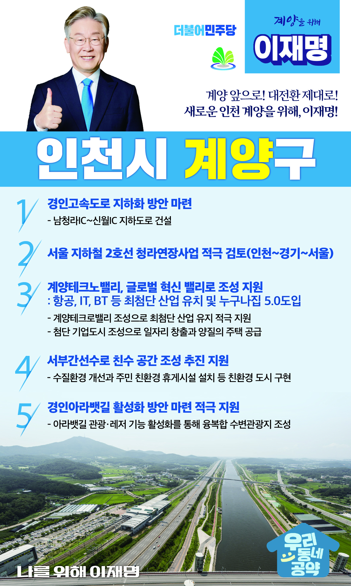

## 인천 지역 공약

# 계양구

### 계양 앞으로, 대전환 제대로!
> 2022-02-05

존경하는 계양구민 여러분, 더불어민주당 대통령 후보 이재명입니다.

 

계양은 서울, 부천, 인천의 신·구도심 그리고 인천·김포국제공항으로 접근이 용이한 ‘사통팔달’의 요충지로서 수도권의 주요 ‘베드타운’으로 자리 잡아 왔습니다.

 

 

그러나, 저출산·고령화 시대에 진입하며 계양의 인구는 지속해서 감소했고, 2020년에는 30만 인구선이 무너지며 계양을 위축시키고 있습니다.
인구감소는 곧 소비 위축으로 이어지며, 계양의 성장 저하와 침체를 가져오기에 시급히 해결해야할 문제입니다.

 

위기를 기회로 만들어온 저 이재명과 민주당이 해낼 수 있습니다.

계양의 변화와 혁신을 이끌어가기 위한 5대 지역공약을 말씀드리겠습니다.

 

첫째, 경인고속도로 지하화 사업을 적극 지원하겠습니다.

 

경인고속도로 진입 구간은 상습정체를 빚는 구간으로 제3연륙교 건설 시 교통혼잡이 더 심해질 것이 예상되는 상황입니다.

경인고속도로 지하화 사업을 적극 지원하여 교통난을 해소하고 주민 교통편의를 증진시키겠습니다.

 

둘째, 지하철 2호선 청라연장사업을 적극 검토하겠습니다.

 

계양구는 서울과 근접한 지역으로 유동인구가 많은 교통의 중심지이지만 서울로 이동할 수 있는 대중교통은 1호선으로 한정되어 있습니다.

서울 지하철 2호선 청라 연장을 적극 검토하여 인천에서 경기, 서울을 잇는 수도권 대중교통망을 완성되도록 적극 돕겠습니다.

 

셋째, 계양테크노밸리가 첨단혁신 밸리로 조성되도록 지원하겠습니다.

 

계양테크노밸리가 성공되도록 조성되어 최첨단 산업을 유치할 수 있도록 적극 지원하겠습니다.

이를 통해 일자리가 창출되고 양질의 주택이 공급되는 일자리와 주거가 어우러진 첨단 기업도시로 발전하도록 돕겠습니다.  

 

넷째, 서부간선수로 친수공간 조성이 차질 없이 추진되도록 지원하겠습니다.

 

서부간선수로는 계양구를 대표하는 주요 물길이지만 수질오염과 고질적인 악취로 몸살을 앓고 있습니다.

수질환경 개선과 주민들을 위한 친환경 휴게시설 조성을 적극 지원하여 자연과 사람이 공존하는 친수공간으로 탈바꿈하겠습니다.

 

다섯째, 경인아라뱃길 활성화 방안이 마련되도록 적극 지원하겠습니다.

 

아라뱃길은 당초 물류 용도로 활용할 목적이었으나 물동량이 저조하여 어려움을 겪고 있습니다.

아라뱃길의 관광·레저 기능이 활성화되는 방안이 마련되도록 지원하여 대표적 관광지로 거듭나도록 돕겠습니다. 

 

 

존경하는 계양구민 여러분!

 

계양구가 신(新) 경인산업축이자 주요관광지로 발돋움하여 비단 인천뿐만 아니라 대한민국의 미래 먹거리의 중심지가 되도록 그 대전환을 만들어내겠습니다.

저는 그동안 지킬 수 있는 것만 약속했고 약속은 꼭 지켰습니다.

오늘 여러분께 드린 약속도 실력과 성과로 입증된 제가 반드시 실천하겠습니다.

 

 

계양 앞으로! 대전환 제대로!

새로운 인천 계양을 위해, 이재명! 