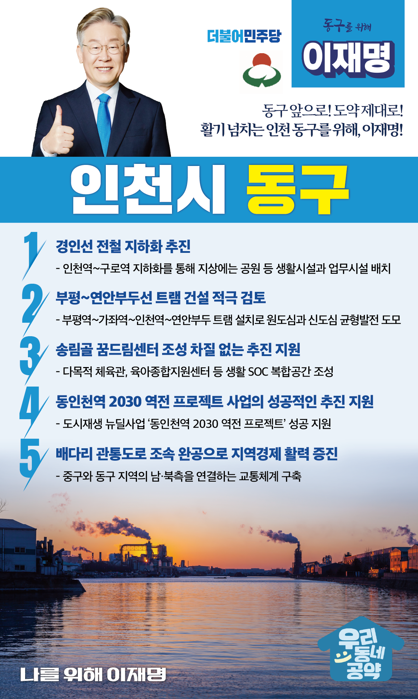

## 인천 지역 공약

# 동구

### 활기 넘치는 인천 동구를 위해! 이재명! 
> 2022-02-05

동구 구민 여러분,

 

동구는 인천 근대화 역사에서 빠질 수 없는 중심지입니다.

개항 이후에는 군사요충지의 역할을 수행했으며, 인천 3.1 운동의 발상지가 되었던 장영초등학교를 품고 있는 지역입니다.

 

더불어 한국철도의 시작이었던 경인선과 아시아 최대 공구상가인 송림공구상가, 현대제철과 동국제강, 두산인프라코어 등 굵직한 대기업을 품고 있는 경제도시이기도 합니다.

 

동시에 인구감소, 신·구도시 간 불균형 심화 문제 등 해결해야 할 과제도 안고 있습니다.

원도심과 신도심이 어깨를 나란히 하는 인천 동구, 이재명과 민주당이 해낼 수 있습니다.

인천 동구에 활력을 불어넣기 위한 5대 지역공약을 말씀드리겠습니다.

 

첫째, 경인선 전철 지하화를 추진하겠습니다.

도심을 양분시키는 경인전철은 지역 발전의 가장 큰 걸림돌이었습니다.

1호선의 지하화를 추진하고 지상에 공원 등 생활시설과 업무시설을 배치해 단절된 도시를 연결하고 시민들의 삶을 풍요롭게 하겠습니다.

 

둘째, 부평~연안부두선 트램 건설을 적극 검토하겠습니다.

서해 도서로 운항하는 여객선의 출발지인 연안부두에서 부평역을 잇는 부평~연안부두선 트램 사업은 동구 주민들의 이동편의와 교통복지를 향상시키고, 원도심과 신도심의 균형발전도 증진할 것입니다. 

 

셋째, 송림골 꿈드림센터의 조성이 차질 없도록 돕겠습니다.

인천 동구의 새로운 거점이자 지역 활성화의 중심이 될 송림골 꿈드림센터가 차질없이 조성되도록 지원하겠습니다.

다목적 체육관, 육아종합지원센터 등 복합공간으로 구성해 주민 건강과 ‘아이 키우기 좋은 환경’ 조성에도 도움이 되게 하겠습니다.

 

넷째, 동인천역 2030 역전 프로젝트 사업의 성공적인 추진을 지원하겠습니다.

동인천의 대표적인 도시재생 뉴딜사업인 ‘동인천역 2030 역전 프로젝트’의 성공을 지원하겠습니다.

동인천역이 상업과 문화 중심지로 활기를 되찾고, 좋은 일자리도 창출하여 청년세대가 모여드는 중심 시가지로 거듭나도록 적극 돕겠습니다.

 

다섯째, 배다리 관통도로를 조속히 완공하여 지역경제에 활력을 불어넣겠습니다.

올해 초(1.3) 배다리 관통도로의 마지막 구간인 승인지하차도 착공을 위한 민·관 상생 협약이 맺어졌습니다.

이제 20년 숙원사업의 마침표를 제대로 찍겠습니다. 

중구와 동구 지역의 남·북측을 연결하는 교통체계를 구축하여 지역주민이 상생하고 지역경제가 활성화되도록 적극 돕겠습니다.

 

 

존경하는 동구 구민 여러분!

 

이재명은 지킬 수 있는 것만 약속했고 약속했던 것은 지켜왔습니다.

오늘 여러분께 드린 약속도 실력과 성과로 입증된 제가 행동과 실천으로 보여드리겠습니다. 

 

동구 앞으로! 도약 제대로!

활기 넘치는 인천 동구를 위해, 이재명!  

						