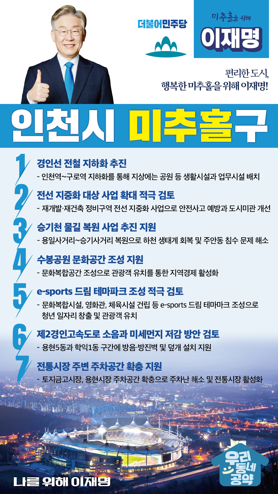

## 인천 지역 공약

# 미추홀구

### 편리한 도시, 행복한 미추홀! 
> 2022-02-05

존경하는 미추홀구 구민 여러분,

 

미추홀구는 인천 역사의 발상지이자 변천사를 간직한 문화중심지입니다.

인천도호부 관아. 인천향교, 문학산성, 학산서원 터 등 주요 문화재를 품은 도시입니다.

 

주안 국가산업단지를 품고 있어 국내 산업경제를 지탱해 온 지역 중 하나이기도 합니다.

산업화 시대, 경제의 성장거점 역할을 수행하며 국민경제 및 지역경제 발전과 일자리 창출에 기여한 지역입니다.

 

동시에 도심을 분단하는 경인전철, 신·구도심의 불균형 발전 등해결해야 할 과제도 남아있습니다.

 

저 이재명과 민주당이 위기를 기회로 만들어온 저력을 바탕으로 미추홀구를 다시 한번 도약시키겠습니다.

 

더 살기 좋은 미추홀구를 위한 7대 지역공약을 말씀드리겠습니다.

 

 

첫째, 경인선 전철 지하화를 추진하겠습니다.

도심을 양분시키는 경인전철은 지역 발전의 가장 큰 걸림돌이었습니다.

1호선의 지하화를 추진하고 지상에 공원 등 생활시설과 업무시설을 배치해 단절된 도시를 연결하고 시민들의 삶을 풍요롭게 하겠습니다.

 

둘째, 전선 지중화 대상 사업 확대를 적극 검토하겠습니다.

균형발전을 위해 추진 중인 재개발·재건축 정비구역은 무분별한 전선 케이블 등으로 주민 불편과 안전사고 발생 우려가 높은 상황입니다.

안전사고 예방과 도시미관 개선을 위해 재개발·재건축 정비구역도 전선 지중화 사업 대상에 포함하는 방안을 검토하겠습니다. 

 

셋째, 승기천 물길복원 사업이 원만히 추진되도록 지원하겠습니다. 

미추홀구 도심의 주요 물길인 승기천의 물길 복원으로 하천 생태계를 회복할 수 있습니다.

동시에, 주안동 일대의 침수 문제도 해소하여 주민들의 안전을 지킬 수 있도록 지원하겠습니다.

 

 

넷째, 수봉공원에 문화공간이 조성되도록 지원하겠습니다.

수봉공원은 인천의 원도심에 맑은 산소를 공급하는 허파와 같은 곳입니다.

문화복합공간을 조성하여 인천의 대표적인 공원이 되도록 뒷받침하겠습니다. 

지역주민이 편히 쉴 수 있고, 관광객 유치를 통해 지역경제가 활성화되도록 하겠습니다.

 

다섯째, e-sports 드림 테마파크 조성을 적극 검토하겠습니다.

미추홀구는 산·관·학이 서로 협력할 수 있는 지역이면서 동시에 인천공항과 인천항에 인접해 있어 글로벌 문화도시로의 성장 가능성이 높은 지역입니다. 

e-sports 드림 테마마크 조성은 청년의 일자리를 창출하고, 관광객 유치를 통한 부가가치 창출에 기여할 것입니다. 

 

여섯째, 제2경인고속도로 소음과 미세먼지 저감 방안을 검토하겠습니다.

제2경인고속도로에서 발생하는 소음과 미세먼지로 인접지역 주민들이 불편을 겪고 있습니다. 제2경인고속도로 출발지점과 가까운 용현5동과 학익1동 구간에 

방음·방진벽과 덮개 설치를 지원하여 쾌적한 주거환경을 만들겠습니다.

 

일곱째, 전통시장 주변 주차공간 확충을 지원하겠습니다. 

오래된 주택과 좁은 골목으로 전통시장 인근 주차공간이 현저히 부족한 상황입니다.

주차공간 확충을 지원하여 주차난을 해소하고 전통시장 활성화도 뒷받침하겠습니다. 

 

존경하는 미추홀구민 여러분!

 

미추홀구의 도약을 위해서는 지자체 행정업무를 모두 경험한 능력 있는 대통령이 필요합니다.

이재명이 열어갈 미추홀구의 미래를 기대해주십시오.

 

미추홀 앞으로! 발전 제대로!

미추홀의 미래를 위해, 이재명!  

						