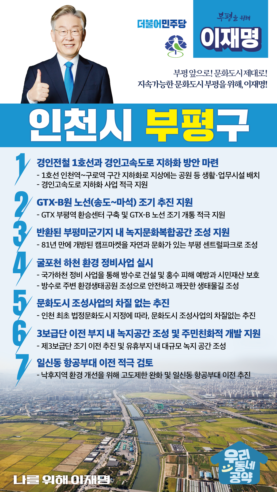

## 인천 지역 공약

# 부평구

### 지속가능한 문화도시 부평을 위해!
> 2022-02-05

존경하는 부평구민 여러분,

 

700여 년의 역사를 가진 우리 부평은 인천을 대표하는 도심입니다.

1960년대 산업화 시대에는 인천에서 처음 부평 국가산업단지가 조성되었고, 부평 국가산업단지에서 우리의 산업화 1세대가 흘린 땀은 대한민국 경제 성장의 역사가 되었습니다.

 

우리나라 대중문화에서도 부평은 상징적인 곳입니다. 

50∼60년대에는 미군기지에서 공연하던 우리 음악가들은 이른바 '뮤지션 타운'에서 모여 살면서 우리 대중음악에 큰 영향을 미쳤습니다.

 

그러나 부평의 화려했던 대중문화는 과거가 되어버리고 있습니다. 

전환의 시대에 접어들면서 부평의 산업도 위축되고 있습니다.

 

역사와 문화가 가장 잘 어울리는 부평이 지속 가능한 문화도시가 되도록 부평구 7대 지역공약을 말씀드리겠습니다. 

 

첫째, 경인전철과 경인고속도로 지하화 방안을 마련하겠습니다. 

 

도심을 양분시키는 경인전철은 지역 발전의 가장 큰 걸림돌이었습니다.

1호선의 지하화를 검토하고지상에 공원 등 생활시설과 업무시설을 배치해 단절된 도시를 연결하고 시민들의 삶을 풍요롭게 하겠습니다. 

교통 혼잡이 심각한 경인고속도로 지하화 사업도 적극 지원하겠습니다.

 

둘째, 수도권 광역급행철도 GTX-B 노선이 조기 추진되도록 지원하겠습니다.

GTX 부평역 환승센터 구축사업을 내실 있게 추진하여 지역을 대표할 수 있는 랜드마크가 되도록 지원하고, GTX-B 노선의 조기 개통을 위한 사업추진 계획을 적극 지원하여 주민들의 교통편의 향상에 최선을 다하겠습니다.

 

셋째, 반환된 부평미군기지의 녹지문화복합공간 조성을 지원하겠습니다.

전국에 있는 많은 미군기지 중 부평의 캠프마켓이 가장 빨리 시민의 품으로 돌아왔습니다. 

81년 만에 개방된 캠프마켓을 자연과 문화가 살아 숨쉬는 부평의 센트럴파크로 만들기 위해 적극 지원하겠습니다.

 

넷째, 국가하천인 굴포천이 조속히 정비되도록 최선을 다하겠습니다. 

부평을 가로지르는 굴포천은 경사가 완만하고 하폭이 좁아 걸핏하면 홍수가 발생하곤 했습니다. 

국가하천 정비사업으로 방수로를 건설해 홍수 피해를 예방하고 시민들의 소중한 재산을 보호하겠습니다. 

방수로 주변에는 환경생태공원을 조성해 안전하고 깨끗한 생태물길을 조성하겠습니다.

 

다섯째, ‘문화도시 부평’ 조성사업을 뒷받침하겠습니다. 

부평구는 지난해 인천 최초로 법정 문화도시로 지정되는 쾌거를 이루었습니다.

구민의 더욱 풍성한 문화생활을 위해 문화도시 조성사업이 차질 없이 추진되도록 돕겠습니다.

 

여섯째, 제3보급단 조기 이전이 원만히 진행되어 주민 친화적으로 개발되도록 지원하겠습니다.  

3보급단 이전사업으로 유휴부지가 확보되면, 대규모 녹지 공간이 조성되어 지역 주민들의 정주환경이 개선되도록 적극 지원하겠습니다.

 

일곱째, 일신동 항공부대 이전을 적극 검토하겠습니다.

일신동 항공대는 주거지와 붙어 있어 주민들은 밤낮없이 헬기가 뜨고 내리는 소음을 들어야 하며, 고도제한 등 각종 제약으로 지역이 낙후되어 주민들도 지역을 떠나고 있습니다. 

일신동 항공대 이전 논의가 원만히 진행되도록 지원하겠습니다. 

 

존경하는 부평구민 여러분!

 

역사를 잊지 않고, 문화를 아는 대통령이 필요합니다.

국민의 민생을 최우선으로 하는 행정가가 필요합니다.

 

이재명이 열어갈 부평의 미래를 기대해주십시오.

 

부평 앞으로! 문화도시 제대로!

지속가능한 문화도시 부평을 위해, 이재명! 