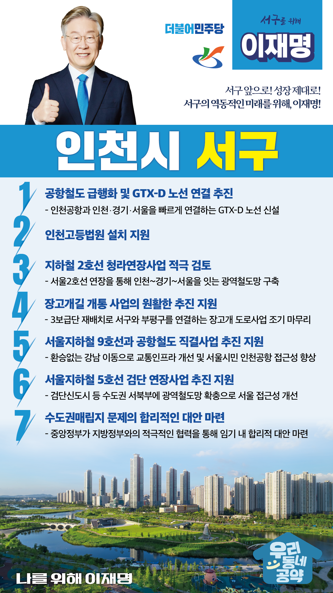

## 인천 지역 공약

# 서구

### 서구의 역동적인 미래를 위해!
> 2022-02-05

존경하는 서구 구민 여러분,

 

인천 서구는 대한민국의 관문인 인천국제공항이 인접해 있으며 국제산업금융도시인 청라국제도시와 검단신도시, 입체도시인 루원시티가 조성돼 인천의 명실상부한 경제수도, 신흥 거점도시로 성장하고 있습니다.

 

인천 서구가 더욱 역동적인 성장을 할 수 있도록 저 이재명이 앞장서겠습니다. 

구도심 활성화를 위한 지역재생사업을 적극 추진하고, 신도심의 가치를 높여 신·구도심이 조화롭게 상생발전을 이뤄갈 수 있도록 하겠습니다.

 

이를 위한 인천 서구 7대 지역공약을 말씀드리겠습니다.

 

첫째, 공항철도를 급행화하고 GTX-D 노선 연결을 추진하겠습니다.

인천국제공항은 제4활주로가 완공되면 1억명 이상이 방문하는 세계 3대 공항이 될 전망입니다. 

공항 이용객을 비롯한 지역주민들의 교통편의 향상을 위해 공항철도를 급행화와 GTX-D 노선 연결 사업을 추진하겠습니다.

 

둘째, 인천고등법원 설치를 돕겠습니다.

인천은 광역시 중 두 번째로 큰 도시이지만 아직 고등법원이 없습니다. 

이로 인해 인천 시민들은 재판을 위해서 서울고등법원까지 이동해야 합니다.

인천고등법원 설치 논의가 원활히 진행되도록 지원하여 소송업무로 인한 시간적·경제적 불편을 개선하도록 돕겠습니다. 

 

셋째, 지하철 2호선 청라연장사업을 적극 검토하겠습니다.

인천 서구는 서울로 이동할 수 있는 대중교통이 매우 부족하여 시민들이 많은 불편을 겪고 있습니다. 

인천에서 경기, 서울을 잇는 수도권 대중교통망을 완성을 위해 서울 지하철 2호선 청라 연장을 돕겠습니다. 

 

넷째, 장고개길 개통 사업이 원활히 추진되도록 지원하겠습니다.

3보급단은 개발제한구역으로 지정되어 주변 지역 주민들이 큰 불편을 감내해왔습니다.

3보급단 재배치가 차질 없이 추진되어 장고개 도로사업이 조기에 마무리 되도록 지원하겠습니다.

 

다섯째, 서울지하철 9호선과 공항철도 직결사업의 추진을 지원하겠습니다.

서구 주민의 20년 숙원사업인 9호선과 공항철도 직결사업이 원만하게 추진되도록 뒷받침하겠습니다. 

서구 주민들의 서울 접근성을 획기적으로 개선하고, 인천공항 이용객의 공항 접근성도 향상시켜 나가겠습니다. 

 

여섯째, 서울지하철 5호선의 검단 연장사업이 원만히 추진되도록 돕겠습니다.

서울5호선 검단 연장 사업은 열악한 교통망으로 불편을 겪고 있는 수도권 서북부 주민들의 교통기본권을 보장하는 숙원사업입니다. 

시민들의 교통편의를 증진시키고 수도권 균형발전을 이뤄낼 수 있도록 노력하겠습니다.

 

일곱째, 수도권매립지 문제의 합리적인 대안을 마련하겠습니다.

수도권매립지 문제는 이해관계가 첨예하여 지방정부 간 협의만으로 해결이 쉽지 않습니다. 

중앙정부가 지방정부와의 적극적인 협력을 통해 임기 내에 합리적 대안을 마련할 수 있도록 노력하겠습니다.

 

존경하는 서구 구민 여러분!

 

저는 그동안 지킬 수 있는 것만 약속했고 약속은 꼭 지켰습니다.

오늘 여러분께 드린 약속도 실력과 성과로 입증된 제가 반드시 실천하겠습니다.

이재명이 열어갈 서구의 미래를 기대해주십시오.

 

서구 앞으로! 성장 제대로!

서구의 역동적인 미래를 위해, 이재명!  