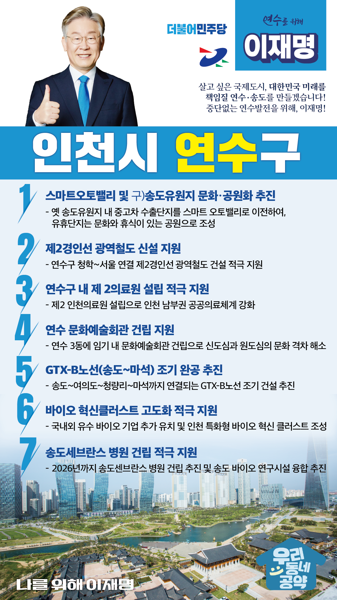

## 인천 지역 공약

# 연수구

### 살고 싶은 국제도시, 중단 없는 연수 발전!
> 2022-02-05

존경하는 연수구민 여러분, 더불어민주당 대통령 후보 이재명입니다.

 

우리 연수·송도는 바다를 메워 무(無)에서 유(有)를 창조한 도시입니다.

 

삼성바이오와 셀트리온 등 유수한 바이오 기업들이 한데 모여 바이오산업의 미래를 책임지고 있으며 송도 센트럴 파크 등 도시와 자연이 조화를 이룬 상업·관광 도시입니다.

또한, 제2경인선과 인천발KTX, 월곶판교선 등 수도권 남부지역 교통의 출발점입니다.

 

연수구는 인천 발전의 새로운 동력으로 대한민국 미래 먹거리와 4차 산업을 선도할 곳이며, 인천을 대표하는 국제 교육·문화의 도시이기도 합니다.

 

한층 더 도약하는 연수구, 저 이재명과 민주당이 해낼 수 있습니다.

인천 연수구의 중단없는 발전을 위한 7대 지역공약을 말씀드리겠습니다.

 

첫째, 옛 송도유원지를 연수구민의 문화 공원으로 만들겠습니다.

 

옛 송도유원지 내 중고차 수출단지는 스마트 오토밸리로 이전을 차질없이 추진하고, 이 곳을 문화와 휴식이 있는 공원으로 조성하여 인천 시민께 돌려드리겠습니다.

 

둘째, 제2경인선 광역철도가 신설되도록 지원하겠습니다.

 

연수구 청학부터 서울로 연결되는 제2경인선 광역철도 건설을 적극 지원하여 인천과 서울 간 접근성을 획기적으로 향상 시키겠습니다.

 

셋째, 연수구에 제2 인천 의료원 설립을 적극 지원하겠습니다.

 

코로나 19 등으로부터 시민의 건강을 지키고, 연수구를 비롯한 인천 남부권의 취약한 공공의료체계를 강화하기 위해 제2인천의료원 설립을 적극 지원하겠습니다.

 

넷째, 연수 문화예술회관 건립을 지원하여 문화도시 연수구를 만들겠습니다.

 

신도심과 원도심의 문화 향유 격차를 줄이기 위해 연수 3동에 문화예술회관 건립이 필요합니다.

이를 통해 주민들의 삶을 더 풍요롭게 하겠습니다.

 

다섯째, 수도권 광역급행철도 GTX-B 노선을 조기에 추진하겠습니다.

 

연수구민의 교통난 해소를 위해 인천 송도에서 출발하여 여의도, 청량리를 거쳐 마석까지 연결되는 GTX-B 노선이 조기에 건설되도록 적극 노력하겠습니다.

 

여섯째, 송도 바이오 혁신클러스터 고도화를 적극 지원하겠습니다. 

 

2021년 7월 송도가 K-바이오 랩허브로 지정됐습니다.

송도에 국내외 유수 바이오 기업을 추가로 유치하고 인천 특화형 바이오 혁신 클러스터를 조성하여 송도가 글로벌 백신 허브 도시로 도약하도록 뒷받침하겠습니다.

 

일곱째, 송도 세브란스 병원 건립을 적극 지원하겠습니다.

 

연수구민의 오랜 숙원사업인 송도 세브란스 병원이 예정대로 2026년경 건립될 수 있도록 돕겠습니다.

이 병원은 송도의 바이오 연구 시설과 융합하여 국내 최고 수준의 의료 인프라를 구축할 수 있도록 지원하겠습니다.

 

존경하는 연수구민 여러분!

 

연수구의 발전은 중단 없이 진행되어야 합니다. 성남과 경기도가 그랬듯, 인천과 연수구도 주민들의 삶을 위해 더욱 발전되어야 합니다.

지자체 행정업무를 모두 경험한 능력 있는 현장 대통령이 필요합니다.

이재명이 열어갈 연수구의 미래를 기대해주십시오.

 

앞으로 연수! 제대로 연수 발전!

새로운 연수구를 위해, 이재명! 