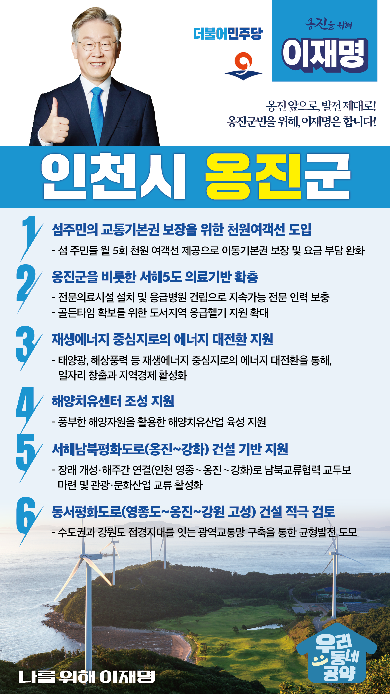

## 인천 지역 공약

# 옹진군

### 옹진 앞으로, 발전 제대로!
> 2022-02-05

존경하는 옹진군민 여러분,

 

인천 옹진군은 113개의 섬으로 구성된 아름다운 섬의 고장으로 천혜의 자연환경을 간직하고 있습니다.

대한민국 서해안의 최북단에 위치한 국가 보안상 전략적 요충지며 황해권역 미래 해양교통의 중심지이기도 합니다.

 

한편 지역경제 위축, 의료공백 문제 등 해결해야 할 과제도 남아있습니다.

안전하고 살기 좋은 옹진군을 위한 6대 지역공약을 말씀드리겠습니다. 

 

첫째, 섬주민의 교통기본권 보장을 위해 천원여객선을 도입하겠습니다. 

 

섬 주민들은 육지와 떨어져 있어 모든 국민이 가져야 할 교통기본권을 누리지 못하고 있습니다.

섬 주민들에게 월 5회 천원 여객선을 제공하여 주민들의 이동기본권을 보장하고 요금 부담도 완화하겠습니다. 

 

둘째, 옹진군민의 삶을 지키는 보건 의료체계를 구축하겠습니다.

 

서해5도 지역의 의료기반 확충은 주민의 생명과 직결된 시급한 과제입니다.

응급의료 인력을 확충과 응급헬기 지원을 확대하여  주민 생명을 보호하기 위한 골든타임을 확보해 나가겠습니다. 

 

셋째, 옹진군을 재생에너지 중심지가 되도록 지원하겠습니다.

 

기후위기 대응을 위해 영흥화력발전소의 단계적 폐쇄가 불가피합니다.

발전소와 협력업체 종사자의 고용불안과 지역경제 침체가 우려됩니다.

에너지 대전환 시대를 맞아 옹진군을 태양광, 해상풍력 등 재생에너지 중심지가 되도록 지원하겠습니다.

이전보다 더 많은 일자리가 창출되어 고용불안을 해소하도록 지원하겠습니다.

 

넷째, 해양치유센터 조성을 지원하겠습니다.

 

옹진군은 풍부한 해양자원을 보유한 수도권 대표 해양관광지입니다. 

해양자원을 활용한 해양치유산업의 발전 가능성도 큽니다. 

옹진군이 추진하는 해양치유센터 조성을 적극 지원하여 일자리와 부가가치 창출이 이뤄지도록 노력하겠습니다.

 

다섯째, 서해 남북평화도로 건설 기반을 조성해 나가겠습니다. 

 

지난해 인천 영종도와 신도를 잇는 서해남북평화도로가 착공됐습니다. 

서해평화도로는 남북교류협력과 지역경제 활성화를 위한 중요사업입니다. 

한반도 평화 체제 구축과 발맞추어 남북평화도로 건설 기반을 만들어가겠습니다. 

 

여섯째, 동서평화도로 건설을 적극 검토하겠습니다.

 

영종도에서 옹진군을 거쳐 강원도 고성까지 접경지역들을 연결하는 동서평화도로 건설을 적극 지원하겠습니다. 

수도권과 강원도를 잇는 광역교통망 구축으로 물류와 관광기반을 확보하고 접경지역의 균형발전을 도모하겠습니다.

 

 

존경하는 옹진군민 여러분!

 

이재명은 지킬 수 있는 것만 약속했고 약속했던 것은 지켜왔습니다.

살기 좋은 옹진군 미래를 위한 약속 실력과 성과로 입증된 이재명이 반드시 실천하겠습니다.

 

옹진 앞으로, 발전 제대로!

옹진군민을 위해, 이재명은 합니다!  

						