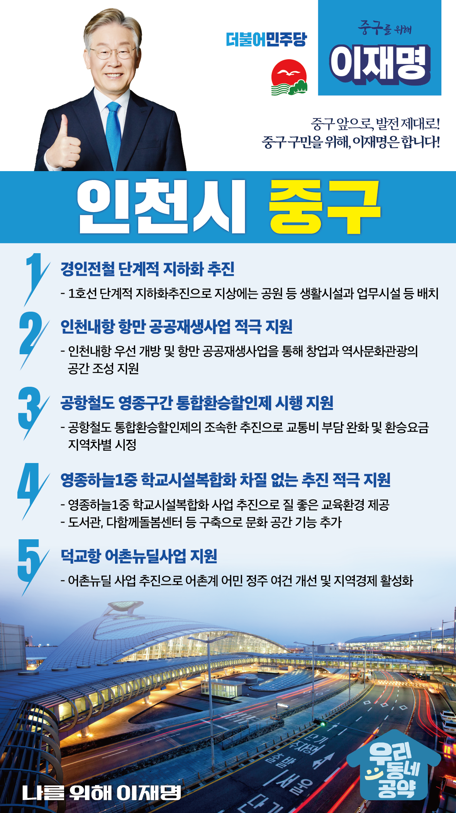

## 인천 지역 공약

# 중구

### 중구 앞으로, 발전 제대로!
> 2022-02-05

인천 중구 구민 여러분,

 

인천 중구는 1883년 개항 이래 항구를 중심으로 시가지가 형성 발전되어 왔으며, 가장 먼저 인천의 핵심도시로 발전한 지역입니다. 동양 최대의 갑문시설을 갖춘 인천항은 우리나라 해운항만의 전진기지이며, 서해 7개 도시의 연결지인 동시에 전략적으로 중요한 요새이기도 합니다.

 

인천의 중심부로 발달해온 까닭에 오래된 건물과 협소한 도로 등 재개발의 필요성이 높은 지역이며, 지속적인 인구 유출 등의 과제도 남아있습니다.

 

인천 중구를 다시 ‘생동감 넘치는 도시’로 만들어가기 위한 5대 지역공약을 말씀드리겠습니다.

 

첫째, 경인전철의 단계적 지하화를 추진하겠습니다.

도심을 양분시키는 경인전철은 지역 발전의 가장 큰 걸림돌이었습니다.

1호선의 지하화를 단계적으로 추진하고 지상에 공원 등 생활시설과 업무시설을 배치해 단절된 도시를 연결하고 시민들의 삶을 풍요롭게 하겠습니다.

 

둘째, 인천내항 항만 공공재생사업을 적극 지원하겠습니다.

인천내항 물동량 감소 등으로 인해 인근 지역경제가 침체되고 있습니다.

인천내항을 우선 개발하고 항만 공공재생사업을 통해 창업과 역사문화관광의 공간으로 거듭날 수 있도록 지원하겠습니다.

 

셋째, 공항철도 영종구간의 통합환승할인제가 하루빨리 시행되도록 지원하겠습니다.

하나의 노선에 두 개의 상이한 운임체계가 적용되어 영종도 주민의 부담이 큽니다. 

공항철도 통합환승할인제를 조속히 추진하여 주민들의 교통비 부담을 덜고, 그동안 소외됐던 영종지역에 대한 차별을 해소하겠습니다. 

 

넷째, 영종 하늘1중 학교시설복합화가 차질 없이 추진되도록 적극 지원하겠습니다.

영종국제도시 인구가 지속적으로 증가하여 학급과밀화가 예상됩니다. 

영종 하늘1중 학교시설복합화 사업을 지원하여 질 좋은 교육환경을 제공하겠습니다. 

아울러 도서관, 다함께돌봄센터 등도 설치하여 지역주민이 함께 누리는 문화공간이 되도록 돕겠습니다. 

 

다섯째, 덕교항 어촌뉴딜사업이 차질 없도록 지원하겠습니다.

지난해 말 덕교항이 어촌뉴딜 사업에 선정되었습니다. 

어촌뉴딜 사업이 차질 없이 추진되어 중구지역 어촌계 어민의 정주 여건을 개선하고, 지역경제에 새로운 활력을 불어넣겠습니다.

 

 

존경하는 중구 구민 여러분!

 

이재명은 지킬 수 있는 것만 약속했고 약속했던 것은 지켜왔습니다.

살기 좋은 인천 중구 미래를 위한 약속 실력과 성과로 입증된 이재명이 반드시 실천하겠습니다.

 

중구 앞으로, 발전 제대로!

중구 구민을 위해, 이재명은 합니다! 

						